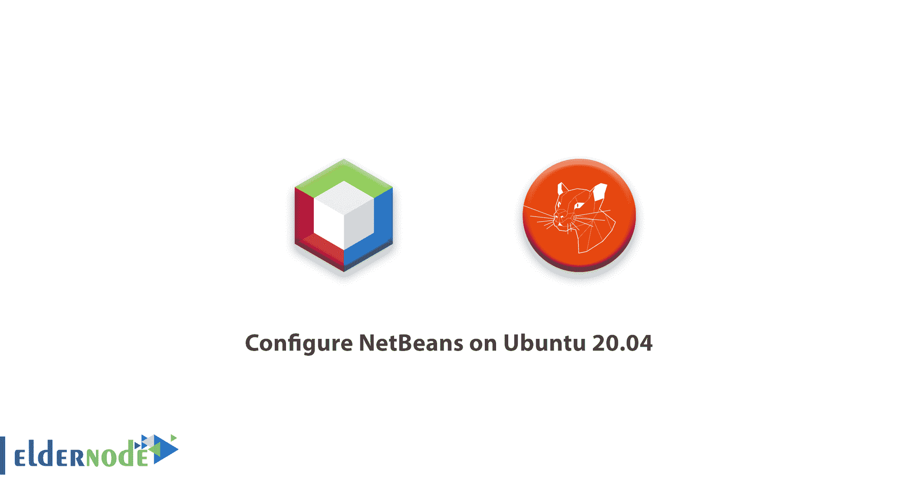

# 如何在 Ubuntu 20.04 - ElderNode 博客上配置 NetBeans

> 原文：<https://blog.eldernode.com/configure-netbeans-on-ubuntu-20-04/>



NetBeans tool 是一个用于开发 Java 应用程序的 IDE。在本文中，我们试着一步步学习如何在 Ubuntu 20.04 上配置 NetBeans。你可以访问 [Eldernode](https://eldernode.com/) 提供的包来购买 [Linux VPS](https://eldernode.com/linux-vps/) 服务器。

## 教程如何在 Ubuntu 20.04 上安装和配置 NetBeans

该应用可用于各种流行的系统，如 Windows、 [Linux](https://blog.eldernode.com/tag/linux/) 等。，您可以轻松安装和设置。

### 步骤 1)先决条件

首先，安装并激活最新版本的 Ubuntu。
然后使用以下命令安装并激活 Java 8 或更高版本。

```
sudo apt install default-jdk 
```

### 步骤 2)如何在 Ubuntu 上安装 Netbeans

我们使用 Snap 包在 [Ubuntu Linux](https://eldernode.com/ubuntu-vps/) 服务器上安装 Netbeans IDE。为此，请打开终端并运行以下命令来安装 Netbeans IDE。

```
sudo snap install netbeans --classic 
```

如果安装成功，输出应该如下所示:

```
netbeans 11.3 from Apache NetBeans* installed 
```

### 步骤 3)在 Ubuntu 上运行 Netbeans IDE

安装完成后，在应用程序部分搜索并打开 Netbeans。运行后，您可以轻松地在程序上运行您的程序。

### 步骤 4)删除 Ubuntu 上的 Netbeans

如果你在完成项目后不再需要 Netbeans，你可以用下面的命令把它从 Ubuntu 中删除。

```
sudo snap remove netbeans 
```

我们希望本教程对你有用。

## 结论

在本文中，您了解了如何在 Ubuntu 20.04 上配置 NetBeans。在 [Eldernode 社区](https://community.eldernode.com/)中讨论这个话题，看看其他人对服务器交换的看法。