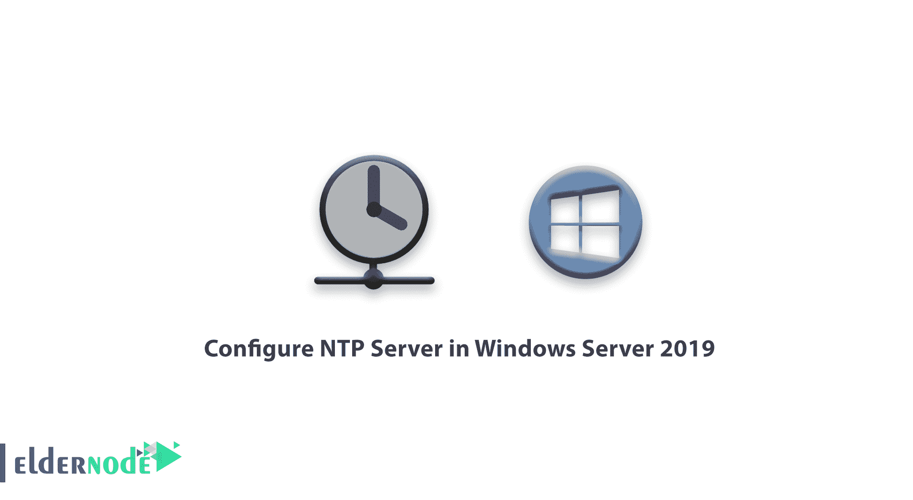
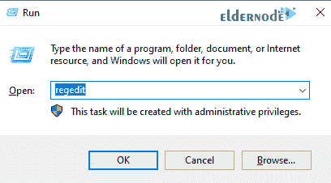
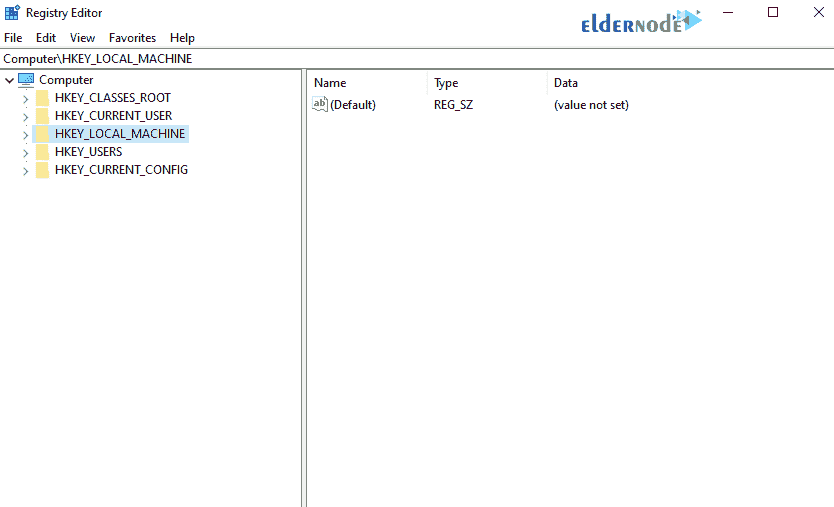
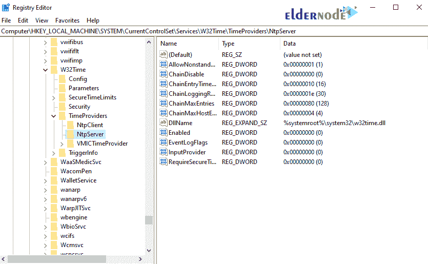
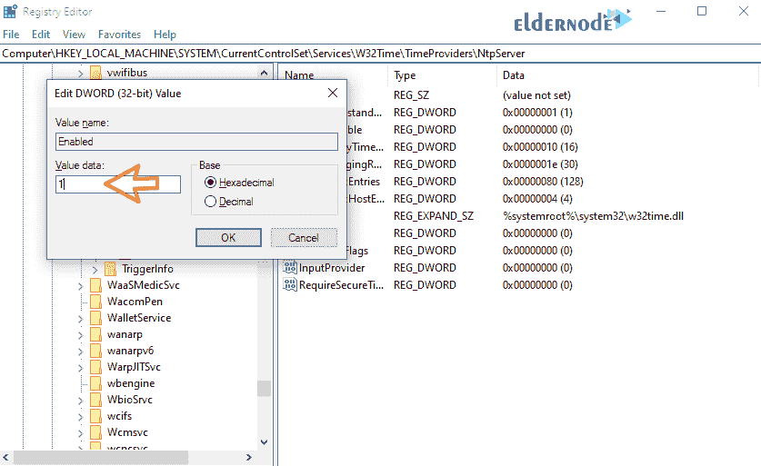
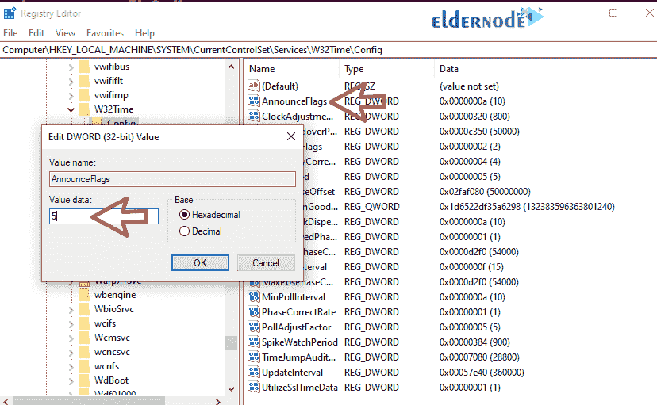
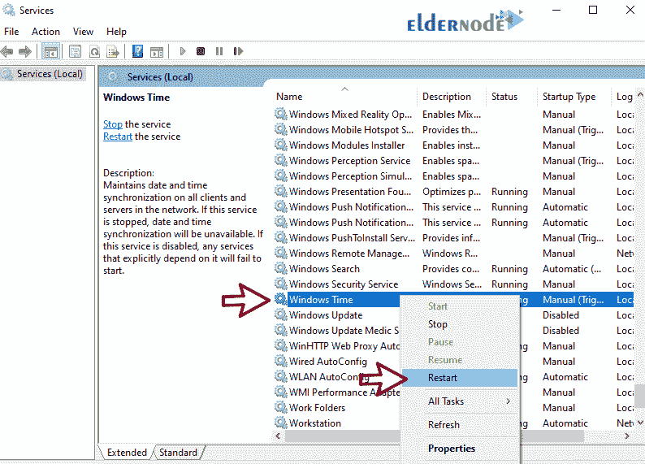

# 教程在 Windows Server 2019 中配置 NTP 服务器- Eldernode

> 原文：<https://blog.eldernode.com/configure-ntp-server-in-windows-server/>



教程在 Windows Server 2019 中配置 NTP 服务器。在所有客户端和服务器上获得准确的时间非常重要。如果计算机上的时间不准确，就会出现严重的网络问题。幸运的是，Windows 已经考虑到了这一点。服务 [网络时间协议](https://en.wikipedia.org/wiki/Network_Time_Protocol) (NTP)从 Windows XP 和 Windows Server 2003 就有了。此外，NTP 服务的大多数 Unix 和 Linux 版本都支持第一个版本。

在本文中，我们将教你如何在 windows server 2019 中配置 NTP 服务器。

您可以从 eldernode 选择您最理想的 [Windows VPS Server](https://eldernode.com/windows-vps/) 软件包。

### a)打开注册表编辑器

**1。**点击**开始**菜单，搜索运行。

**2。键入 Regedit 并点击回车。将会打开一个窗口，如下所示。**



**3。在打开的窗口中选择 HKEY_LOCAL_MACHINE 。**



**4。**按照下面的路径到达 NtpServer 选项。

```
 SYSTEM>CurrentControlSet>Services>W32Time>TimeProviders>NtpServer 
```



5.在右边页面，双击使能。

在数值数据部分，将数值从 **0 更改为 1** ，点击 ok 。



**6。**继续下面的路径，直到到达配置选项。

```
 Computer>HKEY_LOCAL_MACHINE>SYSTEM>CurrentControlSet>Services>W32Time>Config. 
```

在右边的页面中，**双击** AnnounceFlags ，将其值改为 **5** ，点击 ok 。



以下选项解释了有关 AnnounceFlags 的信息:

0x00 不是时间服务器

0x01 始终时间服务器

0x02 自动时间服务器

0x04 始终可靠的时间服务器

0x08 自动可靠时间服务器

域成员和独立客户端和服务器的默认值是 10。

b)重新启动 NTPServer

### 1.通过在开始菜单中搜索或点击窗口键打开服务。

2.在打开的窗口中，选择窗口时间选项。然后**右键点击**，选择重启。



c)在防火墙中打开 UDP 端口 123

### 您可以按照了解如何在 Windows 防火墙上打开端口。

请注意，此端口是 UDP 而不是 TCP。

**尊敬的用户**，我们希望您能喜欢这个[教程](https://eldernode.com/category/tutorial/)，您可以在评论区提出关于本次培训的问题，或者解决[老年人节点培训](https://eldernode.com/blog/)领域的其他问题，请参考[提问页面](https://eldernode.com/ask)部分，并尽快提出您的问题。腾出时间给其他用户和专家来回答你的问题。

好运。

**你可能也会对一些相关文章感兴趣:**

**You may also be interested in some related articles:**