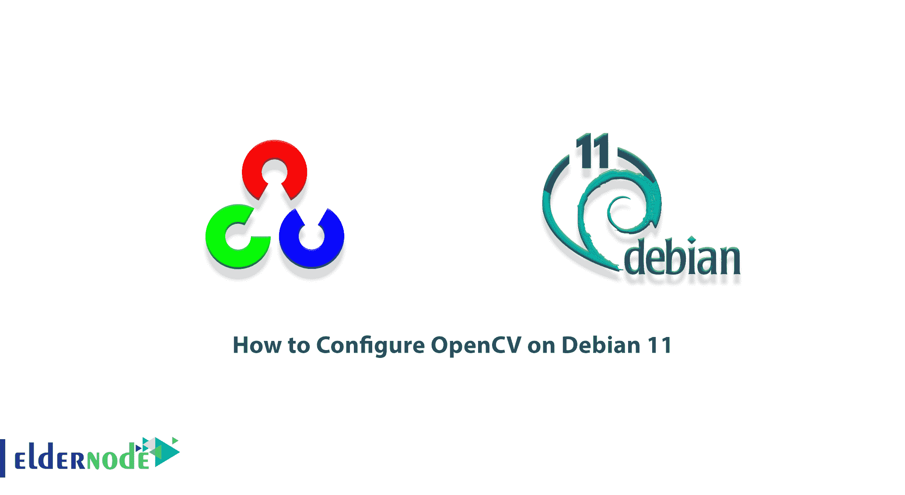

# 如何在 Debian 11 - Eldernode 博客上配置 OpenCV

> 原文：<https://blog.eldernode.com/configure-opencv-on-debian-11/>



OpenCV 是最初由英特尔开发的编程函数库。OpenCV 库是开源的、跨平台的，在 BSD 许可下可以免费使用。本库的算法使用 SSE、AVX、TBB、IPP、CUDA、OpenCL 进行优化和并行化。在这篇文章中，我们将教你如何在 Debian 11 上配置 OpenCV。如果你想购买一台 [**Linux VPS**](https://eldernode.com/linux-vps/) 服务器，你可以访问 [Eldernode](https://eldernode.com/) 中的软件包。

## **教程在 Debian Linux 上配置 OpenCV**

### **OpenCV 是什么？**

OpenCV 库支持各种平台，包括 [Windows](https://blog.eldernode.com/tag/windows/) 、 [Linux](https://blog.eldernode.com/tag/linux/) 、Android、iOS、Macintosh。它还包含 2500 多种优化算法。OpenCV 可以用于图像过滤、人脸识别、运动检测、人机交互、运动跟踪、运动感知、物体检测等等。

为了支持某些 OpenCV 应用，有一个机器学习库，包括以下内容:

1.元算法

2.数学希望最大化算法

3.梯度树增加

4.支持向量机(SVM)

5.最近邻算法

6.学习决策树

7.人工神经网络

8.随机森林

## **如何在 Debian 11 上安装 OpenCV**

在这一节，我们想教你如何在 [Debian](https://blog.eldernode.com/tag/debian/) 11 上安装 OpenCV。为此，您必须按顺序执行以下步骤。

注意 OpenCV Python 模块可以从标准的 Debian 仓库获得。在撰写本文时，标准的 Debian 库包括 OpenCV 4 . 5 . 3 版。第一步是使用以下命令更新系统，然后安装 OpenCV Python 模块:

```
sudo apt update
```

```
sudo apt install python3-opencv
```

接下来，要确认安装，进入 cv2 模块并使用以下命令打印 OpenCV 版本:

```
python3 -c "import cv2; print(cv2.__version__)"
```

安装 OpenCV 的第二种方法是使用源代码。在这种方法中，要从源代码安装 OpenCV 的最新版本，需要依次执行以下步骤。使用以下命令，您可以安装所有必需的和可选的依赖项:

```
sudo apt install build-essential cmake git pkg-config libgtk-3-dev \  libavcodec-dev libavformat-dev libswscale-dev libv4l-dev \  libxvidcore-dev libx264-dev libjpeg-dev libpng-dev libtiff-dev \  gfortran openexr libatlas-base-dev python3-dev python3-numpy \  libtbb2 libtbb-dev libdc1394-22-dev
```

安装所需的依赖项后，可以使用以下命令克隆 OpenCV 和 OpenCV 参与库:

```
mkdir ~/opencv_build && cd ~/opencv_build
```

```
git clone https://github.com/opencv/opencv.git
```

```
git clone https://github.com/opencv/opencv_contrib.git
```

现在，您需要使用以下命令创建一个临时构建目录，并转到该目录:

```
cd ~/opencv_build/opencv
```

```
mkdir build && cd build
```

通过运行以下命令来配置 OpenCV 基础设施:

```
cmake3 -D CMAKE_BUILD_TYPE=RELEASE \
```

```
-D CMAKE_INSTALL_PREFIX=/usr/local \
```

```
-D INSTALL_C_EXAMPLES=ON \
```

```
-D INSTALL_PYTHON_EXAMPLES=ON \
```

```
-D OPENCV_GENERATE_PKGCONFIG=ON \
```

```
-D OPENCV_EXTRA_MODULES_PATH=~/opencv_build/opencv_contrib/modules \
```

```
-D BUILD_EXAMPLES=ON ..
```

### **在 Debian 11 上配置 OpenCV**

在这一节中，我们将看看如何配置和启动 OpenCV。您可以运行以下命令来启动编译过程。在下面的命令中，您需要根据您的处理器更改 **-j 标志**。注意，如果您不知道处理器的内核数量，您可以通过键入 **nproc** 找到它。

```
make -j2
```

现在是时候通过执行以下命令来安装 OpenCV 了:

```
sudo make install
```

在下一步检查 OpenCV 安装是否成功时，您可以轻松地输入以下命令:

```
pkg-config --modversion opencv4
```

```
python3 -c "import cv2; print(cv2.__version__)"
```

## 结论

可视化软件开发人员面临的一个问题是对图像进行各种计算。由于信息量大，它们的处理需要最佳的编程。在本文中，我们试图教你如何在 Debian 11 上配置 OpenCV。