# 教程在 Windows Server 2016 上配置 OpenSSL

> 原文：<https://blog.eldernode.com/configure-openssl-on-windows-server/>

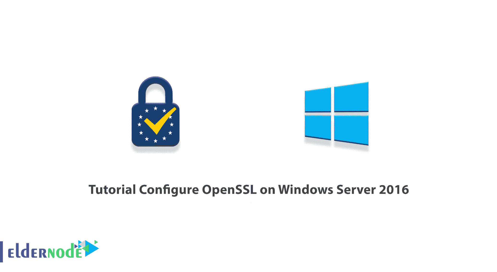

OpenSSL 是一个全面的加密库，它使用 TLS 协议，这是一个开源应用程序。它于 1998 年首次发布，可用于 Linux、Windows、macOS 和 BSD 系统。OpenSSL 允许用户使用 SSL 做各种事情。这些包括创建 CSR(证书签名请求)和生成私钥，以及安装 SSL 证书。在本文中，我们将向您介绍**教程在 Windows Server 2016 上配置 OpenSSL**。你可以使用 [Eldernode](https://eldernode.com/) 中可用的软件包来购买一台 **[Windows VPS](https://eldernode.com/windows-vps/)** 服务器。

## **如何在 Windows Server 2016 上配置 OpenSSL**

OpenSSL 是用于传输层安全(TLS)和安全套接字层(SSL)协议的健壮的、商业级的、全功能的工具包。在下一节中，我们将向您介绍 OpenSSL 的概念。然后我们会教你如何在 [Windows Server](https://blog.eldernode.com/tag/windows/) 2016 上安装 OpenSSL。最后，我们将教你如何配置 OpenSSL。请继续关注本文的其余部分。

### **OpenSSL 简介**

OpenSSL 是 SSL 领域中使用最广泛的工具之一。SSL 证书现在需求量很大。自从 HTTPS 无处不在运动发起以来，加密领域发生了巨大的变化。首先，他们引入 SEO 作为安装数字证书的激励，后来，他们强制所有网站安装 Chrome HTTPS。如果你不使用 SSL 证书，流行的浏览器如 Chrome 和 T2 的 Firefox 都不会认为你的网站是一个“安全”的网站。

SSL 的正确实施对于网站的安全和成功至关重要。尽管许多网站管理员是第一次学习 SSL，对 SSL 了解不多，但他们拥有所需的工具是很重要的。其中一个工具是 OpenSSL。

使用 OpenSSL，您可以为您的数字证书申请一个证书，并在您的服务器上安装 SSL 文件。您还可以将证书转换为各种 SSL 格式，并执行各种身份验证。您所要做的就是学习一些常用的 OpenSSL 命令，随着每个新证书的安装，配置过程将会更快更容易。因为并非所有服务器都提供 SSL 管理的 web 界面，所以在某些操作系统上，OpenSSL 是安装和配置证书的唯一解决方案。

在本文的续篇中，加入我们，一步步教你如何在 Windows Server 2016 上安装 OpenSSL。

## **如何在 Windows Server 2016 上安装 OpenSSL**

在这一节，我们想教你如何在 Windows Server 2016、2019、2012 上安装 OpenSSL。为此，只需按顺序执行以下步骤。

第一步是去 [OpenSSL 下载](https://slproweb.com/products/Win32OpenSSL.html)页面。然后，根据你的系统版本，下载最新的 OpenSSL build。您也可以通过在 [PowerShell](https://blog.eldernode.com/get-help-command-in-powershell/) 中运行以下命令来下载 OpenSSL:

```
curl.exe -L -o Win64OpenSSL.exe https://slproweb.com/download/Win64OpenSSL-1_1_0j.exe
```

成功下载 OpenSSL 后，现在可以通过在 PowerShell 中运行以下命令来开始安装过程:

```
.\Win64OpenSSL.exe
```

在打开的窗口中，选择**我接受协议**选项确认许可协议，然后点击**下一步**:

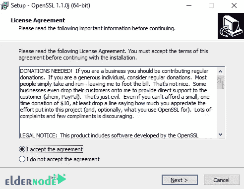

在下一步中，您需要指定 OpenSSL 的安装路径，并点击 **Next** :

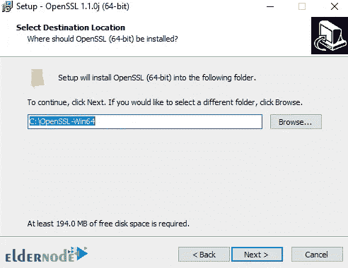

然后，您可以选择应用程序快捷方式的目录:

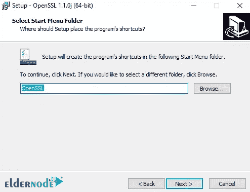

然后你必须选择下一步要做的**额外任务**。因此，在选择下图中的一个选项后，您必须点击**下一个**:

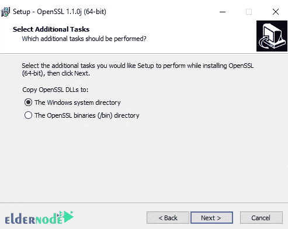

最后，点击 **Install** 在您的系统上安装 OpenSSL:

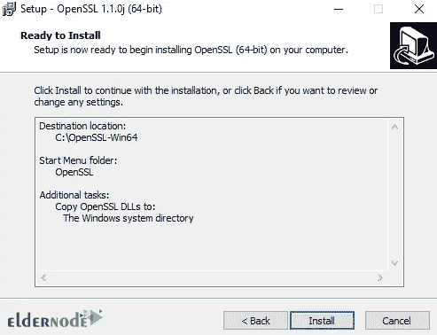

*

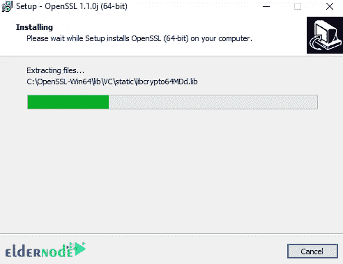

点击**完成**完成安装:

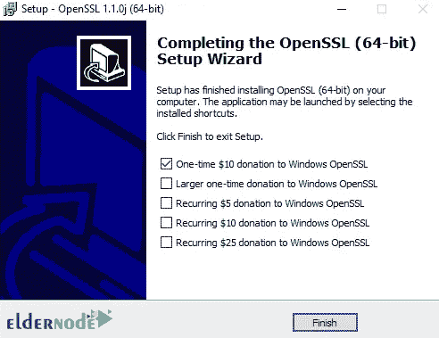

***注意:*** 安装完成后，需要将 64 位版本的 **C:\OpenSSL-Win64** 和 32 位版本的 **C:\OpenSSL-Win32** 添加到 Windows 环境的路径中。

### **在 Windows Server 2016 上配置 OpenSSL**

在您能够成功安装 OpenSSL 之后，我们现在想要配置它。您可以使用以下命令创建一个测试 SSL 证书来验证您的安装:

```
openssl.exe req -new -nodes -keyout server.key -out server.csr -newkey rsa:2048
```

现在，您可以配置环境变量，使 OpenSSL 在您的系统上正常工作。这些环境变量是 **OPENSSL_CONF** 和**路径**。您可以轻松地使用以下命令进行这些设置:

```
set OPENSSL_CONF=C:\OpenSSL-Win32\bin\openssl.cfg
```

```
set Path=%Path%;C:\OpenSSL-Win32\bin
```

需要注意的是，你可以在系统中永久查看 **OPENSSL_CONF** 和路径变量。为此，请按照以下步骤操作:

第一步是按下**窗口+R** 组合键打开**运行**窗口:

然后输入“ **sysdm.cpl** ，按**回车**:

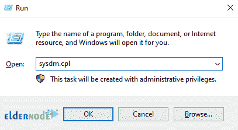

接下来，您需要进入“**高级**选项卡，点击“**环境变量**”:

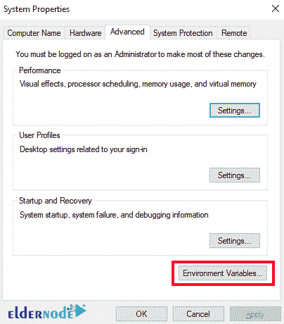

下图显示了如何配置 OPENSSL_CONF 变量:

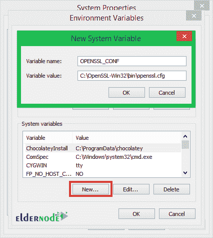

下图显示了如何配置路径变量:

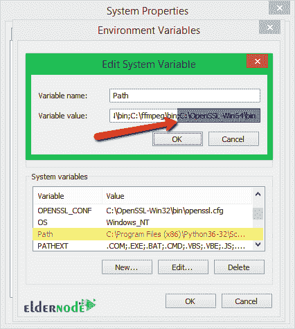

## 结论

在本文的开始，我们试图向您介绍 OpenSSL 的概念。然后我们解释了如何在 Windows Server 2016 上安装 OpenSSL。最后，我们教你如何配置 OpenSSL。