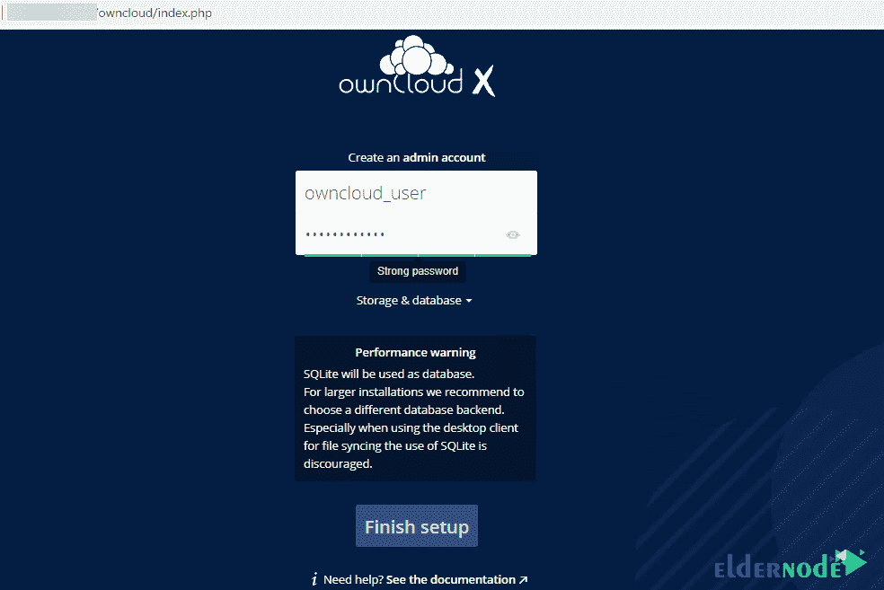

# 教程在 Rocky Linux - Eldernode 博客上配置 OwnCloud

> 原文：<https://blog.eldernode.com/configure-owncloud-on-rocky-linux/>


OwnCloud 是一组用于创建和使用文件托管服务的客户端-服务器软件。OwnCloud 在性能上与广泛使用的 Dropbox 类似。ownCloud 和 Dropbox 的主要功能区别在于 OwnCloud 主要是服务器软件。OwnCloud 服务器版本是免费和开源的，因此它允许任何人免费在自己的私有服务器上安装它。在这篇文章中，我们将教你如何在 Rocky Linux 上配置 OwnCloud。如果你想买一个 [**Linux VPS**](https://eldernode.com/linux-vps/) 服务器，你可以在 [Eldernode](https://eldernode.com/) 看到可用的软件包。

## **如何在 Rocky Linux 上配置 own cloud**

### **什么是 OwnCloud？**

OwnCloud 是 2010 年首次开发的开源软件。该软件允许您运行个人云存储服务。OwnCloud 的功能可以与 Dropbox 等其他云存储服务相媲美。OwnCloud 服务器软件可以免费安装在 Linux 上。客户端软件也可以安装在运行 [Windows](https://blog.eldernode.com/tag/windows/) 、OS X 或者 [Linux](https://blog.eldernode.com/tag/linux/) 的电脑上。移动应用程序也适用于 Android 和 iOS。

## **如何在 Rocky Linux 上安装 own cloud**

在这一节，我们想教你如何在 Rocky Linux 上安装 OwnCloud。为此，您可以按顺序执行以下步骤

您必须首先使用以下命令**更新系统**:

```
yum update -y
```

您现在可以使用以下命令**下载 OwnCloud** :

```
cd /tmp
```

```
wget https://download.owncloud.org/community/owncloud-complete-20210326.tar.bz2
```

现在你需要**解压 **/var/www/html/** 目录下的下载文件**:

```
yum install bzip2
```

```
tar -xvf owncloud-complete-20210326.tar.bz2 -C /var/www/html/
```

您必须使用以下命令配置您自己的云目录权限:

```
chown apache:apache -R /var/www/html/owncloud/
```

```
chmod -R 755 /var/www/html/owncloud
```

最后，您必须使用以下命令**创建一个新的 MySQL 数据库**。请注意，在以下命令中，用实际密码替换**您的密码**:

```
mysql -u root -p
```

```
mysql> CREATE DATABASE ownclouddb;
```

```
mysql> GRANT ALL PRIVILEGES ON ownclouddata.* TO 'ownclouduser'@'localhost' IDENTIFIED BY 'YOUR-PASSWORD' WITH GRANT   OPTION;
```

```
mysql> FLUSH PRIVILEGES;
```

```
mysql> exit;
```

### **在 Rocky Linux 上配置 own cloud**

在这一节，我们想教你如何在 Rocky Linux 上配置 OwnCloud。请遵循以下步骤。

您必须首先使用以下命令打开防火墙中的端口:

```
firewall-cmd --zone=public --add-port=80/tcp --permanent
```

```
firewall-cmd --reload
```

现在，您需要使用以下命令将 SELinux 模式设置为许可模式:

```
setenforce 0
```

使用您喜欢的编辑器打开配置文件:

```
vi /etc/selinux/config
```

打开配置文件后，按如下方式更新命令:

```
# This file controls the state of SELinux on the system.
```

```
# SELINUX= can take one of these three values:
```

```
# enforcing - SELinux security policy is enforced.
```

```
# permissive - SELinux prints warnings instead of enforcing.
```

```
# disabled - No SELinux policy is loaded.
```

```
SELINUX=permissive
```

```
# SELINUXTYPE= can take one of these two values:
```

```
# targeted - Targeted processes are protected,
```

```
# mls - Multi Level Security protection.
```

```
SELINUXTYPE=targeted
```

现在，您可以运行以下命令。执行以下命令，允许 Apache Web 服务器写入 Owncloud 目录:

```
setsebool -P httpd_unified 1
```

最后，您可以在 URL 中键入以下命令来完成您自己的云安装:

```
http://server_IP/owncloud
```

最后一步是**为 OwnCloud 创建一个管理员帐户**。您必须输入想要设置的用户名和密码，如下所示:



点击**完成设置**完成安装和配置步骤:


## 结论

通过在服务器上安装 OwnCloud，您可以安全地存储和访问文件。您还能够共享和协作内容，使团队能够在任何地方、任何设备上轻松处理数据。在本文中，我们试图教你如何在 Rocky Linux 上配置 OwnCloud。