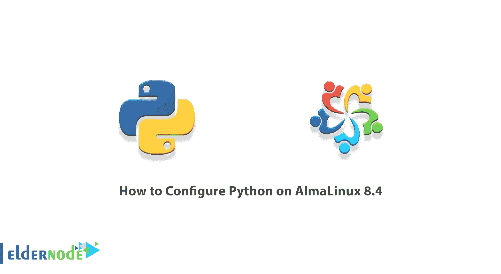

# 如何在 AlmaLinux 8.4 - Eldernode 博客上配置 Python

> 原文：<https://blog.eldernode.com/configure-python-on-almalinux/>



Python 编程语言是一种简单易学的语言。这就是为什么很多程序员新手选择它作为他们的第一编程语言，因为 Python 已经被开发成一种“通用语言”，并不局限于开发特定类型的软件。换句话说，它可以用于从“数据分析”到制作电脑游戏的任何事情。在本文中，我们将教你如何在 AlmaLinux 8.4 上配置 Python。如果你想买一个 [**Linux VPS**](https://eldernode.com/linux-vps/) 服务器，你可以在 [Eldernode](https://eldernode.com/) 看到可用的软件包。

## **教程在 AlmaLinux 8.4 上配置 Python【安装】**

### **Python 及其特性简介**

Python 是一种面向对象的高级编程语言，用于 Web 和应用程序开发软件。这种编程语言在快速应用程序开发领域非常有吸引力。因为它有动态类型和动态绑定。

Python 是一种相对简单的编程语言，由于其注重可读性的独特“语法”,所以易于学习。对于“开发人员”来说，用 Python 编程语言编写的代码比其他语言更容易阅读和翻译。这反过来降低了维护和开发用这种语言编写的程序的成本。因为它允许团队一起工作，而不会遇到语言障碍，团队成员之间也不会有不同的工作经历。

Python 的特性包括:

–使用良好的语法，提高用这种语言编写的程序的可读性

–支持各种编程任务，如与网络浏览器同步、搜索文本和编辑文件。

–这种语言有一种交互模式，可以轻松测试软件中的小段代码。

–Python 语言可以通过添加新模块来开发。

## **如何在 AlmaLinux 8.4 上下载 Python**

在这一节中，我们想向您展示如何在 [AlmaLinux](https://blog.eldernode.com/install-and-use-almalinux/) 上安装 Python。为此，您必须按顺序执行以下步骤。第一步是安装 Python 开发库:

```
sudo dnf install gcc openssl-devel bzip2-devel libffi-devel
```

您现在可以通过运行以下命令下载 Python :

```
cd /opt wget https://www.python.org/ftp/python/3.8.3/Python-3.8.3.tgz
```

现在是时候通过运行以下命令提取下载的文件了:

```
tar xzf Python-3.8.3.tgz
```

### **在 AlmaLinux 8.4 上安装配置 Python**

在上一节下载并解压缩 Python 之后，我们现在想向您展示如何配置它。第一步，您需要转到 Python-3.8.3 文件夹，并根据您的系统环境配置源文件。为此，您必须执行以下操作:

```
cd Python-3.8.3
```

```
sudo ./configure --enable-optimizations
```

```
sudo make altinstall
```

最后，您可以通过运行以下命令来查看 Python 在系统中的状态:

```
python3.8 -V
```

## 结论

Python 是一种完全专业且功能强大的面向对象编程语言。由于其特点，这种语言日益吸引了越来越多的观众。在本文中，我们试图一步步向您展示如何在 AlmaLinux 8.4 上配置 Python。应该注意的是，AlmaLinux 是 RHEL 的一个二进制分支，是作为 CentOS 的替代品而开发的。