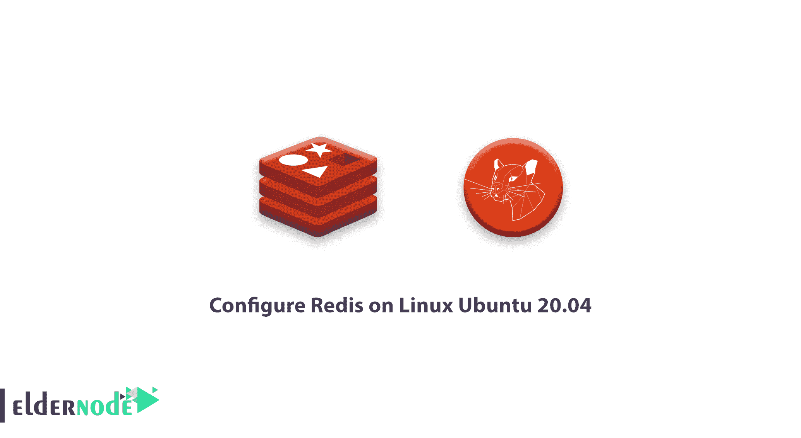

# 教程在 Linux Ubuntu 20.04 | Eldernode 上配置 Redis

> 原文：<https://blog.eldernode.com/configure-redis-on-linux-ubuntu-20-04/>



在这个[教程](https://eldernode.com/category/tutorial/)中，我们要学习如何在 [Linux](https://eldernode.com/tag/linux/) Ubuntu 20.04 上安装和配置 Redis。而且让我们看看如何做出一个完整的 [Redis](https://redis.io/) 配置。

## 如何在 Linux Ubuntu 20.04 上安装、使用和配置 Redis

使用了作为用于维护数据库、缓存和接口消息(消息代理)的主内存数据库(在内存中)的技术。

### 步骤 1)首先，安装 Redis

首先更新 Ubuntu:

```
sudo apt update 
```

然后用下面的命令安装 Redis:

```
sudo apt install redis-server 
```

安装 Redis 后，启用以下命令

```
sudo systemctl enable redis-server 
```

### 步骤 2)设定 Redis

您可以使用其配置文件进行任何其他参数更改:/etc/redis/redis.conf。

```
sudo vim /etc/redis/redis.conf 
```

您可以根据每台服务器增加允许的内存限制。

完成任何更改后，重新启动服务一次:

```
sudo systemctl restart redis-server 
```

### 步骤 3)如何连接 Redis 服务器

您可以使用 redis-cli 工具来确认 redis 服务器之间的连接。

```
redis-cli 
```

输出:

```
127.0.0.1:6379> ping  PONG 
```

你已经成功地在完整的 [Ubuntu 20.04](https://eldernode.com/tag/ubuntu-20-04/) 上安装了 Redis。