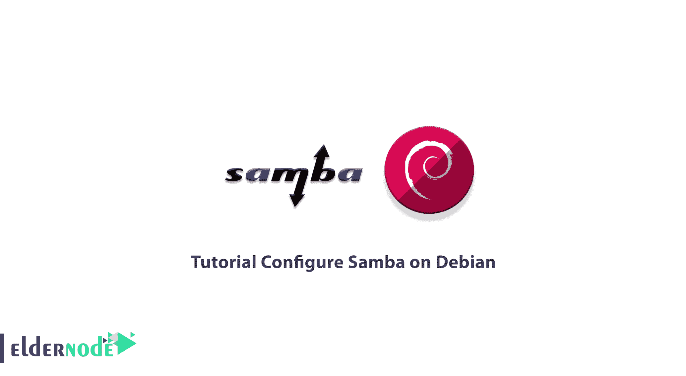
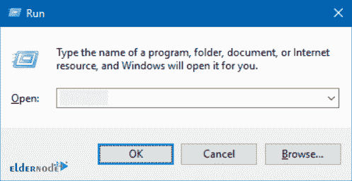
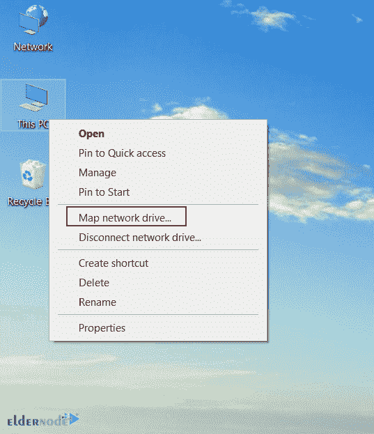
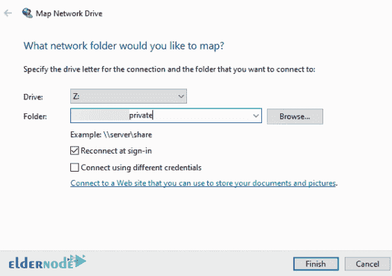
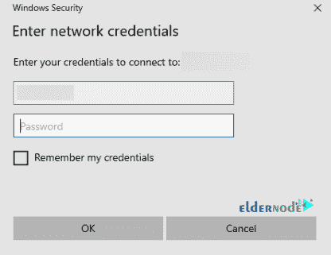
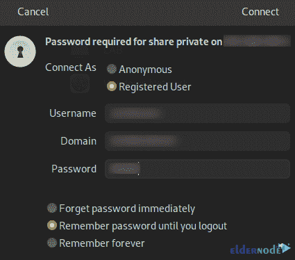

# 教程在 Debian - Eldernode 博客上配置 Samba

> 原文：<https://blog.eldernode.com/configure-samba-on-debian/>



如果您从 Windows 客户端连接到 Windows 文件服务器，由于两个操作系统之间的通信协议相同，您的通信将会顺利建立。但是要将 Windows 客户机连接到来自 Linux 或 Unix 操作系统的服务器文件，您将需要一个通信协议。Samba 是 Linux 和 Windows 之间的通信协议。在本文中，我们将教你如何在 Debian 上配置 Samba。另外，如果你想购买一个 [**Linux VPS**](https://eldernode.com/linux-vps/) 主机，你可以访问 [Eldernode](https://eldernode.com/) 中可用的软件包。

## **什么是桑巴？**

Samba 是一个协议、网络工具和标准的 Windows 互操作性程序套件，适用于 Linux 和 Unix。Samba 这个名称来源于 SMB，SMB 代表服务器消息块，是 Microsoft Windows 网络文件系统使用的标准协议的名称。Samba 允许 Windows 共享 Unix 主机上的文件和打印机，还允许 Unix 用户访问 Windows 系统上的共享资源。Samba 是重新实现 SMB/CIFS 网络协议的免费软件。Andrew Tridgell 在 1991 年 12 月和 1992 年 1 月开发了 Samba Unix 的第一个版本。

### **桑巴特色**

*   在重负载下提供良好的性能
*   提供安全的数据传输
*   支持 NT 风格的打印服务(SPOOLSS)
*   支持 CIFS/中小企业的 POSIX 扩展
*   支持 TCP/IP 上的 NetBIOS(NBT)
*   易于快速部署
*   允许并发操作
*   多通道技术

## **如何在 Debian 上安装 Samba**

在执行任何操作之前，使用以下命令更新您的软件包列表:

```
sudo apt update
```

Samba 可以在 Debian 默认仓库中获得。您可以通过运行以下命令来安装 Samba:

```
sudo apt install samba smbclient cifs-utils
```

以下依赖项也将随 Samba 一起安装:

```
The following additional packages will be installed:  attr ibverbs-providers keyutils libcephfs2 libgfapi0 libgfrpc0 libgfxdr0  libglusterfs0 libibverbs1 librados2 librdmacm1 python3-cffi-backend  python3-cryptography python3-dnspython python3-gpg python3-markdown  python3-pygments python3-requests-toolbelt python3-samba python3-tdb  python3-yaml samba-common samba-common-bin samba-dsdb-modules  samba-vfs-modules tdb-tools
```

建议的软件包:

```
winbind python-cryptography-doc python3-cryptography-vectors python3-sniffio  python3-trio python-markdown-doc python-pygments-doc ttf-bitstream-vera  bind9 bind9utils ctdb ldb-tools ntp | chrony smbldap-tools ufw  heimdal-clients
```

将安装以下新软件包:

```
attr cifs-utils ibverbs-providers keyutils libcephfs2 libgfapi0 libgfrpc0  libgfxdr0 libglusterfs0 libibverbs1 librados2 librdmacm1  python3-cffi-backend python3-cryptography python3-dnspython python3-gpg  python3-markdown python3-pygments python3-requests-toolbelt python3-samba  python3-tdb python3-yaml samba samba-common samba-common-bin  samba-dsdb-modules samba-vfs-modules smbclient tdb-tools
```

## **如何在 Debian 上配置 Samba**

此时，您需要更改 Samba 全局设置。Samba 配置文件位于/etc/samba/smb.conf 中。为此，您应该使用您喜欢的文本编辑器打开该文件，并更改您想要的设置:

```
nano /etc/samba/smb.conf
```

现在是时候创建一个共享的 Samba 目录了，您可以在其中共享公共和私有目录:

```
sudo mkdir /public  sudo mkdir /private
```

然后，您需要向 Samba conf 添加两个目录。为此，请在文本编辑器中打开文件并编辑它:

```
nano /etc/samba/smb.conf
```

请记住在文件末尾添加共享和身份验证方法，以便进行访问:

```
[public]  comment = Public Folder  path = /public  writable = yes  guest ok = yes  guest only = yes  force create mode = 775  force directory mode = 775  [private]  comment = Private Folder  path = /private  writable = yes  guest ok = no  valid users = @smbshare  force create mode = 770  force directory mode = 770  inherit permissions = yes
```

在这一步中，您应该创建 Samba 共享用户和用户组来访问私有共享。您可以通过输入以下命令来创建该组:

```
sudo groupadd smbshare
```

接下来，您应该为私有共享添加必要的权限:

```
sudo chgrp -R smbshare /private/  sudo chgrp -R smbshare /public
```

要设置适当的目录权限，请运行以下命令:

```
sudo chmod 2770 /private/  sudo chmod 2775 /public
```

上述命令开头的值 2 代表 SGID 位，它允许新创建的文件继承父组。

要访问私有共享，您需要创建一个不登录的本地用户。为此，请运行以下命令:

```
sudo useradd -M -s /sbin/nologin sambauser
```

然后，您应该将用户添加到 Samba 共享组，如下所示:

```
sudo usermod -aG smbshare sambauser
```

请记住使用以下命令为用户创建 SMB 密码:

```
sudo smbpasswd -a sambauser
```

最后，通过输入以下命令启用创建的帐户:

```
sudo smbpasswd -e sambauser
```

## **如何验证桑巴配置**

您可以在以下命令的帮助下测试配置文件:

```
sudo testparm
```

现在您需要在 Samba 共享中创建演示文件。为此，请运行以下命令:

```
sudo mkdir /private/demo-private /public/demo-public  sudo touch /private/demo1.txt /public/demo2.txt
```

您应该通过执行以下命令来应用更改，从而重新启动该服务:

```
sudo systemctl restart nmbd
```

如果您运行了防火墙，您可以使用以下命令从指定的 IP 范围启用远程访问:

```
sudo ufw allow from IP-range to any app Samba
```

请注意，您应该在上面的命令中输入您的 IP，而不是 IP-range。

## **如何从客户端访问股票**

首先，您应该能够从本地设备访问共享。您可以使用以下命令来完成此操作:

```
$ smbclient '\\localhost\private' -U sambauser  Enter WORKGROUP\sambauser's password:   Try "help" to get a list of possible commands.  smb: \> ls  .                                     D        0  Tue Apr  26 02:10:34 2022  ..                                    D        0  Tue Apr  26 02:04:41 2022  demo1.txt                             N        0  Tue Apr  26 02:10:34 2022  demo-private                          D        0  Tue Apr  26 02:10:24 2022                   39987708 blocks of size 1024\. 32647972 blocks available  smb: \> exit
```

### **设置 Windows 客户端**

您可以使用 Samba 共享系统的 IP 地址从 Windows 访问共享。

首先，你应该通过按 **Win+R** 打开一个 run 框，然后输入你的 IP。



然后你会看到共享文件夹。在其中一个共享文件夹中创建文件。

应该可以在 Samba 服务器设备上查看创建的文件。

接下来，您需要在您的 Windows 系统上安装 Samba 共享。为此，右击**这台电脑**并选择**映射网络驱动器**。



现在您需要填写路径细节。



然后，您应该输入 Samba 用户凭证。



最后，您将可以使用该共享。

### **设置 Linux 客户端**

要设置 Linux 客户机，您应该使用以下命令安装 Samba 包:

```
sudo apt install samba-client cifs-utils
```

安装完成后，进入**文件管理器**，选择**其他位置**。然后，您可以使用以下语法添加您的共享:

```
smb://servername/Share_name
```

现在您应该输入 Samba 用户凭证。



最后，您将有 Samba 共享可用。

## **如何在 Debian 上卸载 Samba**

您可以使用以下命令删除 Samba:

```
apt-get remove samba
```

以下命令可以删除整个 samba 包和配置文件:

```
sudo apt-get purge samba
```

Purge 与 remove 相同，只是前者会删除软件包。就是这样！

## 结论

在本文中，我们教你如何在 Debian 上配置和卸载 Samba。安装 Samba 后，您可以通过网络在 Windows 和 Linux 系统之间共享文件。我希望这篇文章对你有用。你可以在评论里提出你的问题。