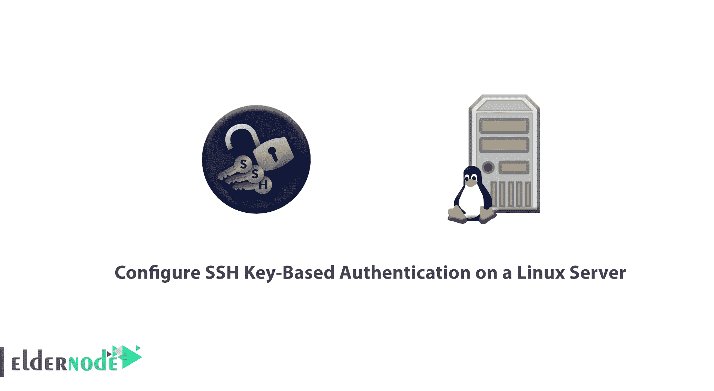

# 教程在 Linux 服务器上配置基于 SSH 密钥的身份验证- Eldernode

> 原文：<https://blog.eldernode.com/configure-ssh-authentication-linux/>



SSH 或安全外壳是一种加密协议，用于管理服务器并与之通信。当使用一个 [Linux 服务器](https://eldernode.com/installations/configure-linux-server-security/)时，很可能你会花大部分时间在一个通过 SSH 连接到你的服务器的终端会话上。

登录到 [SSH 服务器](https://www.ssh.com/ssh/server)有几种不同的方式，但是在本指南中，我们将重点关注设置 SSH 密钥。SSH 密钥提供了一种简单但极其安全的登录服务器的方式。因此，这是我们推荐给所有用户的方法。

## 教程在 Linux 服务器上配置基于 SSH 密钥的认证

请阅读本文，了解如何在 Linux 服务器上配置基于 SSH 密钥的认证。

### SSH 密钥是如何工作的？

首先，我们将了解 SSH 密钥的基本工作原理。

SSH 服务器可以使用各种不同的方法对客户端进行认证。其中最基础的是[密码](https://eldernode.com/test-secure-password/)认证，虽然简单易用，但并不是最安全的。

尽管密码是以安全的方式发送到服务器的，但它们通常并不复杂，也不够长，不足以抵御反复的、持续的攻击者。现代处理能力与自动化脚本相结合，使得暴力破解受密码保护的帐户成为可能。虽然还有其他增加附加[安全](https://eldernode.com/how-to-increase-website-security/) ( [fail2ban](https://eldernode.com/fail2ban-secure-linux-server/) 等方法。)，SSH 密钥被证明是一种可靠且安全的替代方案。

此外，SSH 密钥对是两个加密的安全密钥，可用于向 SSH 服务器认证客户端。每个密钥对由一个公钥和一个私钥组成。私钥由客户端保留，应该绝对保密。私钥的任何泄露都将允许攻击者登录到使用相关公钥配置的服务器，而无需额外的身份验证。作为额外的预防措施，可以在磁盘上用密码对密钥进行加密。

此外，相关的公钥可以自由共享，不会产生任何负面影响。公钥可用于加密只有私钥才能解密的消息。该属性被用作使用密钥对进行身份验证的一种方式。

公钥被上传到您希望能够使用 SSH 登录的远程服务器。该密钥被添加到您将要登录的用户帐户中的一个名为 **~/的特殊文件中。ssh/authorized_keys** 。

当客户机试图使用 SSH 密钥进行身份验证时，服务器可以测试客户机是否拥有私钥。如果客户机能够证明它拥有私钥，就会产生一个 shell 会话或者执行所请求的命令。

### 如何创建 SSH 密钥

在这一步中，我们将向您展示如何创建 SSH 密钥。为服务器配置 SSH 密钥认证的第一步是在本地计算机上生成 SSH 密钥对。

为此，您可以使用一个名为 **ssh-keygen** 的特殊实用程序，它包含在标准 OpenSSH 工具套件中。默认情况下，这将创建一个 2048 位的 RSA 密钥对，这对于大多数用途来说是合适的。

使用以下命令在本地计算机上生成 SSH 密钥对。

```
ssh-keygen 
```

```
Generating public/private rsa key pair.  Enter file in which to save the key (/home/username/.ssh/id_rsa)
```

之后，该实用程序将提示您为将要生成的密钥选择一个位置。默认情况下，密钥将存储在 **~/中。用户主目录中的 ssh** 目录。私钥将被称为 **id_rsa** ，相关的公钥将被称为 **id_rsa.pub** 。

通常，在这个阶段最好坚持使用默认位置。这样做将允许您的 SSH 客户端在尝试认证时自动找到您的 SSH 密钥。如果您想选择一个非标准路径，请现在输入，否则，请按 ENTER 键接受默认值。

如果您之前已经生成了一个 SSH 密钥对，您可能会看到如下所示的提示:

```
/home/username/.ssh/id_rsa already exists.  Overwrite (y/n)?
```

但是如果你选择覆盖磁盘上的密钥，你将**而不是**不能再使用以前的密钥进行认证。选择“是”时要非常**小心**，因为这是一个**无法**逆转的破坏性过程。

```
Created directory '/home/username/.ssh'.  Enter passphrase (empty for no passphrase):  Enter same passphrase again:
```

然后，系统会提示您输入密钥的密码。这是一个可选的密码，可用于加密磁盘上的私钥文件。

您可能想知道如果仍然需要输入密码短语，SSH 密钥有什么优势。一些优点是:

**1-** 私有 SSH 密钥(受密码保护的部分)永远不会暴露给网络。密码短语仅用于在本地机器上解密密钥。这意味着基于网络的暴力破解密码是不可能的。

**2-** 私钥保存在受限目录中。SSH 客户端不会识别没有保存在受限目录中的私钥。密钥本身也必须有受限的权限(只有所有者可以读写)。这意味着系统上的其他用户不能窥探。

**3-** 任何希望破解私有 SSH 密钥密码的攻击者都必须已经能够访问系统。这意味着他们已经可以访问您的用户帐户或 root 帐户。如果您处于这种情况，密码可以防止攻击者立即登录到您的其他服务器。这有望让您有时间创建和实现一个新的 SSH 密钥对，并删除对受损密钥的访问。

由于私钥永远不会暴露给网络，并且通过文件权限进行保护，因此除了您(和 root 用户)之外，任何人都不能访问该文件。在这些条件被破坏的情况下，密码作为额外的保护层。

**注意**:密码是可选的附加项。如果您输入了一个密钥，则每次使用该密钥时都必须提供它(除非您运行的是存储解密密钥的 SSH 代理软件)。我们**推荐**使用密码短语，但是如果你不想设置密码短语，你可以简单地按下回车键来绕过这个提示。

```
Your identification has been saved in /home/username/.ssh/id_rsa.  Your public key has been saved in /home/username/.ssh/id_rsa.pub.  The key fingerprint is:  a9:49:2e:2a:5e:33:3e:a9:de:4e:77:11:58:b6:90:26 [[email protected]](/cdn-cgi/l/email-protection)_host  The key's randomart image is:  +--[ RSA 2048]----+  |     ..o         |  |   E o= .        |  |    o. o         |  |        ..       |  |      ..S        |  |     o o.        |  |   =o.+.         |  |. =++..          |  |o=++.            |  +-----------------+ 
```

从现在开始，您有了一个公钥和私钥，可以用来进行身份验证。下一步是将公钥放在您的服务器上，以便您可以使用 SSH 密钥认证来登录。

### 如何将公钥复制到您的服务器上

现在需要注意的是，如果您已经有了一个可用的服务器，并且在创建时没有嵌入密钥，您仍然可以上传您的公钥，并使用它来验证您的服务器。

您使用的方法在很大程度上取决于您可用的工具和当前配置的详细信息。以下方法都产生相同的最终结果。最简单、自动化程度最高的方法是第一种，如果无法使用前面的方法，后面的方法都需要额外的手动步骤。

### 使用 SSH-Copy-ID 复制您的公钥

让我们看看将您的公钥复制到现有服务器的最简单方法，使用一个名为 ssh-copy-id 的实用程序。因为这种方法简单，所以如果可行的话，推荐使用。

ssh-copy-id 工具包含在许多发行版的 OpenSSH 包中，因此您可以在本地系统上使用它。要使用这种方法，您必须已经拥有对服务器的基于密码的 SSH 访问权限。

要使用该实用程序，您只需指定想要连接的远程主机和您拥有 SSH 访问密码的用户帐户。这是您的公共 SSH 密钥将被复制到的帐户。

```
ssh-copy-id [[email protected]](/cdn-cgi/l/email-protection)_host
```

然后，您会收到如下消息。

```
The authenticity of host '111.111.11.111 (111.111.11.111)' can't be established.  ECDSA key fingerprint is fd:fd:d4:f9:77:fe:73:84:e1:55:00:ad:d6:6d:22:fe.  Are you sure you want to continue connecting (yes/no)? yes
```

通过显示此信息，您可以确保本地计算机无法识别远程主机。这将在您第一次连接到新主机时发生。键入“yes”并按 ENTER 键继续。

因此，该实用程序将扫描您的本地帐户，查找我们之前创建的 **id_rsa.pub** 密钥。当它找到密钥时，会提示您输入远程用户帐户的密码:

```
usr/bin/ssh-copy-id: INFO: attempting to log in with the new key(s), to filter out any that are already installed  /usr/bin/ssh-copy-id: INFO: 1 key(s) remain to be installed -- if you are prompted now it is to install the new keys  [[email protected]](/cdn-cgi/l/email-protection)'s password:
```

现在，输入密码并按回车键。该实用程序将使用您提供的密码连接到远程主机上的帐户。然后它会复制你的 **~/的内容。ssh/id_rsa.pub** key 到远程帐户 home ~/中的一个文件中。ssh 目录名为 **authorized_keys** 。

**点**:出于安全考虑，您输入的内容不会被显示。

输出

```
Number of key(s) added: 1    Now try logging into the machine, with:   "ssh '[[email protected]](/cdn-cgi/l/email-protection)'"  and check to make sure that only the key(s) you wanted were added.
```

请注意，您的 id_rsa.pub 密钥已经上传到远程帐户。你可以继续下一部分。此时，您的 **id_rsa.pub** 密钥已经上传到远程帐户。你可以继续下一部分。

### 使用 SSH 复制您的公钥

如果您没有 **ssh-copy-id** 可用，但是您可以使用基于密码的 ssh 访问您服务器上的帐户，那么您可以使用传统的 SSH 方法上传您的密钥。

为此，您可以在本地计算机上输出我们的公共 SSH 密钥的内容，并通过 SSH 连接将其传输到远程服务器。另一方面，我们可以确保 **~/。ssh** 目录存在于我们正在使用的帐户下，然后将我们通过管道传输的内容输出到这个目录下的一个名为 **authorized_keys** 的文件中。

您可以使用 **> >** 重定向符号追加内容，而不是覆盖内容。这将允许我们添加密钥，而不会破坏以前添加的密钥。

你可以在下面看到完整的命令。

```
cat ~/.ssh/id_rsa.pub | ssh [[email protected]](/cdn-cgi/l/email-protection)_host "mkdir -p ~/.ssh && cat >> ~/.ssh/authorized_keys" 
```

然后，您会收到如下消息。

```
The authenticity of host '111.111.11.111 (111.111.11.111)' can't be established.  ECDSA key fingerprint is fd:fd:d4:f9:77:fe:73:84:e1:55:00:ad:d6:6d:22:fe.  Are you sure you want to continue connecting (yes/no)? yes
```

通过显示此信息，您可以确保本地计算机无法识别远程主机。这将在您第一次连接到新主机时发生。键入“yes”并按 ENTER 键继续。

之后，系统会提示您输入您尝试连接的帐户的密码:

```
[[email protected]](/cdn-cgi/l/email-protection)'s password: 
```

一旦您输入了密码，您的 **id_rsa.pub** 密钥的内容将被复制到远程用户账户的 **authorized_keys** 文件的末尾。如果成功，请继续下一节。

### 手动复制您的公钥

如果您无法使用基于密码的 SSH 访问您的服务器，您需要手动执行上述过程。

您的 **id_rsa.pub** 文件的内容必须添加到位于 **~/的文件中。ssh/authorized_keys** 在你的远程机器上。

要显示您的 **id_rsa.pub** 密钥的内容，请在您的本地计算机中键入以下内容:

```
cat ~/.ssh/id_rsa.pub 
```

然后，您将看到密钥的内容

```
ssh-rsa AAAAB3NzaC1yc2EAAAADAQABAAACAQCqql6MzstZYh1TmWWv11q5O3pISj2ZFl9HgH1JLknLLx44+tXfJ7mIrKNxOOwxIxvcBF8PXSYvobFYEZjGIVCEAjrUzLiIxbyCoxVyle7Q+bqgZ8SeeM8wzytsY+dVGcBxF6N4JS+zVk5eMcV385gG3Y6ON3EG112n6d+SMXY0OEBIcO6x+PnUSGHrSgpBgX7Ks1r7xqFa7heJLLt2wWwkARptX7udSq05paBhcpB0pHtA1Rfz3K2B+ZVIpSDfki9UVKzT8JUmwW6NNzSgxUfQHGwnW7kj4jp4AT0VZk3ADw497M2G/12N0PPB5CnhHf7ovgy6nL1ikrygTKRFmNZISvAcywB9GVqNAVE+ZHDSCuURNsAInVzgYo9xgJDW8wUw2o8U77+xiFxgI5QSZX3Iq7YLMgeksaO4rBJEa54k8m5wEiEE1nUhLuJ0X/vh2xPff6SQ1BL/zkOhvJCACK6Vb15mDOeCSq54Cr7kvS46itMosi/uS66+PujOO+xt/2FWYepz6ZlN70bRly57Q06J+ZJoc9FfBCbCyYH7U/ASsmY095ywPsBo1XQ9PqhnN1/YOorJ068foQDNVpm146mUpILVxmq41Cj55YKHEazXGsdBIbXWhcrRf4G2fJLRcGUr9q8/lERo9oxRm5JFX6TCmj6kmiFqv+Ow9gI0x8GvaQ== [[email protected]](/cdn-cgi/l/email-protection) 
```

接下来，您应该使用任何可用的方法来访问您的远程主机。确保 **~/。当您在远程服务器上访问您的帐户时，ssh** 目录被创建。

```
mkdir -p ~/.ssh 
```

此时，您可以在该目录下创建或修改 **authorized_keys** 文件。将您的 **id_rsa.pub** 文件的内容添加到 **authorized_keys** 文件的末尾，如有必要，使用以下命令创建它:

```
echo public_key_string >> ~/.ssh/authorized_keys 
```

现在，用来自 **cat ~/的输出替换 **public_key_string** 。您在本地系统上执行的 ssh/id_rsa.pub** 命令。应该从**宋承宪-RSA AAAA……**开始。

继续尝试在没有密码的情况下认证[，当它成功工作时。](https://eldernode.com/linux-login-without-entering-password/)

### 使用 SSH 密钥认证您的服务器

如果您成功地完成了上述步骤之一，您应该能够在没有远程帐户密码的情况下登录到远程主机。

基本过程是一样的:

```
ssh [[email protected]](/cdn-cgi/l/email-protection)_host 
```

如果这是您第一次连接到该主机，您可能会看到如下内容。

```
The authenticity of host '111.111.11.111 (111.111.11.111)' can't be established.  ECDSA key fingerprint is fd:fd:d4:f9:77:fe:73:84:e1:55:00:ad:d6:6d:22:fe.  Are you sure you want to continue connecting (yes/no)? yes
```

通过显示此消息，表明您的本地计算机无法识别远程主机。键入“yes ”,然后按 ENTER 键继续。

但是，如果您没有提供私钥的密码，您将会立即登录。如果您在创建密钥时提供了私钥的密码，现在将要求您输入密码。之后，应该会在远程系统上为您生成一个新的 shell 会话。

如果成功，请继续了解如何锁定服务器。

### 在您的服务器上禁用密码验证

在此步骤中，您将验证如果您能够使用 SSH 登录到您的帐户而无需密码，那么您已经成功地为您的帐户配置了基于 SSH 密钥的身份验证。但是，您的基于密码的身份验证机制仍然有效，这意味着您的服务器仍然面临暴力攻击。

但是在完成本节中的步骤之前，请确保您已经为该服务器上的 root 帐户配置了基于 SSH 密钥的身份验证，或者最好为该服务器上具有 **sudo** 访问权限的帐户配置了基于 SSH 密钥的身份验证。这一步将锁定基于密码的登录，因此确保您仍然能够获得管理访问权限是至关重要的。

并使用 SSH 密钥登录到您的远程服务器，无论是作为根用户还是使用具有 sudo 权限的帐户。当您看到上述情况的真实性时，请打开 SSH 守护程序的配置文件。

```
sudo nano /etc/ssh/sshd_config 
```

在文件内部，搜索名为 **PasswordAuthentication** 的指令。这可能会被注释掉。取消对该行的注释，并将值设置为“no”。这将禁止您使用帐户密码通过 SSH 登录:

```
PasswordAuthentication no 
```

您现在可以保存并关闭文件。要实际实现我们刚才所做的更改，您必须重新启动服务。

在 **Ubuntu** 或 **Debian** 机器上，你可以发出这个命令:

```
sudo service ssh restart 
```

在 **CentOS** / **Fedora** 机器上，守护进程被称为 **sshd:**

```
sudo service sshd restart 
```

完成这一步后，您就成功地将 SSH 守护进程转换为只响应 SSH 密钥。

在本文中，您成功地完成了在 Linux 服务器上配置 SSH 基于密钥的认证教程。从现在开始，您应该在您的服务器上配置并运行 SSH 基于密钥的认证，允许您在不提供帐户密码的情况下登录。从这里，有很多方向可以去。如果你有兴趣阅读更多关于这个主题的内容，可以找到我们的相关文章[教程在 CentOS 8 上设置 SSH 密钥](https://blog.eldernode.com/set-up-ssh-keys-on-centos-8/)和[如何在 Ubuntu 20.04 上设置 SSH 密钥](https://blog.eldernode.com/set-up-ssh-keys-ubuntu-20/)。