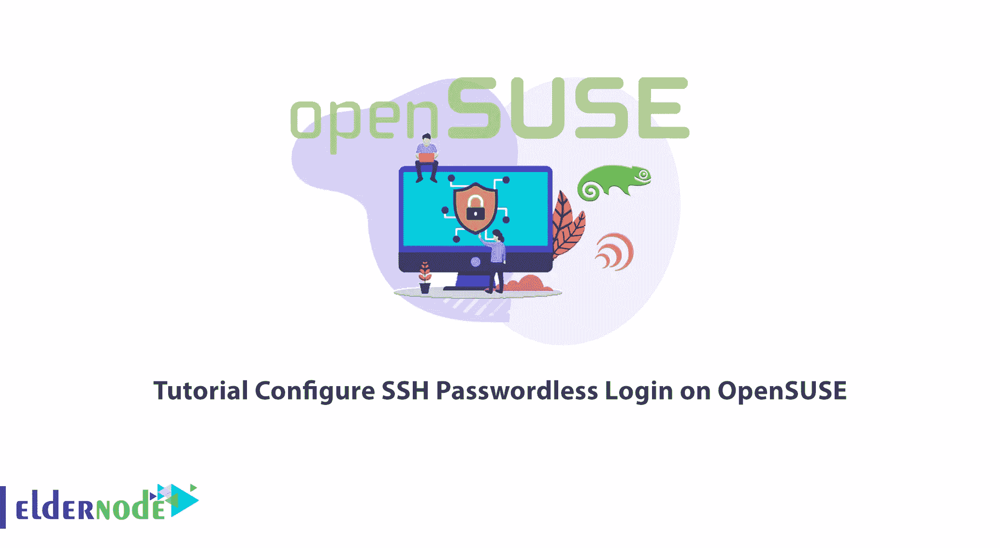
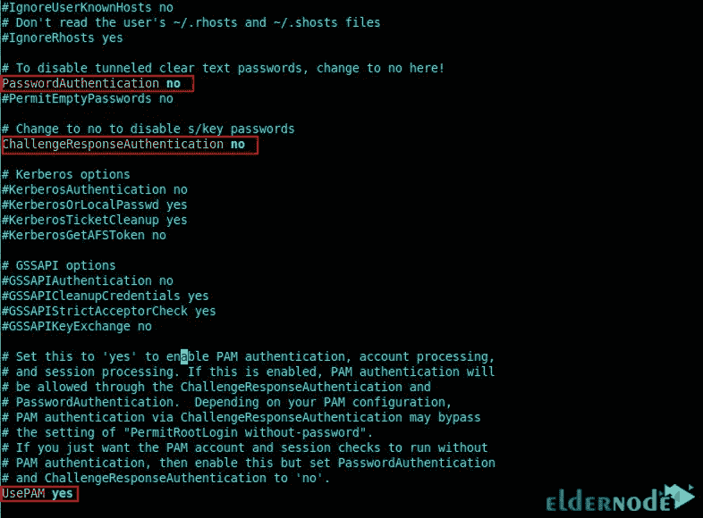

# 教程在 OpenSUSE 上配置 SSH 无密码登录

> 原文：<https://blog.eldernode.com/configure-ssh-passwordless-login-on-opensuse/>



远程计算机控制一直是所有用户关心的问题。根据您使用的操作系统，有不同的方法和协议来实现这一点。过去，用户使用不安全的方法与服务器通信，这导致了许多问题。在这方面，SSH 是一种广泛使用且非常安全的协议。在这篇文章中，我将教你如何在 OpenSUSE 上配置 SSH 无密码登录。查看 [**Linux VPS**](https://eldernode.com/linux-vps/) 服务器软件包，这些软件包可以在 [Eldernode](https://eldernode.com/) 网站上找到，如果你想要的话可以购买。

## **如何在 OpenSUSE** 上配置 SSH 无密码登录

### 什么是 SSH，它有什么特点？

[SSH](https://blog.eldernode.com/ssh-connection-softwares/) 代表安全外壳或安全套接字外壳，是一种网络通信协议，允许您安全地连接到计算机或远程服务器。网络管理员可以远程管理服务器和应用程序，将文件从一台计算机传输到另一台计算机，并使用 SSH 执行命令。它提供强密码验证和公钥验证，以及通过开放网络(如互联网)连接的两台计算机之间的加密数据通信。该协议也用于为其他应用程序协议创建安全隧道。

SSH 的一些特性是:

1-安全文件传输

2-安全远程命令执行

3-安全远程登录

4 端口转发

5-访问控制

6 键和代理

### **如何生成 SSH 公/私钥对**

首先，我们**通过输入以下命令创建密钥对**:

```
ssh-keygen -t
```

您可以使用带有 **-t** 标志的上述命令来指定密钥类型。如果您使用上面的命令而不带任何参数，将会生成一个 2048 位的 RSA 密钥。默认情况下，私钥存储在 **~/中。ssh/id_rsa** 目录，公钥存储在 **~/中。ssh/id_rsa.pub** 目录。

您还可以使用自定义名称生成密钥对。如果您想使用密钥对进行交互式登录，只需在创建密钥对时设置一个密码。

生成密钥对后，需要确认已经在 **~/中生成。ssh** 目录。为此，请运行以下命令:

```
ls -la .ssh/my_key*
```

现在是时候通过运行以下命令将 SSH 密钥上传到远程 OpenSUSE 服务器了:

```
ssh-copy-id -i .ssh/my_key.pub [[email protected]](/cdn-cgi/l/email-protection)_IPaddress
```

我们在上面的命令中使用 **-i** 标志来指定公钥路径。记得在请求后输入您的 SSH 密码。

您可能会遇到“**收到从您的 _ IP 地址端口 22:2 断开:太多身份验证失败，从您的 _ IP 地址端口 22** 断开”错误，在这种情况下，请输入以下命令:

```
ssh-copy-id -i .ssh/my_key.pub -o IdentitiesOnly=yes [[email protected]](/cdn-cgi/l/email-protection)_IPaddress
```

### **在 OpenSUSE 上配置 SSH 无密码登录**

在执行任何操作之前，请验证远程无密码登录到 OpenSUSE 服务器。

您应该**使用私钥**登录，并输入您的密码:

```
ssh -i .ssh/my_key [[email protected]](/cdn-cgi/l/email-protection)_IPaddress
```

现在，我们将禁用 SSH 密码认证。

在这样做之前，您应该设置无密码身份验证。否则可能会导致您被锁定在 OpenSUSE 服务器之外。

在此步骤中，将 **PasswordAuthentication** 和**ChallangeResponseAuthentication**配置指令设置为 no，将 **UsePAM** 设置为 yes:



**保存**您所做的设置，然后**根据以下命令重启 sshd 守护进程**:

```
sudo systemctl restart sshd
```

就是这样！执行上述步骤后，OpenSUSE 服务器上任何试图使用密码登录的用户都会遇到“**权限被拒绝**”错误。

## 结论

无密码认证是众所周知的 OpenSSH 安全实践之一。在本文中，我们教您如何在 OpenSUSE 上配置 SSH 无密码登录。我希望这篇文章对你有用。如有疑问，可在评论中联系我们。