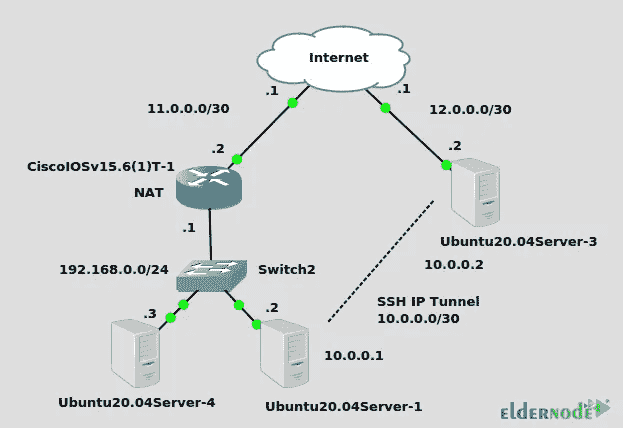

# 如何在 Ubuntu 20.04 上配置 SSH VPN 隧道

> 原文：<https://blog.eldernode.com/configure-ssh-vpn-tunnel-on-ubuntu-20-04/>


SSH 是一种安全的通信协议，它通过安全的通信隧道传输数据。SSH 隧道是另一种技术，攻击者可以通过这种技术绕过防火墙限制。本文将教你如何在 Ubuntu 20.04 上配置 SSH VPN 隧道。如果你打算购买自己的 [Ubuntu VPS](https://eldernode.com/ubuntu-vps/) 服务器，你可以查看 [Eldernode](https://eldernode.com/) 网站上提供的软件包。

## **如何在 Ubuntu VPS 上设置 SSH VPN 隧道**

SSH 隧道或 SSH 端口转发是一种通过加密的 SSH 连接传输网络数据的方法。事实上，它是 OpenSSH 的工具之一，允许 TCP 或 UDP 端口通过 SSH 连接进行转发。OpenSSH 可以在 SSH 连接的基础上创建一个虚拟以太网适配器，允许完整的第 3 层 IP 连接。这允许您添加通过此虚拟连接的路由，并通过它运行路由协议。

### **在 Ubuntu 20.04 上安装 SSH VPN 隧道**

首先，您将设置一个 IP SSH 隧道，从位于私有物理 IP 192.168.0.2 的左侧 Ubuntu20.04Server-1 到位于公共物理 IP 192.168.0.2 的右侧 Ubuntu20.04Server-3。SSH 隧道将使用 10.0.0.0/30 网络。该隧道穿过 Cisco 路由器上设置的 NAT (PAT ),该路由器将 Ubuntu20.04Server-1 连接到互联网。穿越 IP SSH 隧道的 NAT 没有问题。在最后一步中，您将添加静态路由，以允许 Ubuntu20.04Server-4 通过 SSH 隧道 ping Ubuntu20.04Server-3。



**Ubuntu20.04Server-3**

第一步，在以下命令的帮助下安装 OpenSSH 服务器:

```
sudo apt-get install openssh-server
```

您应该以 root 用户身份从客户端登录，以创建 TUN 适配器。用所需的文本编辑器打开以下文件:

```
sudo nano /etc/ssh/sshd_config
```

现在取消注释，将“ **PermitRootLogin 禁止密码**改为“ **PermitRootLogin 无密码**”，将“ **PermitTunnel no** ”改为“ **PermitTunnel yes** ”。

完成后，**保存**文件。

**使用下面的命令重启**您的 OpenSSH 服务器:

```
sudo systemctl restart sshd
```

**Ubuntu20.04Server-1**

在此步骤中，通过运行以下命令，安装 autossh 工具来监视 ssh 会话，并在会话终止时重新启动它们:

```
sudo apt-get install autossh
```

最后，设置密钥认证，以 root 用户身份登录到服务器。为此，请输入以下命令:

```
ssh-keygen -t rsa 
```

```
cat ~/.ssh/id_rsa.pub | ssh [[email protected]](/cdn-cgi/l/email-protection) "mkdir -p ~/.ssh && cat >> ~/.ssh/authorized_keys"
```

### **连接隧道上 Ubuntu 20.04**

首先，从 Ubuntu20.04Server-1 输入以下命令:

```
autossh -M 0 -o "ServerAliveInterval 30" -o "ServerAliveCountMax 3" -NTC -o Tunnel=point-to-point -w 0:0 12.0.0.2 &
```

–**-m0**:不用，是指监听 TCP 端口

–**-o " ServerAliveInterval 30 "**:每 30 秒发送一次 keepalive

–**-o " ServerAliveCountMax 3"**:最多重试 3 次 keepalive。Autossh 到此结束，接下来开始本地 ssh 命令。

–**-N**:指示 SSH 不要执行远程命令

–**-T**:禁用伪 tty 分配

–**-C**:压缩可能会提高性能，也可能会降低性能

–**-o Tunnel =点对点**:创建一个虚拟接口

–**-w0:0**:它给本地和远程调谐器适配器一个编号，在本例中为 0。“:”的左边是本地，右边是远程。

–**12.0.0.2**:隧道终点

最后一个&符号在后台执行命令，允许您取回 shell。

如果一切正常，服务器和客户机上都将有一个" **tun0** "设备。

“ip route”命令可用于测试重启后的网络计划:

**在 Ubuntu 20.04Server-1 上(客户端)**

```
ip addr add 10.0.0.1/30 dev tun0 
```

```
ip link set tun0 up
```

然后使用以下命令为 192.168.0.0/24 添加一条静态路由，通过新创建的隧道访问该网络:

**在 Ubuntu 20.04Server-3(服务器)上**

```
ip addr add 10.0.0.2/30 dev tun0 
```

```
ip link set tun0 up 
```

```
ip route add 192.168.0.0/24 via 10.0.0.1
```

另外，为 10.0.0/30 网络添加一条指向 192.168.0.2 的路由，以查看隧道是否能路由所有 IP 流量，而不仅仅是客户端和服务器之间的流量:

**在 Ubuntu 20.04Server-4 上(旁观者在 192.168.0.3)**

```
ip route add 10.0.0.0/30 via 192.168.0.2
```

***注意:*** 客户端要启用 IP 转发。

现在从 Ubuntu 20.04 server-4 ping 到 Ubuntu 20.04Server-3，如下所示:

```
ping 10.0.0.2 
```

```
PING 10.0.0.2 (10.0.0.2) 56(84) bytes of data. 
```

```
64 bytes from 10.0.0.2: icmp_seq=1 ttl=63 time=3.87 ms 
```

```
64 bytes from 10.0.0.2: icmp_seq=2 ttl=63 time=3.73 ms
```

最后，从服务器 Ubuntu 20.04Server-3 一直 ping 到 Ubuntu 20.04Server-4，直接通过 Cisco 路由器上的 NAT，如下所示:

```
ping 192.168.0.3 
```

```
PING 192.168.0.3 (192.168.0.3) 56(84) bytes of data. 
```

```
64 bytes from 192.168.0.3: icmp_seq=1 ttl=63 time=3.30 ms 
```

```
64 bytes from 192.168.0.3: icmp_seq=2 ttl=63 time=3.69 ms
```

就是这样！

## 结论

SSH 隧道一种端口转发技术，允许 TCP 或 UDP 端口通过 SSH 连接进行转发。在本文中，您了解了如何在 Ubuntu 20.04 上配置 SSH VPN 隧道。我希望这篇教程对你有用，并且能帮助你在你的 Ubuntu 服务器上配置 SSH VPN 隧道。如果你面临任何问题或有任何疑问，请在评论区联系我们。