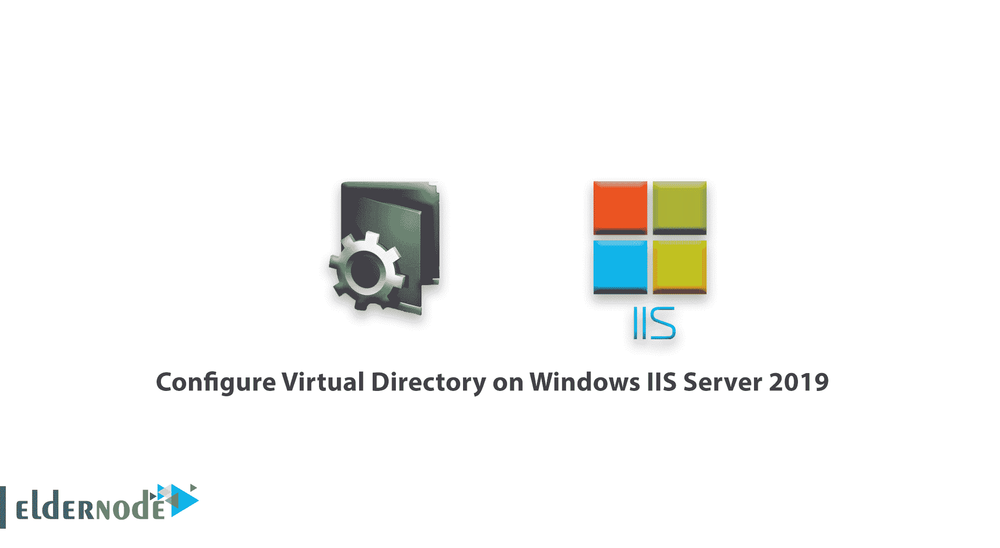
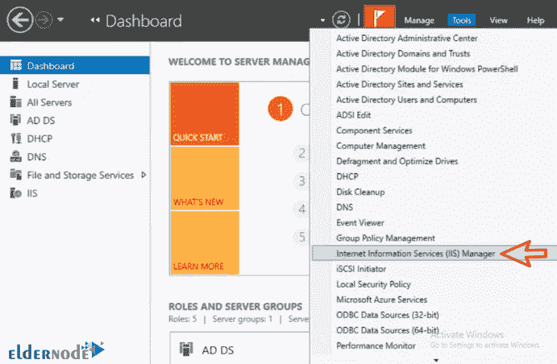
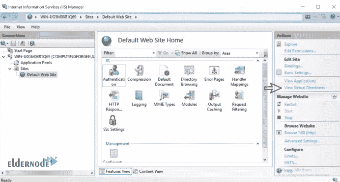
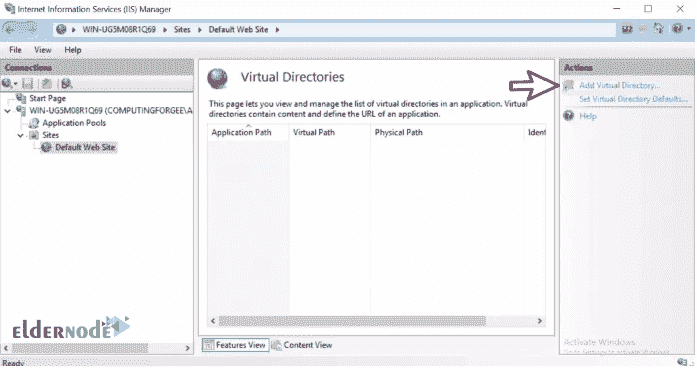
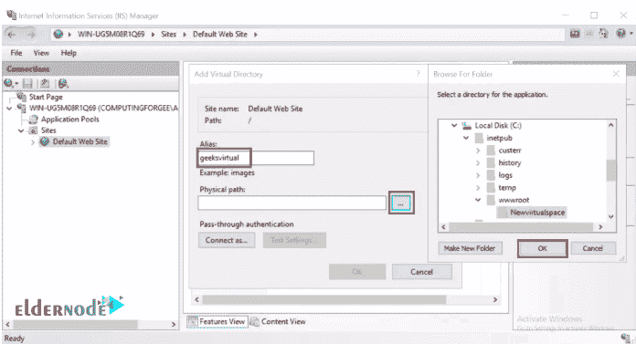
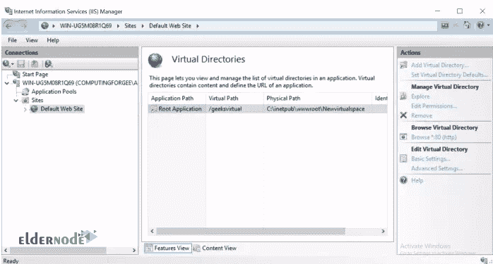
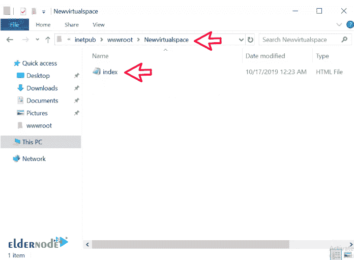
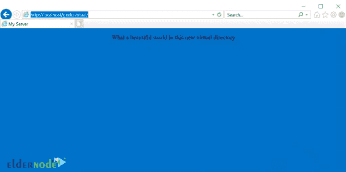

# 教程在 Windows IIS Server 2019 上配置虚拟目录- Eldernode

> 原文：<https://blog.eldernode.com/configure-virtual-directory-on-windows-server/>

教程在 Windows IIS Server 2019 上配置虚拟目录。如你所知，一个网站的所有文件和内容都位于特定的文件夹和路径中。有时，您需要您的网站包含文件夹中的特定内容以及相对于网站的另一个位置。**例如**，在你的公司里，你有一个不同表格的文件夹，几个不同的网站必须能够访问并提供给他们的用户。该文件夹位于一个物理路径中，所有网站都可以从该路径访问文件。

事实上，虚拟目录指的是位于本地或在另一台远程计算机上的 web 服务器上共享的物理内容，这些内容并不存在于网站本身。虚拟目录可以在网站或特定的网络应用中创建。这些像网络应用一样，有别名，它位于网站 URL 的末尾，指向物理路径。在本教程中，你将学习如何在 IIS Server 2019 上安装虚拟目录。

您可以从 eldernode 选择您最理想的 [Windows VPS Server](https://eldernode.com/windows-vps/) 软件包。

## 如何向 IIS Server 2019 添加虚拟目录

**1)** 打开服务器管理器:

第一步，你需要打开服务器管理器。然后从工具选项卡中选择 [IIS 管理器](https://docs.microsoft.com/en-us/previous-versions/iis/6.0-sdk/ms525920(v%3Dvs.90)) 选项。

**2。在打开的**窗口中，从左栏选择默认网址。

在右栏中，点击查看虚拟目录。然后，您应该能够添加一个新的虚拟目录。

**3。** 点击添加虚拟目录如下所示。

**4。** 将显示一个名为**添加虚拟目录**的小窗口。在**别名**部分输入您想要的别名。

选择一个物理路径上传文件。

点击 OK 查看您添加的虚拟目录。

*

**5。** 将你的文件复制到你在步骤 4 中指定的物理路径。我们将使用一个基本的 HTML 文件。

**注意:** 记住 IIS 必须有权限从这个物理路径/目录读取。

**6。** 打开浏览器，指向你之前指定的别名。如果不是从本地加载，请输入 IIS 服务器的 IP 地址。

在 ISS 网络服务器上虚拟目录的安装已经成功完成。

**尊敬的用户**，我们希望您能喜欢这个[教程](https://eldernode.com/category/tutorial/)，您可以在评论区提出关于本次培训的问题，或者解决[老年人节点培训](https://eldernode.com/blog/)领域的其他问题，请参考[提问页面](https://eldernode.com/ask)部分，并尽快提出您的问题。腾出时间给其他用户和专家来回答你的问题。

好运。