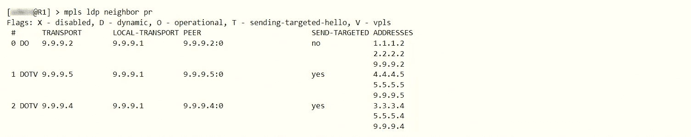
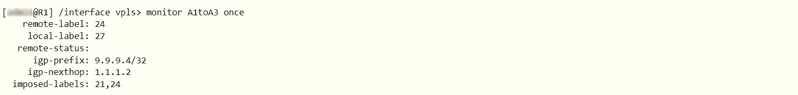
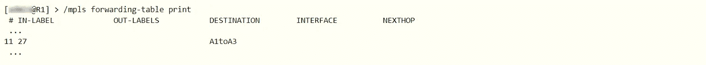
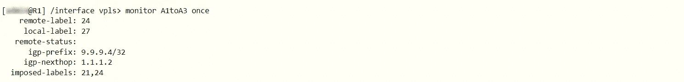
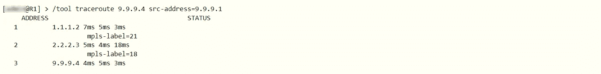
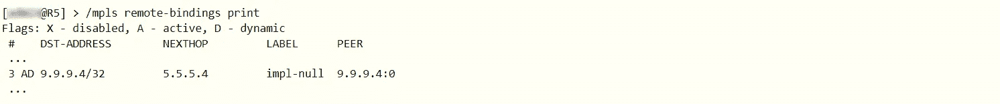
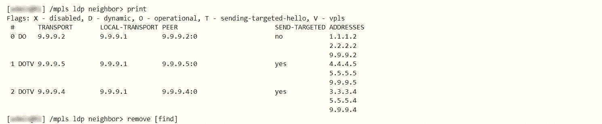
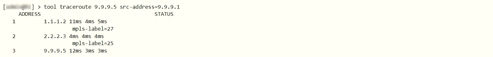

# 如何在 Mikrotik 上配置 VPLS

> 原文：<https://blog.eldernode.com/configure-vpls-on-mikrotik/>


当您的组织或企业有多个分支机构时，您将需要使用第二层互联网平台。VPLS 实际上是具有多点功能的第二层 VPN，可用于此目的。这篇文章将教你如何在 Mikrotik 上配置 VPLS。如果您打算购买一台 Mikrotik VPS 服务器，您可以查看我们网站上提供的套装。

## **教程在 Mikrotik VPS 上安装 VPLS**

### **什么是 VPLS？**

VPLS 代表虚拟专用局域网服务，是一种通过 IP 或 MPLS 网络提供基于以太网的多点对多点通信的方式。这项技术使您能够通过 MPLS 主干网将地理上分散的以太局域网(LAN)站点相互连接起来。事实上，对于实施 VPLS 的客户来说，所有站点都将位于同一个以太网 LAN 上。它为创建一个广泛、互联且安全的网络提供了最佳解决方案。

## **如何在 Mikrotik** 上设置 VPLS

在之前的帖子中，我们已经教过[如何在 Mikrotik](https://blog.eldernode.com/setup-mpls-on-mikrotik/) 中设置 MPLS。在本节中，您将学习如何在 Mikrotik 上配置 VPLS。

您可以将 VPLS 接口视为类似 EoIP 接口的隧道接口。建立以下隧道以实现客户站点之间的透明以太网网段转发:

–> R1-R5(客户 A)

–> R1-R4(客户 A)

–> R4-R5(客户 A)

–> R1-R5(客户 B)

每个隧道设置都涉及在两个隧道端点上创建 VPLS 接口。

LDP 协议协商 VPLS 隧道–两个端点交换隧道标签以用于隧道。要在隧道中转发数据，您需要在数据包上贴上两个标签，即隧道标签和传输标签。事实上，此标签确保流量传递到隧道的另一个端点。

VPLS 隧道配置在/接口 VPLS 菜单中。vpls-id 参数对于该隧道和远程对等体之间的每个隧道必须是唯一的，并且标识 vpls 隧道。

### **所需设置**

```
/interface vpls add name=A1toA2 remote-peer=9.9.9.5 mac-address=00:00:00:00:00:a1 vpls-id=10 disabled=no
```

```
/interface vpls add name=A1toA3 remote-peer=9.9.9.4 mac-address=00:00:00:00:00:a1 vpls-id=10 disabled=no
```

```
/interfacevpls add name=B1toB2 remote-peer=9.9.9.5 mac-address=00:00:00:00:00:b1 vpls-id=11 disabled=no
```

```
/interface vpls add name=A3toA1 remote-peer=9.9.9.1 mac-address=00:00:00:00:00:a3 vpls-id=10 disabled=no
```

```
/interface vpls add name=A3toA2 remote-peer=9.9.9.5 mac-address=00:00:00:00:00:a3 vpls-id=10 disabled=no
```

```
/interface vpls add name=A2toA1 remote-peer=9.9.9.1 mac-address=00:00:00:00:00:a2 vpls-id=10 disabled=no
```

```
/interface vpls add name=A2toA3 remote-peer=9.9.9.4 mac-address=00:00:00:00:00:a2 vpls-id=10 disabled=no
```

```
/interface vpls add name=B2toB1 remote-peer=9.9.9.1 mac-address=00:00:00:00:00:b2 vpls-id=11 disabled=no
```

VPLS 隧道配置创建动态 LDP 邻居，并建立“目标”LDP 会话。目标 LDP 会话是在不是直接邻居的两个路由器之间建立的会话。在此设置之后，R1 LDP 邻居如下所示:



IP 路由标签也在 VPLS 对等体之间交换，但是都不能使用。路由器维护所有交换的标签，以便在需要时可以立即使用。

要查看有关 VPLS 接口的信息，您应该监控其状态:



如您所见，R1 为 R1 和 R4 之间的隧道指定了标签 27。MPLS 转发表指示该标签在该隧道上被检测和接收，而不是转发到下一跳:



远程端点(R4)被分配标签 24。

igp-prefix 表示用于到达隧道远程端点的路由。也就是说，当流量被转发到隧道的远程端点时，该路由器会施加传输标签，即由路由 9.9 的下一跳向 9.9.9.4/32 分发的标签。9.4/32 路线。所以，你可以在 R2 证实这一点:



应用于数据包的隧道标签由该隧道的远程路由器(R4)决定。

强加的标签反映了这种配置:由隧道生成的数据包上有 2 个标签:21 和 24。

### **VPLS 隧道里啤酒花爆开的倒数第二个效果**

传输标签的倒数第二跳弹出导致数据包到达只有一个隧道标签的 VPLS 隧道的端点。这导致 VPLS 隧道端点仅寻找标签来找出如何处理分组。因此，您可以使用 [traceroute](https://blog.eldernode.com/trace-an-ip-address-with-the-linux-traceroute/) 工具观察隧道端点之间的传输标签行为。例如，从 R1 到 R4 的跟踪路由如下:



在 traceroute 输出中，您可以看到隧道端点正在接收一个未标记的探测。事实上，在 VPLS 隧道流量中也会发生同样的情况，传输标签(18)在 R3 上弹出，数据包只与隧道标签交换。

将隧道标记的数据包传送到隧道端点的要求解释了使用“环回”IP 地址作为隧道端点的配置建议。由于 R3 将 3.3.3.0/24 网络作为其连接网络，如果在这种情况下，R4 使用其 3.3.3.4 地址建立了 LDP 会话，则倒数第二跳将出现在 R2 上。这会导致 R3(而不是 R4)收到只有隧道标签的数据包，从而产生无法预测的结果。包括在 R3 无法识别数据包时丢弃帧或以错误的方式发送。

另一个可能发生的问题是直接连接 VPLS 隧道的端点。它们之间不能使用任何传输标签，因为它们都指示对方成为其隧道端点地址的倒数第二跳弹出路由器。例如在 R5 中:



这样，VPLS 隧道在发送数据包时将只使用隧道标签:


### **如何用 VPLS** 桥接以太网网段

VPLS 隧道在路由器之间提供虚拟以太网链路。它们应该通过 VPLS 隧道桥接，以透明地连接两个物理以太网网段。事实上，它的工作方式类似于 EoIP 接口。

运行以下命令，透明地桥接连接到 R1 和 R5 的客户 B 网络:

```
/interface bridge add name=B
```

```
/interface bridge port add bridge=B interface=ether1
```

```
/interface bridge port add bridge=B interface=B1toB2
```

**在 R5 上:**

```
/interface bridge add name=B
```

```
/interface bridge port add bridge=B interface=ether3
```

```
/interface bridge port add bridge=B interface=B2toB1
```

因为除了 R1 和 R5 之间的单个 VPLS 隧道之外，B1 段和 B2 段之间没有链路，所以您不需要在网桥上运行(R)STP 协议。

**在示例设置中，设置了 3 条隧道来连接段 A1、A2 和 A3，从而在所涉及的段之间建立了隧道的所谓“全网状”。如果在没有(R)STP 的情况下启用桥接，则会出现流量环路。如果您正在寻找一些解决方案，请阅读以下内容:**

#### ****启用(R)STP****

**这消除了环路，但有一个缺点，即(R)STP 协议禁止通过其中一个隧道进行转发，只保留它用于备份目的。这样，两个网段之间的流量必须通过两个隧道，这使得设置效率低下。**

#### ****使用桥接防火墙****

**这可确保流量不会形成环路，并包括设置防火墙规则，降低桥接效率。**

#### ****使用桥梁地平线功能****

**水平分割桥接的基本思想是，到达某个端口的流量永远不会被转发到一组端口。如上所述，数据包的发送方连接到目标网络本身。这意味着通过一个 VPLS 隧道到达的数据包永远不能发送到另一个 VPLS 隧道。**

**例如，如果 A1 中的设备发送一个广播或未知 MAC 地址的数据包(这会导致网桥淹没所有接口)，该数据包会通过 VPLS 隧道发送到 R5 和 R4。例如，在常规设置中，当 R5 通过 VPLS 隧道接收到此类数据包时，会将其发送到与之相连的 A2，并通过 VPLS 隧道发送到 R4。因此，R4 收到了同一个数据包的两个副本，导致流量形成环路。**

**您可以使用网桥水平功能来配置具有水平设置的网桥端口，以便从具有水平值 X 的端口接收到的数据包不会被发送或泛洪到具有相同水平值 X 的任何端口。在 VPLS 隧道的全网状情况下，您应该为它们桥接在一起的 VPLS 隧道配置具有相同水平值的每台路由器。**

**使用以下 R1 配置命令为客户 A 启用桥接:**

```
`/interface bridge add name=A`
```

```
`/interface bridge port add bridge=A interface=A1toA2 horizon=1`
```

```
`/interface bridge port add bridge=A interface=A1toA3 horizon=1`
```

**同样，您应该在 R4 和 R5 上配置网桥。物理以太网端口没有配置水平值。如果是的话，它将完全禁止网桥发送数据。**

**horizon 值仅在本地有意义，不会通过网络传输，因此，如果在参与桥接网络的所有路由器上配置相同的值，也没有关系。**

## ****如何优化标签分配****

**在本文的其余部分，我们将教您如何在 Mikrotik 上配置 VPLS。**

### ****标签绑定过滤****

**当您实现给定的示例设置时，很明显并非所有的标签绑定都是必要的。因为它们永远不会被使用，所以您不需要在 R1 和 R5 或者 R1 和 R4 之间交换 IP 路由标签绑定。此外，如果给定的网络核心仅提供到指定客户端以太网段的连接，那么为连接路由器的网络分配标签就没有实际意义。唯一重要的路线是通往 VPLS 隧道终点的/32 路线。**

**您可以使用标签绑定过滤来仅分发特定的标签集，以减少资源使用和网络负载。**

**以下是标签绑定过滤器类型:**

**–>要通告给 LDP 邻居的标签绑定，在/mpls ldp advertise-filter 中配置**

**–>要从 LDP 邻居接受的标签绑定，在/mpls ldp accept-filter 中配置**

**过滤器被组织成一个有序列表，并指定应该包含根据过滤器测试的前缀和邻居(或通配符)的前缀。**

**您可以将所有路由器配置为仅对允许访问隧道端点的路由通告标签。对于这两个通告过滤器，您需要在所有路由器上进行如下配置:**

```
`/mpls ldp advertise-filter add prefix=9.9.9.0/24 advertise=yes`
```

```
`/mpls ldp advertise-filter add prefix=0.0.0.0/0 advertise=no`
```

**此筛选器会公布覆盖隧道端点(9.9.9.1/32，9.9.9.4/32, 9 . 9 . 9 . 5/32)的前缀为 9.9.9.0/24 的路由的绑定。**

**由于默认的过滤结果是当没有匹配的规则时允许有问题的操作，所以第二个规则是必要的。**

**在给定的配置中，不需要设置 accept filter，因为上面提到的 2 个规则引入的约定是没有 LDP 路由器分发不必要的连接。**

**过滤器更改不会影响现有映射，因此必须重置邻居之间的连接才能应用过滤器。您可以通过删除它们来实现这一点:**

****

**在 **R1** ，您将获得:**

****

**请注意，仍然有不必要的绑定。由于与 VPLS 隧道(链接 9.9.9.5 和 9.9.9.4)的远程端点分布的有目的的 LDP 会话，绑定被分布。**

**您必须配置路由器来过滤它们，以便它们不会向任何隧道端点路由器分发任何 IP 绑定。例如，在 R1，筛选器表应该如下所示:**

****

**这将为路由器提供最少的标签绑定表，例如在 **R1** 上:**

****

**尽管它们是隧道端点，但不应在 R4 和 R5 之间禁用 IP 绑定分发。R4 和 R5 不需要绑定到 VPLS 数据隧道的 IP，这样做不会影响正常情况。但是，如果 R3 和 R5 之间的链路断开，来自 R1 的所有 R5 流量都必须通过 R4 重新路由。在这种情况下，R5 不会将 IP 绑定分发到 R4，导致 R4 无法将 MPLS 流量转发到 R5。**

### ****标签绑定过滤对网络中的数据转发有什么影响？****

**现在，您应该会注意到这些更改后的 traceroute 结果。从 R1 到 R5 的 traceroute 使用 R1 的环回地址作为源地址，其行为仍然相同。每个跃点报告收到的标签:**

****

**在使用 R1 面向网络地址的 traceroute 中:**

****

**除了最后一跳，所有的跳都会被响应。因为没有从 R5 到 R1 的标签交换路径(这次使用地址 1.1.1.1 ),也没有分发标签绑定。因此，ICMP 响应被路由，返回途中的路由器(R3 和 R2)收到带有源地址的数据包，并立即丢弃这些数据包，而不进行路由。**

**使用它们的非环回地址跟踪从 R1 到 R5 的路由:**

****

**这种跟踪路由不需要标签交换，其工作方式与没有 MPLS 的网络完全一样。**

**就是这样！**

## **结论**

**在本文中，我们教您如何在 Mikrotik 上配置 VPLS，并向您介绍了 VPLS。我希望本教程对你有用，并能帮助你在 Mikrotik 上配置 VPLS。如果你遇到任何问题，你可以在评论区联系我们。**