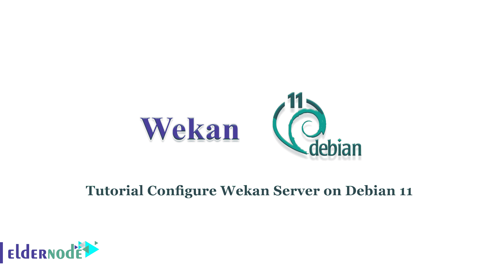

# 教程在 Debian 11 - Eldernode 博客上配置 Wekan 服务器

> 原文：<https://blog.eldernode.com/configure-wekan-server-on-debian/>



Wekan 是一个开源看板应用程序。Wekan 允许您使用基于 Meteor Javascript 框架的虚拟卡来管理日常任务。您可以创建板和卡，并随着您在每项任务中的进展，在列之间移动它们，还可以在 Wekan 的帮助下将与您一起工作的人添加到板上的工作中。这是一个基于网络的工具，类似于 Trello，这就是为什么它很容易改变和使用。在这篇文章中，我们将教你如何在 Debian 11，10 上安装和配置 Wekan 服务器。如果你想购买一台 [**Linux VPS**](https://eldernode.com/linux-vps/) 服务器，你可以访问 [Eldernode](https://eldernode.com/) 中的软件包。

## **如何在 Debian Linux 上安装和配置 Wekan 服务器**

Wekan 允许任何人轻松地使用和修改它。它还允许您将其托管在自己的服务器上，这确保了您可以完全控制您的数据，并可以按照您的意愿操纵它。

### **如何在 Debian 11 | Debian 10 上配置 Wekan 服务器**

你应该更新你的 debian 服务器包:

```
sudo apt update
```

Snap 是一个规范的包管理和部署系统。在此步骤中，您需要借助以下命令安装 snap:

```
sudo apt install snapd -y
```

现在是时候安装 Wekan 了:

```
sudo snap install wekan
```

现在，您需要为 Wekan 配置 web URL 的根目录:

```
sudo snap set wekan root-url="http://your_server_ip"
```

然后，您可以使用以下命令来设置 Wekan http 端口:

```
sudo snap set wekan port=''
```

现在，您应该在 snap 上重新启动 MongoDB 服务:

```
sudo systemctl restart snap.wekan.mongodb
```

然后，您还需要在 snap 上重新启动 Wekan 服务:

```
sudo systemctl restart snap.wekan.wekan
```

您可以运行以下命令来检查状态:

```
sudo ss -tunelp | grep 80
```

在下一步中，您应该在系统引导时启动 Wekan 服务:

```
sudo snap enable wekan
```

现在，您需要通过以下命令安装 MongoDB 工具:

```
sudo apt install mongo-tools -y
```

接下来，您必须重启 Wekan:

```
sudo systemctl restart snap.wekan.wekan
```

最后，您应该重新加载快照:

```
sudo snap refresh
```

### **如何访问 Wekan Web 界面**

注意:要访问 Wekan Web 界面，您应该有一个管理员帐户。为此，首先打开您的 web 浏览器并输入以下 URL:

```
http://ServerIP/sign-up
```

然后，您应该在注册页面上创建一个帐户。

创建帐户后，您可以访问 Wekan Web 界面。

## 结论

本文教你如何在 Debian 11 上安装和配置 Wekan 服务器。使用 Wekan，开发人员或其他团队的项目协作变得更加容易，这提高了团队的生产率，因为工作量在团队成员之间分配，并且在更少的时间内完成更多的工作。安装 Wekan 后，您可以访问仪表板并开始创建和管理卡。