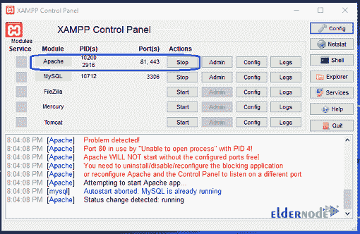

# 如何在 Windows 10 上配置 XAMPP-elder node

> 原文：<https://blog.eldernode.com/configure-xampp-on-windows-10/>

如何在 Windows 10 上配置 XAMPP？在之前的教程中，[对于如何在 Windows 10](https://eldernode.com/install-xampp-on-windows-10/) 中安装 Xampp 进行了充分的讲解。在本文中，我们将教你如何在 Windows 10 中配置 xampp 。有时候，你可能会遇到 Apache 和 MySQL 服务的问题。这就是为什么你需要改变 Apache 和 MySQL 的端口号。要解决这些问题，请继续学习本教程。

您可以从 eldernode 选择您最理想的 [Windows VPS Server](https://eldernode.com/windows-vps/) 软件包。

关注我们的 xampp 配置教程。

## 教程在 Windows 10 上配置XAMPP

**1。** 第一步你需要安装 [Xampp](https://www.apachefriends.org/download.html) 软件。

**2。** 安装后运行 Xampp 。

当您启动相关模块(服务)时，相关模块(服务)的颜色会变成 **绿色** 颜色。

PID 和端口号也将显示给用户。

## 如何修复 Apache 无法在 XAMPP 启动的问题

您可以使用两种方法来解决 Apache 无法在 Xampp 软件中工作的问题:

### A)更改默认的 Apache 端口

**1。T3 第一步，你需要打开 Xampp 控制面板。**

**2。** 第二步，需要点击 Apache 前面的配置按钮。

**3。** 在打开的小窗口中，点击 Apache (httpd.conf) 。

**4。T3 在打开的记事本文件中，按 Ctrl + F ，搜索 Listen 80 。用另一个开放端口(如 81 或 9080)替换 Listen 80。保存文件并重启 Xampp 服务器。**

**5。** 再次运行 Xampp 点击 Apache 前面的开始。

### B)禁用 IIS

**1。** 第一步，你要打开控制面板。

**2。** 点击程序。

**3。T3 点击打开或关闭 Windows 功能打开 Windows 功能窗口。**

**4。在打开的** 窗口中，取消 互联网信息服务，点击确定。

**5。** 重启你的系统。

**6。** 再次打开 Xampp 控制面板，点击 Apache 前面的开始。

另请参见:

**尊敬的用户**，我们希望您能喜欢这个[教程](https://eldernode.com/category/tutorial/)，您可以在评论区提出关于本次培训的问题，或者解决[老年人节点培训](https://eldernode.com/blog/)领域的其他问题，请参考[提问页面](https://eldernode.com/ask)部分，并尽快提出您的问题。腾出时间给其他用户和专家来回答你的问题。

好运。

Goodluck.