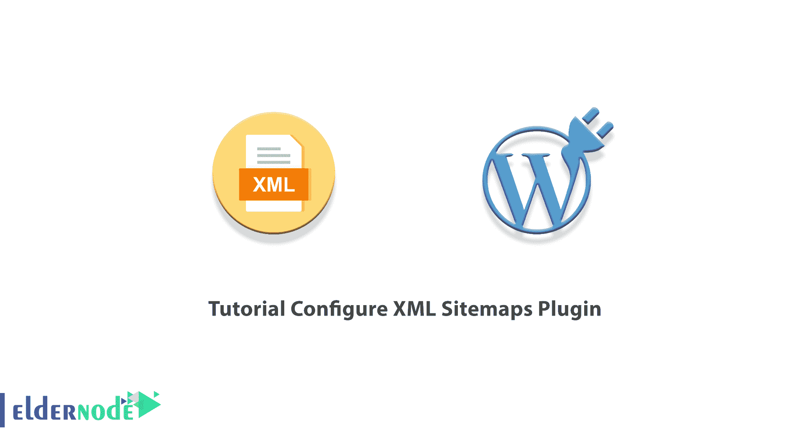
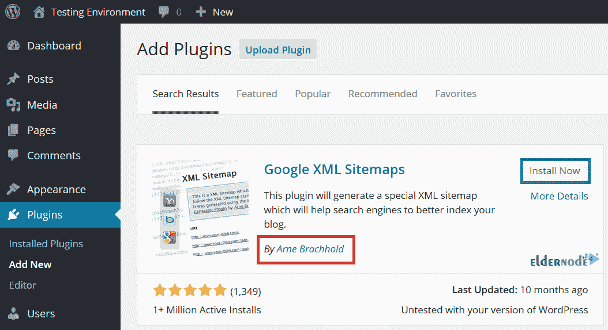
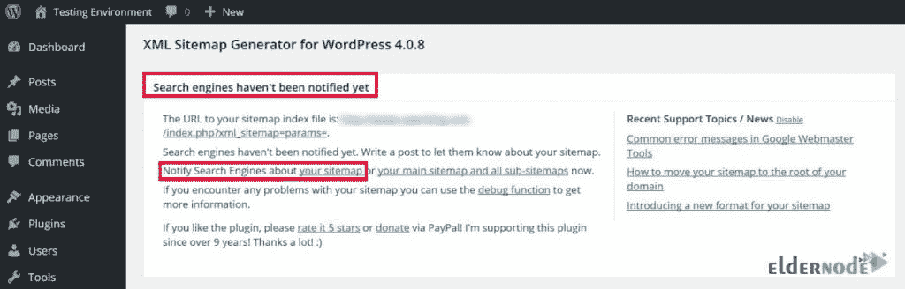
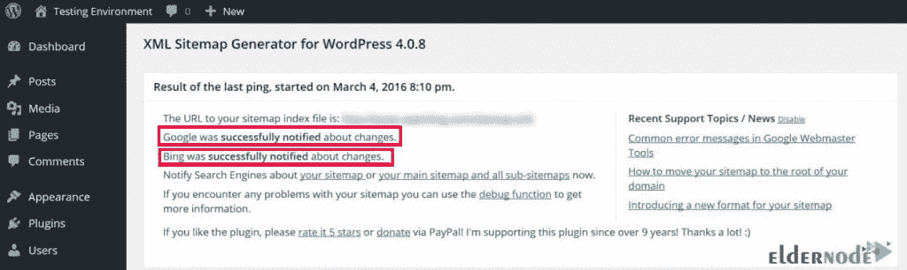
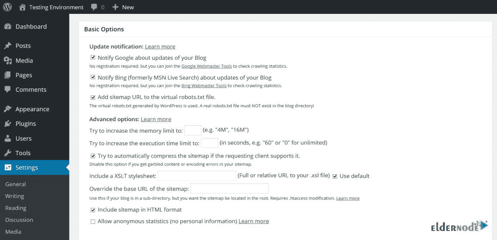
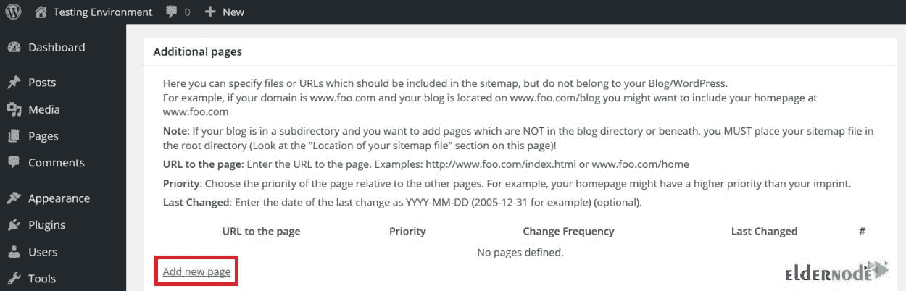
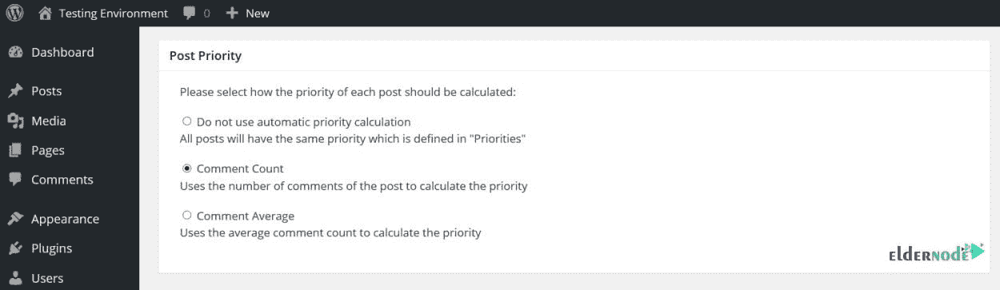
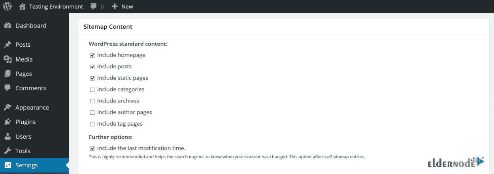
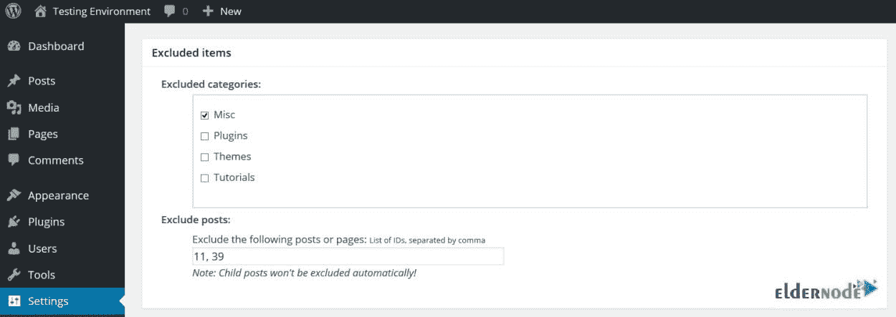
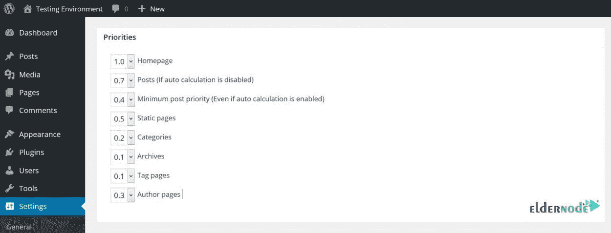

# 教程配置 XML 站点地图插件[2021] - Eldernode 博客

> 原文：<https://blog.eldernode.com/configure-xml-sitemaps-plugin/>



类似于每一个 WordPress 插件，XML Sitemaps 插件被用来改善 SEO。它通过创建特殊的 XML 站点地图，帮助搜索引擎如谷歌、必应、雅虎和 Ask.com 更好地索引你的站点。如果你想通知所有主要的搜索引擎关于你的新内容，XML Sitemaps 插件会在你创建一个帖子后做这件事。使用这个插件可以让你轻松地创建网站地图。此外，你可以不用一个全面的 SEO 插件的包袱来制作网站地图。Google XML Sitemaps 下载量超过 200 万次，是 WordPress 最受欢迎的站点地图插件。加入我们这篇文章来回顾一下**教程配置 XML 站点地图插件**。

## **在 WordPress 上配置 XML Sitemaps 插件的最佳方式**

XML 站点地图插件生成 XML 和 HTML 站点地图。这样，谷歌和其他引擎将索引你的网页和文章。当你开始使用一个站点地图时，爬虫会看到你的站点的结构并且更有效地检索它。它支持所有类型的 WordPress 文章，包括一般文章或任何自定义文章类型。如果你需要一个站点地图，但不想要一个页面搜索引擎优化插件，你应该安装这个插件。

谷歌 XML 网站地图不占太多空间。不管你是不是新手，使用这个插件并不困难，因为选项是不言自明的。

请和我们一起回顾配置 XML 站点地图插件所需的步骤。

## **如何在 WordPress** 中安装 Google XML Sitemaps 插件

为了开始本指南的主要部分，我们假设你以前没有安装这个[插件。这根本不是一个复杂的过程。因此，只需按照下面的路径安装 XML 站点地图插件:](https://blog.eldernode.com/tag/wordpress/)

1-以管理员身份登录你的 WordPress 仪表盘。

2-在左侧面板中，点击插件，点击**添加新的**。

3-在搜索文本框中输入 google **XML sitemaps** 。然后，点击**搜索插件**。

***注意:*** 因为你可能会找到不止一个结果，所以检查一下插件的作者。确保下载正确的插件。XML 站点地图插件的作者是*阿恩·布雷克霍尔德*。

4-找到后，点击**立即安装**。



5-安装成功后，点击**激活插件**链接。

通过这种方式，Google XML Sitemaps 将自动生成您的第一个站点地图，并对您的网站的当前状态进行快照。此外，您可以通过将 **/sitemap.xml** 扩展名添加到您的域来查看您的站点地图。

### **如何配置 XML 站点地图插件**

既然已经安装了 XML 站点地图插件，就可以开始配置它了。导航到**设置** > > **XML-Sitemap** 。由于它附带了一组合理的预配置，您甚至可以保留这些设置。但是如果你配置它，它会工作得更好。请与我们一起向您展示如何根据您的需求进行最佳配置。

首先，当安装完成时，您可能会在屏幕顶部看到一条消息:“**搜索引擎尚未收到通知**”。



要 ping 你的站点地图到两个主要的搜索引擎，如 Google 和 Bing，点击通知搜索引擎关于你的站点地图链接，让你的站点尽快被索引。然后，插件会告诉你 ping 成功了。



接下来，您将学习配置这个插件的七个部分。让我们看看 XML Sitemaps 插件在每一部分都做了什么:

#### **1-基本选项**

该部分将控制基本配置。



建议初学者勾选**谷歌**和**必应**复选框。通过这种方式，您可以决定通知哪些搜索引擎您的网站的更新。因此，在任何新的发布或编辑旧的帖子之后，ping 过程被重复，爬行器被发送来检查更改。

另一个选项是将你的站点地图添加到 ***robot.txt*** 文件中。它与搜索引擎爬虫交流，引导他们浏览你的网站，并告诉他们索引什么。由于 robot.txt 文件对搜索引擎很有用，建议您保持勾选 *robot.txt* 复选框。这样，它会让你在一些额外的搜索引擎中被索引。

然后，您可以向下滚动查看**高级选项**。你可以跳过前两个设置，因为它们是关于内存限制和执行时间的，很大程度上是多余的。再往下，您将被要求配置 XSLT 样式表。

为了让你的站点地图看起来更好，你可以上传一个新的 XSLT 样式表。此外，为了降低“可读性”,可以完全禁用 XSLT。但是请注意，搜索引擎仍然会很好地阅读它。

这一部分中最重要的是“**覆盖站点地图的基本 URL**”。

现在，默认情况下，你的站点地图会出现在 ***/sitemap.xml*** 扩展名下。例如 domain.com/sitemap.xml**T5。**

你把你的网站分成几个子目录。

1 根域名:*domain.com*

2-子目录:*domain.com/blog/*

如果你喜欢在根域站点地图中组合所有的站点地图，你需要在空白字段中输入子目录 URL。

接下来，转到你的根域的 ***。htaccess*** 文件并粘贴以下代码:

```
<IfModule mod_rewrite.c>
```

```
RewriteEngine On
```

```
RewriteRule ^sitemap(-+([a-zA-Z0-9_-]+))?\.xml(\.gz)?$ /your
```

```
blogdir/sitemap$1.xml$2 [L]
```

```
</IfModule>
```

***注意* :** 记得用自己的子目录名替换“ *your-blogdir* ”。

最后一个字段为不太复杂的机器人配置一个 HTML 版本的站点地图，这些机器人不能理解 XML。这将**而不是**适用于任何一个大型搜索引擎，但是，如果你想在任何地方都被索引，请勾选**框**。

#### **2-附加页**

在这一部分，你可以指定额外的外部页面添加到你的站点地图中，这也适用于那些使用子目录和子域的页面。



点击**添加新页面**并按照简单的说明进行操作。然后，指定 URL、优先级、更改频率和上次更改 URL 的日期。

#### **3-岗位优先级**

优先级是网站地图的重要组成部分，因为它们将你最重要的内容传达给了搜索引擎。每个单独的网页都有自己的优先级，分值在 0 到 1 之间，以 0.1 为增量。

如果你现在认为你可以给你所有的 URL 1.0 的最大优先级。这仅仅是一个猜测，而不是更多！

现在，为什么？因为一个 URL 的优先级是相对于其他内部 URL 来判断的，所以你不应该给你的主页和博客文章相同的优先级。因为很明显，不是所有的 URL 都具有同等的价值。



帖子优先级部分查看每个帖子的优先级是如何评分的。如上图所示，有三个选项:

**A)不使用自动优先级计算:**

它对所有帖子一视同仁，稍后分配实际的优先级值。

**B)评论计数:**

如果您选择此选项，将根据帖子收到的评论的绝对数量来计算优先级。

**C)评论平均:**

此选项根据相对于其他帖子的评论数计算优先级。

***注意* :** 当你使用一种基于评论的计算方法时，你的热门帖子将自动获得更高的优先级。

#### **4- Sitemap 内容**

在这一部分，你可以选择你想在你的站点地图中包含的条目、自定义文章类型和分类。



你的个人偏好将决定是否包含你的存档或标签页面，但是包含你所有的 WordPress 文章、页面和自定义文章类型也是理想的。

如果您不希望这些页面出现在 SERPs 中，并且这些页面的价值有问题，最好确保它们被**取消选择**。

您将在该部分的底部看到更多选项。建议您勾选此项，因为它包括上次修改时间。因为如果你不选中它，搜索引擎只会抓取全新的内容，而不是最近编辑过的内容。

#### **5-排除项**

你可以选择你的博客文章来包含在你的站点地图中。因此，在这一部分中，您可以从站点地图中排除整个类别，再加上通过输入 ID 号来排除单个帖子和页面。



#### **6-改变频率**

你在这篇文章的前面读到了频率的变化，它们是给搜索引擎的指导方针，你可以在那里为它们定义值。


改变频率让搜索引擎知道内容改变的频率。这些信息告诉搜索引擎何时需要发送爬虫程序来寻找更新。如果您定期(每天)发布博客内容，建议您设置主页更改频率以反映这一点。但是如果你很少更换你的网站，你可以选择年度选项。选项包括始终、每小时、每天、每周、每月、每年和从不。

***注意* :** 这可能不像时钟一样工作，但变化频率清楚地传达了一种内容相对于其他内容的更新频率。

#### **7-优先级**

前面，您已经了解了邮件优先级。这一部分可以让你对其他内容的重要性进行排名。此外，您需要指定博客文章的最大值和最小值。



因为你的主页可能是你最重要的页面，所以建议你给它最高 1.0 分。然后，静态页面和受欢迎的博客文章很可能是你下一个最重要的页面，所以记得也给它们打高分。

但是，你必须考虑到，不重要的内容不应该得分很高。它稀释了你真正重要的事情的优先级。

## 结论

在本文中，您了解了如何配置 XML 站点地图插件。拥有一个 XML 站点地图来帮助你的站点的 SEO 是非常重要的。你的站点地图会列出你所有的 URL，以及优先级和变化频率。如果你添加了正确的网址，谷歌将很容易访问你最重要的网页和文章。为了更快地索引你想要的文章和页面，你可以改变它们的优先级。此外，您可以将您的 XML 站点地图添加到 Google 搜索控制台，以帮助 Google 快速找到您的站点地图。它允许你检查站点地图的错误。