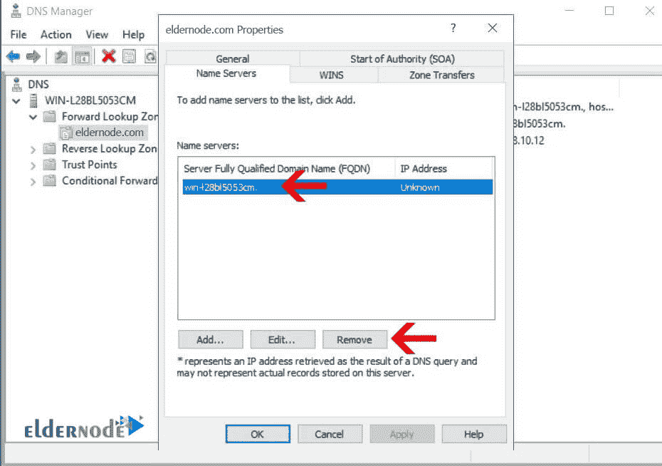

# 如何在 Windows Server 2016 - Window VPS 中将域连接到 DNS

> 原文：<https://blog.eldernode.com/connect-domain-to-dns-in-windows-server/>

如何在 Windows Server 2016 中将域连接到 DNS？在之前的文章中，讲授了 Windows Server 2016 中的 [DNS 服务配置。在同一话题的续篇中，我们将教你如何在](https://eldernode.com/configure-dns-on-windows-server-2016/) [Windows Server 2016](https://eldernode.com/tag/windows-server-2016/) 中连接一个域名到 DNS 。

[**VPS 托管计划**](https://eldernode.com/vps-hosting/)

如你所知，一个域需要一个 DNS 服务来指向网络和互联网上不同的服务器或节点。如果您使用[主机服务](https://eldernode.com/linux-hosting/)，您将能够通过您的 DNS 主机面板配置 [DNS](https://en.wikipedia.org/wiki/Domain_Name_System) 设置。

要安装一个你完全控制的专用 DNS 服务器，你必须在 Windows 或 Linux 上安装 DNS，并最终连接你的域名。

[**购买专用服务器**](https://eldernode.com/dedicated-server/)

关注我们，了解如何在 Windows Server 2016 中将域连接到 DNS。

**1。** 你必须先在你的 Windows Server 2016 上安装 DNS 服务。

**注 1:** 如果您的系统上仍未安装该服务，请参考 Windows Server 2016 中的 [DNS 安装教程。](https://eldernode.com/configure-dns-on-windows-server-2016/)

**2。T3 安装完毕后，打开你的 DNS 管理控制台。**

**3。在控制台的** 中，右击前进区，选择新区。

**4。** 在第一页选择主区域，点击下一步。

**注 2:** 如果该服务器作为第二台 DNS 服务器安装，则必须使用二级区，并经历不同的步骤。

**5。** 在这一部分，完整输入您的域名。

**6。** 在这里指定你的区域文件的名称，点击下一步。我们建议您跳过这一部分，不做任何改动。

**7。** 最后选择不允许动态更新，点击下一步。

接下来我们将设置你的域名或域名服务器。

## 在 Windows Server 2016 中的 DNS 中设置名称服务器

**1。先点击**的，进入专区到**打开**里面的内容。

**2。** 现在**在空字段上右击**，选择新主机。

**3。** 在打开的窗口中，输入单词 **ns1** 作为名称，并输入您的服务器的 IP 地址。

同样，您可以将一个或多个其他 NS 添加到您的服务器或另一台服务器。

**4。** **右击区域上的**，选择属性。

**5。** 转到名称 服务器选项卡。

**6。删除**所有预设的 NS 。

**7。** 现在点击添加，输入你的 NS 名字，并在**底部**添加其地址。然后点击确定。

**8。** 用同样的方法添加其他 NS 。

在本节中，完成了 Windows Server 2016 中与将域连接到 DNS 相关的设置。

现在你需要通过你的域面板**配置**你的子 DNS 和域名服务器，等待根 DNS 更新，直到你的域的所有 DNS 设置都在 Windows Server 2016 上。

**尊敬的用户**，我们希望您能喜欢这个[教程](https://eldernode.com/category/tutorial/)，您可以在评论区提出关于本次培训的问题，或者解决[老年人节点培训](https://eldernode.com/blog/)领域的其他问题，请参考[提问页面](https://eldernode.com/ask)部分，并尽快提出您的问题。腾出时间给其他用户和专家来回答你的问题。

祝你好运。