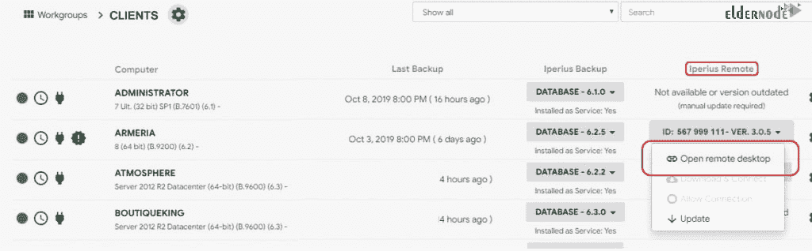

# 如何在 Windows 10 上连接 Iperius 远程桌面- Eldernode

> 原文：<https://blog.eldernode.com/connect-iperius-remote-desktop-on-windows-10/>

教程如何**在 Windows 10 上连接 Iperius 远程桌面**。Iperius Remote 是一款软件，您可以使用它进行技术支持和远程连接。你可以用它连接到 [Windows](https://blog.eldernode.com/tag/windows/) 个人电脑和服务器。比如买了自己的 [Windows 10 远程桌面](https://eldernode.com/windows-10-rdp/)之后。

## 教程在 Windows 10 上连接 Iperius 远程桌面

Iperius Remote 被称为 Iperius 软件套件的工具之一。您可以使用其备份来保护数据免受故障、盗窃和勒索病毒的影响，或者通过 Iperius Storage 将您的数据保存在云中。如果您需要监控您的备份和 IT 基础架构，请使用 Iperius 控制台。在本文中，您将学习如何通过 **Iperius Remote** 远程控制任何 PC 或服务器，并为客户提供远程支持。

## 为什么选择 Iperius(Windows 10 上的 Iperius 远程桌面)

公司对使用免费许可证和低成本许可证软件感兴趣，这有助于他们通过远程连接向客户提供技术支持。使用 Iperius，您可以享受一些功能，如无人值守的自动连接、文件传输和多重连接的可能性。为了能够共享远程计算机和联系人的地址簿，访问权限和多个操作员的管理，以及详细的连接统计，请使用专业版。

## Windows 服务器上的 Iperius 功能

在下面的列表中找到 Iperius 的主要功能:

**1-** 用于 Windows PC /服务器的远程控制

**2-** 也适用于 Android 和 iOS

**3-** 无防火墙配置

**4-** 技术支持和协助的理想选择

**5-** 多重连接

**6-** 集成式多用户聊天

**7-** 双向文件传输

**8-** 加密与安全 HTTPS 协议

**9-** 作为 Windows 服务安装

**10-** 自动和无人值守连接

**11-** 不限目的地的计算机

**12-** 计算机和公司的共享列表

**13-** 组和操作员的管理

**14-** 粒度访问权限管理

**15-** 连接的详细统计

**16-** 定制贵公司的徽标和信息(全面更名)

## 激活和使用 Iperius 遥控器

你可以使用 Windows 平台、Android 或 iOS 应用程序。您可以使用 Iperius 的免费软件作为远程桌面和远程支持。

**但是**在开始学习如何使用之前，我们先来看看使用**免费**软件版本时有哪些**限制**？

当您打开一个远程桌面会话时，您将无法同时拥有显示远程计算机的共享**地址簿**。此外，你不能考虑一些不同的**运营商**账户，这些账户在有几个人提供远程支持的公司中非常有用。如果你期望它提供给你**统计数据**，并让你知道所有连接的数量和持续时间，按远程计算机、组或操作者划分，这是不能令人满意的。

## 使用商业版你会有什么便利？

如果您使用这个版本，您将拥有一个完整的**行政管理仪表板**，它允许您创建计算机组，将远程计算机分配到特定的组，创建多个操作员帐户，并为每个帐户管理组和计算机的**权限**。

## 如何使用 Iperius 控制台的远程连接

正如您在本教程开始时所回顾的，Iperius 控制台允许使用 Iperius Remote 进行远程桌面连接。那么，让我们看看如何使用 Iperius 套件的远程支持产品作为插件。第一步是使用 Iperius 控制台的 **Windows 应用程序，该应用程序在门户网站和软件中都有提供。**

安装并打开程序时，系统会提示您输入凭据。

## 如何将**电脑添加到 Iperius 控制台**T3

您需要在远程计算机上安装**控制台代理**软件，以便能够向 Iperius 控制台监控的计算机添加新计算机。购买后，您会收到一个安装 Iperius 控制台代理所需的许可证代码，以及要插入计算机的“工作组”的名称。Iperius 控制台完全负责管理与每个组相关的用户和计算机的“工作组”。有了这个软件，您将及时配置**具体操作的查看和执行权限**。要查看上次备份的列表和一些重要的统计数据，您可以转到控制面板。从侧面菜单中，我们可以访问各个工作组，然后访问相关的计算机。

所有连接的远程计算机都可以实时查看系统状态，包括已用磁盘空间、防病毒和防火墙的正确安装、当前使用的 RAM 和 CPU 以及活动进程等信息。在下图中，您可以看到一台已连接的计算机，其中有一些关于系统状态的警告。单击计算机名。

此时，您可以转到常规设置并选择 Iperius 远程可执行文件的路径:

Iperius Remote executable

## 是否需要更新！

将 Iperius Remote 和 Iperius 控制台代理更新到受监控计算机上可用的最新版本，以确保所有操作都正确。

## 电脑和 Iperius 远程菜单

为了能够使用特殊菜单访问各种功能，所有安装了 Iperius 控制台代理和 Iperius Remote 更新版本的计算机都将显示一个按钮，显示 Iperius Remote 的状态。

接下来，在您想要连接到远程桌面的计算机行上，单击显示 Iperius Remote is 的按钮。将打开一个包含各种项目的下拉菜单，根据该计算机上 Iperius Remote 和 Iperius 控制台代理的状态启用或禁用这些项目。

条目如下:

1.  打开远程桌面
2.  下载并连接
3.  允许连接
4.  更新

**注**:使用 Iperius 控制台，您可以从一个界面监控多台计算机和服务器。这是这个软件的主要功能之一。在硬件和软件方面，监控主要关注备份的**状态**和**系统的健康和安全**。此外，通过使用 Iperius 控制台，您将能够监控防病毒和防火墙的存在、磁盘上的已用空间、RAM 和 CPU、正在运行的进程等。

结论

在本文中，您学习了如何在 Windows 10 上连接 Iperius 远程桌面。正如您所看到的，Iperius 控制台是一个非常强大的多功能 IT 资产监控工具。此外，您可以阅读更多关于[如何对远程桌面](https://blog.eldernode.com/troubleshoot-remote-desktop/)进行故障诊断的信息。

In this article, you learned How To Connect Iperius Remote Desktop On Windows 10\. As you reviewed, Iperius Console is a very powerful versatile IT asset monitoring tool. Also, you can read more on [How to troubleshoot Remote Desktop](https://blog.eldernode.com/troubleshoot-remote-desktop/).