# 教程在 RDP | Eldernode 上连接 ISL 在线远程桌面

> 原文：<https://blog.eldernode.com/connect-isl-online-remote-desktop-on-rdp/>

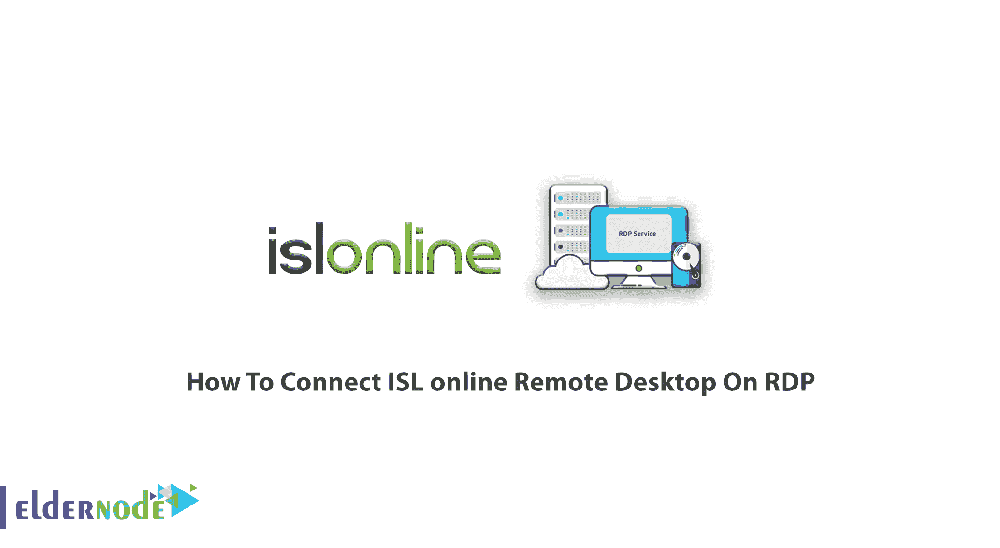

教程如何在 RDP 管理员上**连接 ISL 在线远程桌面。时间是交流中最重要的因素。公司试图让他们的客户更容易加入支持会议。为了节省您的时间，请购买您自己的 [RDP 管理员](https://eldernode.com/buy-rdp/)，享受您的管理员权限和我们的 24 小时支持。**

## 如何连接 RDP 上的 ISL 在线远程桌面

自 2001 年以来，ISL(**I**internet**S**service**L**ayer)被发现，并仍然作为技术最先进的[远程桌面](https://eldernode.com/admin-rdp-server/)解决方案之一，适用于 [Windows](https://blog.eldernode.com/tag/windows/) ，Mac，Linux，iOS，Android 和 Windows 10 Mobile。请阅读本文，了解在 windows 上连接 ISL 在线 RDP 的方法。

## 如何通过 Web 连接 ISL 在线远程计算机

首先，让我们看看如何通过网络连接。看看下面成为专家的步骤。

### 第一步:登录

当您按下右上角的“登录”按钮时，您将能够使用您的 [ISL](https://www.islonline.com/) 会议代理帐户登录，如下所示。

**注意**:在访问 http://localhost/ address 的登录页面时，记得用 *localhost* 替换您相应的服务器地址。

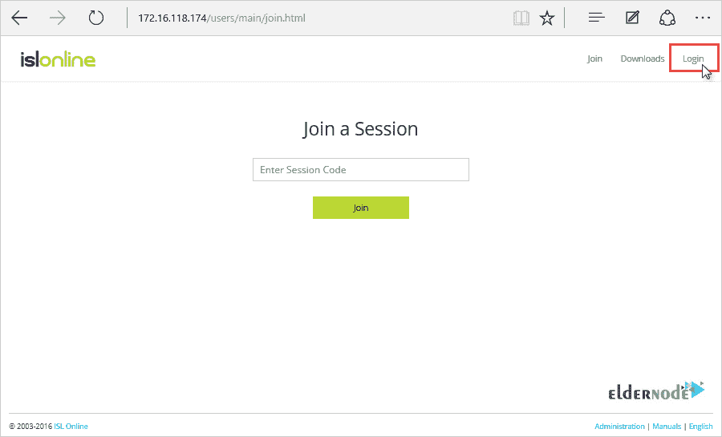

### 第二步:用户名和密码

如下图所示，是时候输入 ISL 会议代理管理员提供给您的用户名和密码了。然后，点击**“登录”**。

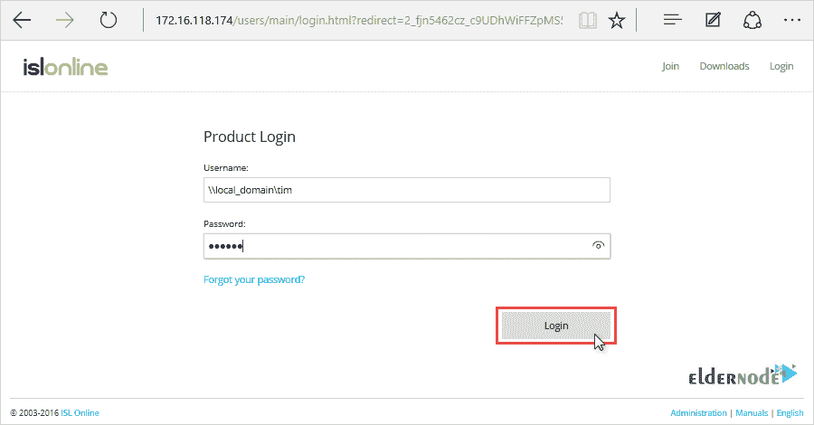

Recommended Article: [VPS vs VPN](https://blog.eldernode.com/vps-vs-vpn/)

### 第三步:远程访问页面

登录后，点击**“远程访问”**选项卡。

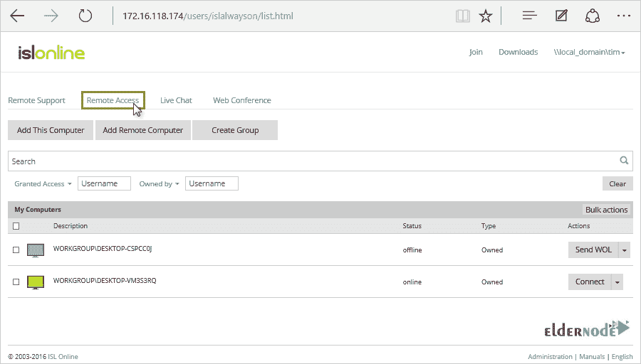

### 第四步:过滤你的电脑

要更快地找到所需的计算机，您可以根据用户对计算机的访问权限和所有者来筛选计算机。

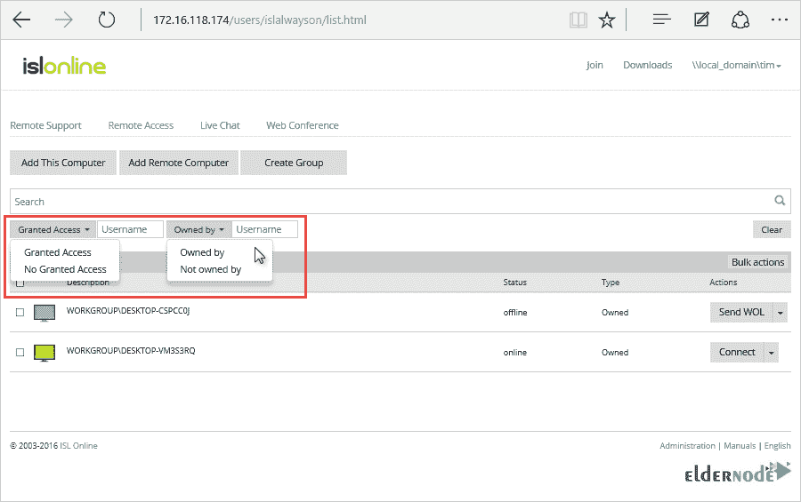

### 第五步:连接电脑

在此步骤中，您需要点击您希望连接的计算机旁边的**“连接”**按钮。

注意:您也可以选择**保存**并保存可执行文件以备后用，例如，将它放在您的桌面上并将其重命名为一个更友好的名称

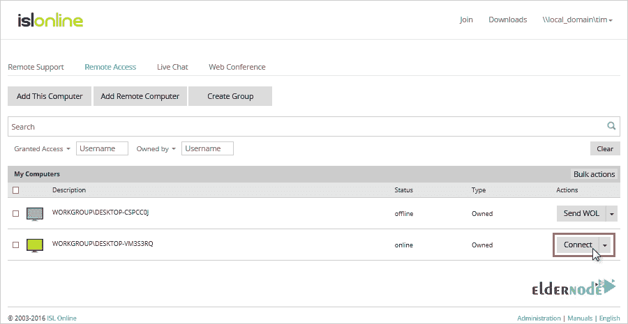

### 步骤 6:启动 ISL 灯

并且，要启动 ISL Light 可执行文件，请单击**“运行”**。

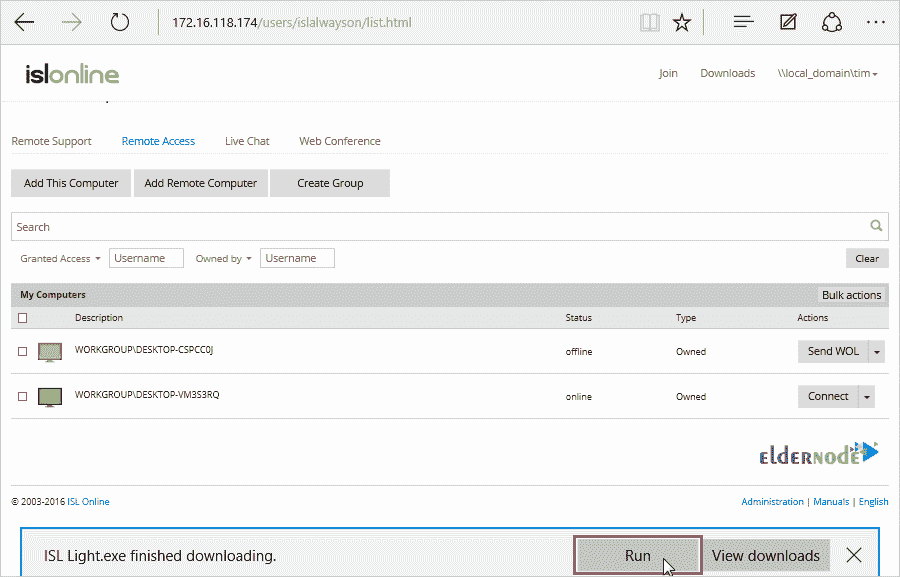

### 步骤 7:开始会话

最后，在最新一步，提示您输入电脑的访问密码，点击**“连接”**。如果密码正确，会话将自动开始。

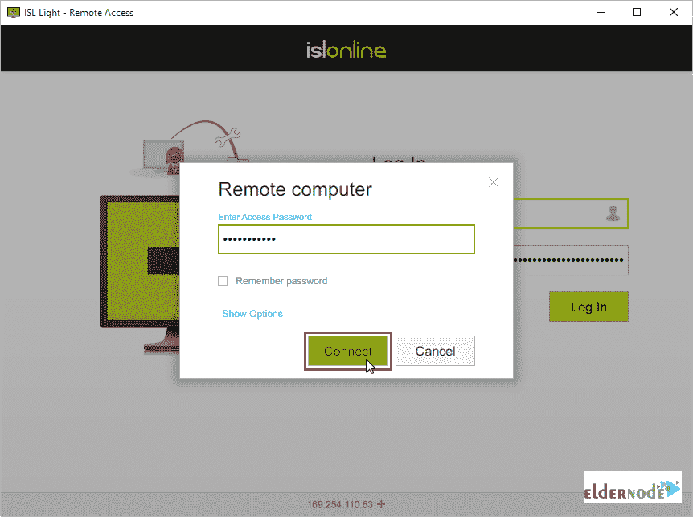

**W** 当您希望访问远程计算机时，只需**双击**您桌面上的可执行文件，在提示时输入适当的用户名和密码，然后计算机访问密码就会与您连接——无需每次都访问您的 ISL 会议代理的产品页面。

**I** 如果您指定用户名、密码和计算机密码，您将获得一个单击式解决方案，该解决方案可以连接到某台 ISL AlwaysOn 计算机，而无需事先输入任何凭据或登录到您的用户。

### 如何使用命令行进行 ISL 连接

ISL AlwaysOn Connect 可以使用命令行参数，从而允许您跳过密码输入表单。可用的参数有:

**1- connect-uid**

如果需要，您可以使用它来传递目标机器所需的惟一 id

**2-用户名**

您可以使用它来提供您的 ISL 在线用户名，例如\\local_domain\tim

**3-密码**

您可以使用它来提供您的 ISL 在线密码

**4-电脑-密码**

您可以使用它来提供计算机访问密码

**5-电脑-密码-MD5**

您可以使用它来提供注册表中写入的原始计算机访问密码-检查**HKEY _ LOCAL _ MACHINE \ SOFTWARE \ ISL Online \ ISL AlwaysOn \ password**

**6 流选项**

您可以使用它来启用列表中所需的复选框[用分号分隔]，例如 small _ foot 离开 _ 背景；

## 如何将 ISL 在线远程与 RDP 连接

在这一部分，您将回顾六个步骤，以了解如何将 ISL online remote desktop 与 RDP 连接起来。但是请考虑到**步骤 1** 和**步骤 2** 显示了一个全局设置，允许 RDP 连接到所有连接到您的 ISL 会议代理的 ISL AlwaysOn 计算机。所以，如果你想只为一台特定的电脑启用 RDP 连接，直接跳到 s **步骤 3** 。

### 步骤 1:登录 ISL(服务器端)

首先，您需要打开“配置”下的“ISL AlwaysOn 设置”,因此，请登录到您的 ISL 会议代理配置页面来执行此操作。

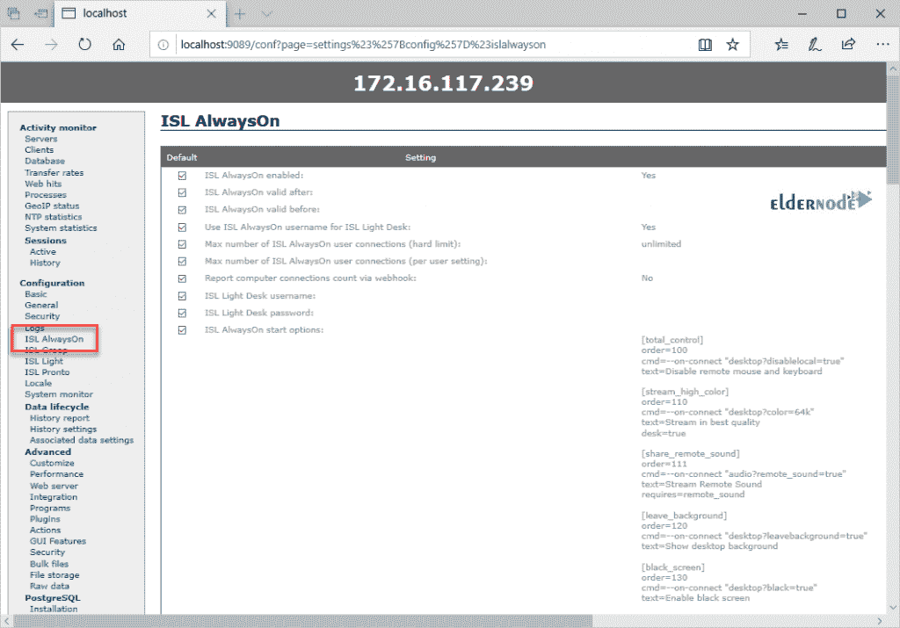

### 步骤 2:允许隧道连接(服务器端)

如下图所示，找到以下设置:允许隧道连接(需要重新连接)并将其设置为**是。**点击页面底部的**保存**应用更改。

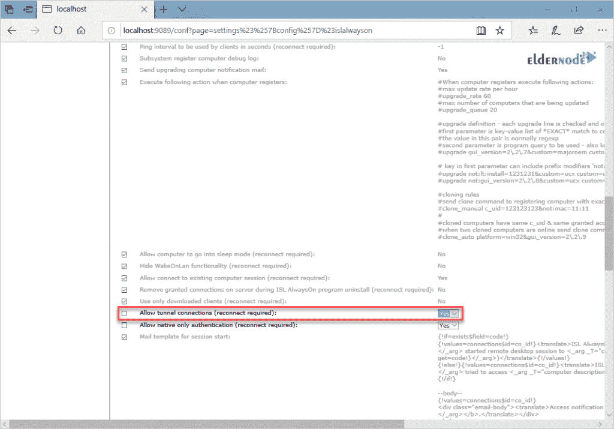

**注意**:需要重新连接通知意味着 ISL AlwaysOn 客户端需要重新连接到 ISL 会议代理服务器，以便更改变得可见。重启服务的最快方法是在客户端的管理命令提示符下使用以下命令:

***网站 ISL _ only _ on***依次为 ***网站 ISL _ only _ on***

### 步骤 3:隧道连接

在这一步中，您应该打开 ISL AlwaysOn 中**高级**设置下的**隧道连接**，并确保“**允许隧道连接(RDP、SSH)** ”复选框被选中。

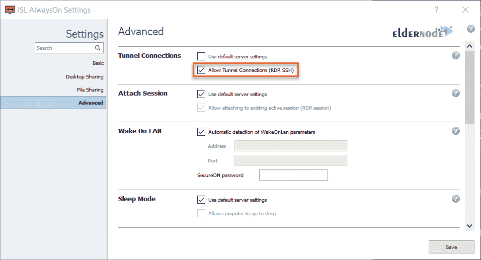

**注意**:在上面的例子中，没有勾选“**允许隧道连接(RDP，SSH)** ”复选框，因为我们不允许 ISL 会议代理中的隧道连接(步骤 1 和 2)。要为此特定计算机启用隧道连接，您必须取消选中“**使用默认服务器设置**”**，然后勾选“**允许隧道连接(RDP、SSH)** ”复选框。**

### **第四步:选择 RDP**

**要选择 **rdp** 选项，点击“**动作**按钮，然后点击“**通过…** 连接”**

**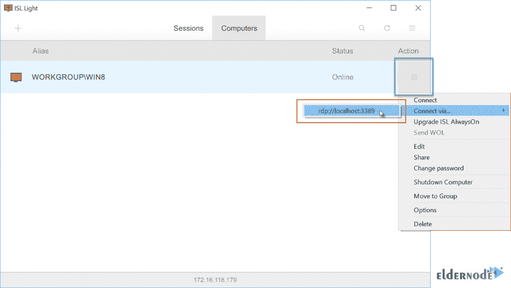**

### **步骤 5:无头和自动化连接**

**要成功通过此步骤，请输入计算机访问密码，然后单击“连接”。首先，到远程计算机的连接将以无头模式建立，这意味着在本地或远程端没有任何接口，因为该连接仅用作 RDP 的隧道。那么 RDP 会话将自动开始。**

**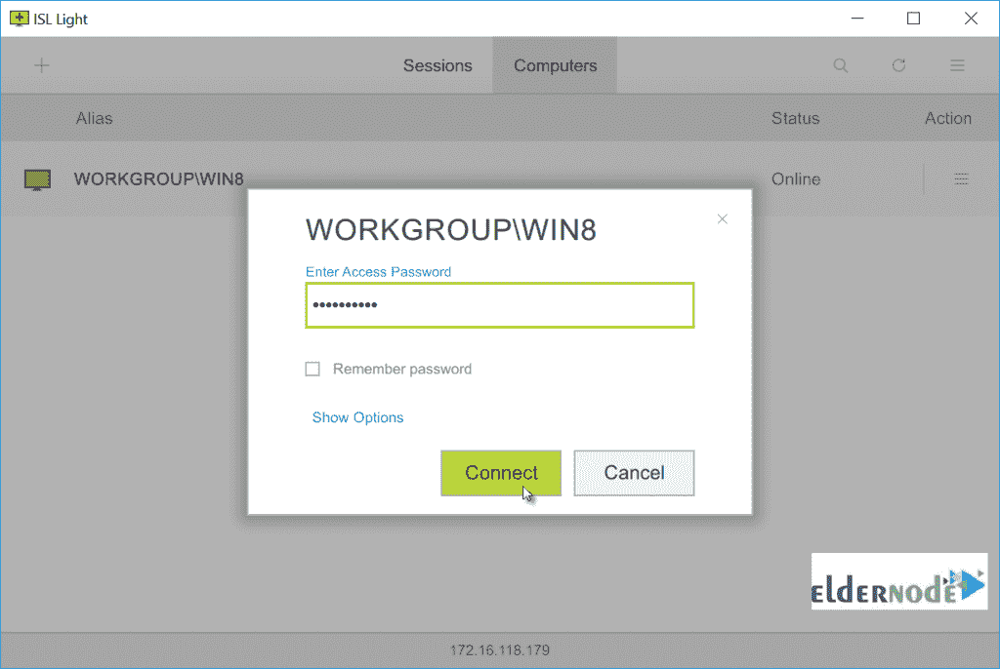**

****注意**:要使用此功能，必须启用远程计算机上的 RDP 连接。**

### **第六步:使用远程计算机**

**Connect to the remote computer using the **RDP **interface as you normally would if the computer was on your local network.**

## **结论**

**在本文中，您学习了通过 **web** 和 **RDP** 连接 ISL online Remote Desktop 的两种方式。现在，您可以在不到一分钟的时间内为远程工作配置您的办公室计算机。从家里或移动设备安全地访问您的办公室计算机。此外，你可以阅读更多关于在 windows 10 中启用远程桌面的 [4 种方法。](https://blog.eldernode.com/4-ways-to-enable-remote-desktop/)**