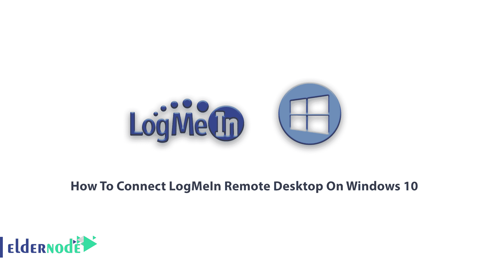
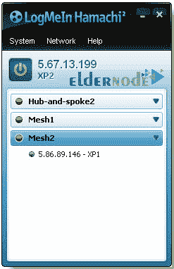
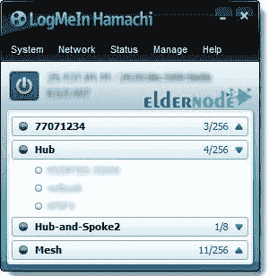
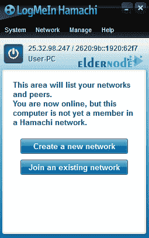
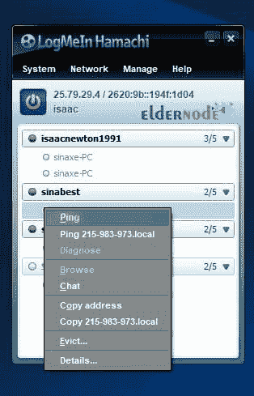
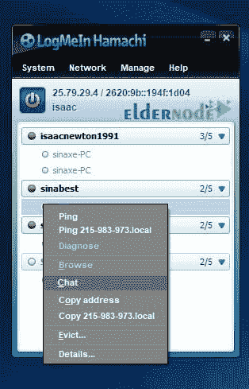

# 如何在 Windows 10 远程桌面上连接 log mein-elder node

> 原文：<https://blog.eldernode.com/connect-logmein-remote-desktop-on-windows-10/>

教程如何在 Windows 10 上**连接远程桌面中的 LogMeIn。logmein hamachi 是一个创建安全和私有网络的有用程序。这个程序在互联网上为你提供一个虚拟的、安全的私人网络。该程序具有良好的用户友好界面和简单的环境。logmein hamachi 应用程序使那些希望通过互联网与朋友一起体验私人和安全网络的用户成为可能，用户可以在那里玩游戏和聊天，共享文件并参与任何其他活动。**

## 教程在 Windows 10 远程桌面上连接登录信息

在这篇文章的后续部分，我们试图让你熟悉 logmein hamachi 程序及其特性。我们也会告诉你使用 Hamachi 程序时的要点。如果你需要在系统间进行远程通信，你可以使用 [Eldernode](https://eldernode.com/) 中 [Buy RDP](https://eldernode.com/buy-rdp/) 可用的软件包。

## 介绍 LogmeIn hamachi 计划

Hamachi 程序已经被用户用来在互联网上创建一个虚拟专用网络。通过订阅这个程序，用户可以创建网络，甚至连接到现有的网络。当程序运行时，IP 被分配给用户。用户在这个程序的主要部分可以连接到其他网络，或者他们可以创建自己的网络，并受益于这个程序的良好功能。

使用 Hamachi 程序，您可以在互联网上为在线游戏创建一个局域网，并轻松地与您的朋友一起玩游戏。这个程序在您的计算机和其他计算机之间创建一个安全的在线网络，它与本地或家庭网络没有什么不同。在下图中，您可以看到连接到 logmein hamachi 中创建的网络的用户。

这个程序像游戏网一样工作，你可以像一个网络一样一起玩。唯一的区别是在互联网上运行。该程序具有良好的用户界面，简单和友好的用户环境，并在其主窗口中显示所提到的两个主要操作，以便用户可以方便地使用所提到的两个主要操作。它就像一个服务器和客户端，你可以管理网络和与你的朋友聊天。除了聊天，你还可以玩网络游戏和分享你的文件。

### 凉拌面的特点

在互联网上建立一个安全的虚拟网络并管理它

B- 有一个良好的用户友好的界面

运行网络下的游戏

**D-** 用户从中央网关访问

**E-** 与朋友和其他成员聊天的能力

**F-** 快速发送虚拟网络客户端软件到新的远程计算机

**G-** 为自己和个人进行网络配置和设置

**H-** 从任何地方通过互联网点击鼠标，为最终用户管理和修复虚拟网络

**I-** 使用 256 位 SSL 加密在公共和私有网络上建立安全通信的能力

**J-** 将网络中的所有用户相互连接的能力

**K-** 用户访问特定计算机的能力

**L-** 共享文件的能力

**M-** 在一个地方控制所有网络的消费和访问

**N-** 管理和检索网络的能力

**O-** 设置密码的能力

**P-** 指定加密连接的能力

**Q-** 网络下玩游戏

**R-** 共享打印机等资源

## 了解 Windows 10 服务器远程桌面上的 Connect log mein

安装 Hamachi 程序后，该程序将从 Hamachi 服务器获得一个有效的 IP。通过创建一个虚拟的内部网络，将您的朋友连接到同一个网络，这样您就可以远程相互连接。该程序设计用于在运行两个主要操作时轻松访问，一个是构建网络，另一个是连接到网络。用户可以很容易地使用这两个动作。根据您的目标，您应该选择以下选项之一。

**1。**创建网络并邀请您的朋友加入创建的网络。

**2。**你的朋友建立了一个网络，你连接到这个网络。

在程序的主要部分，如果你想创建一个网络，选择选项创建一个新的网络。指定网络名称和密码以连接到网络。如果要连接到网络，必须选择第二个选项，即加入现有网络。窗口出现后，您必须键入网络名称和密码并连接到该网络。

### 使用 Hamachi 程序的要点

**1。**要顺利连接到网络并在开放局域网列表中找到该网络，您应该使 Hamachi 网络硬件(**虚拟网卡**)成为网络的优先级。

进入**开始菜单** / **控制面板** / **网络和共享中心**。

出现**网络和共享中心**窗口后，在**左侧菜单**中，点击**更改适配器设置**显示网络列表。

然后从**高级**菜单中选择高级设置。如果不在列表中，按键盘上的 **ALT** 键调出弹出菜单。

在打开的窗口中，点击 **Hamachi** 并用向上箭头将其置于列表顶部。

**2。**禁用 Windows 防火墙和杀毒。

**3。**要测试您的系统和您的朋友系统之间的连接，右键单击您的朋友列表并选择 **Ping** 。如果程序超时，这意味着两个系统之间没有连接，没有数据交换。但是如果超时程序不起作用，两个系统之间的连接就建立了。其他系统之间的这种通信必须是正确的，否则你会遇到问题。

**4。**要与群组成员聊天，可以在**滨口**程序列表中右击其名称，选择**聊天**。对于群组聊天，右键单击群组所连接的网络名称，选择**聊天**，开始聊天。

**5。**在 Hamachi，只有 5 个系统可以联网在一起，但一个拥有服务器的人可以创建几个 Hamachi 网络，并通过构建服务器将其余的连接到其网络。

**6。**服务器的速度和互联网对网络的延时和牵引力影响很大。哈玛奇的潜伏期在 50 到 140 之间。因此，如果网络连接的数量增加，服务器的速度和牵引力必须很高，以便能够无延迟地建立连接。所以人越多，潜伏期就越高。

7 .**。**配置 Hamachi 应用程序设置，以便不是所有您共享的驱动程序都显示给那些您不认识的人。您甚至可以禁用共享。

**8。**您可以在具备局域网功能的游戏中使用 Hamachi 程序。像游戏将军，魂斗罗等。

#### 结论

Logmein 软件对多达 16 台电脑是免费的，但超过 16 台电脑就要付费了。logmein 实际上是一种 vpn 网络，在这里你可以远程访问共享信息。在本文中，在介绍了 logmein 软件之后，我们尝试了如何在 Windows 10 上连接 LogMeIn 远程桌面。