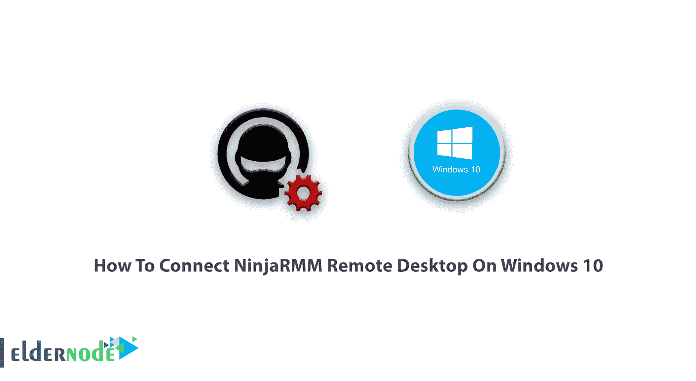
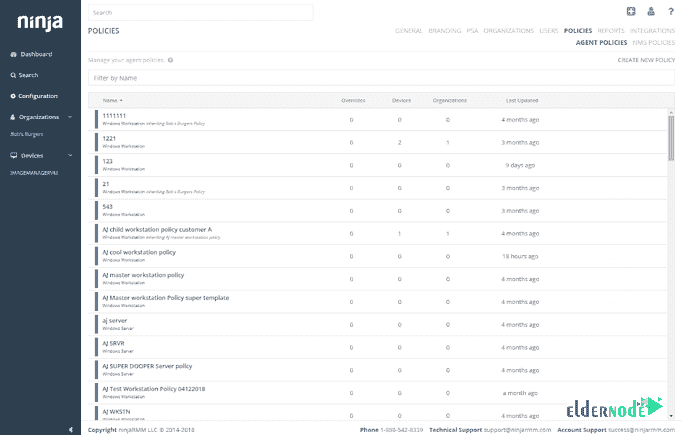
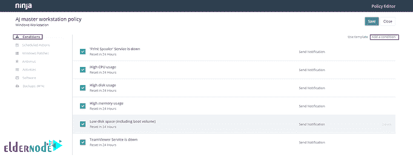
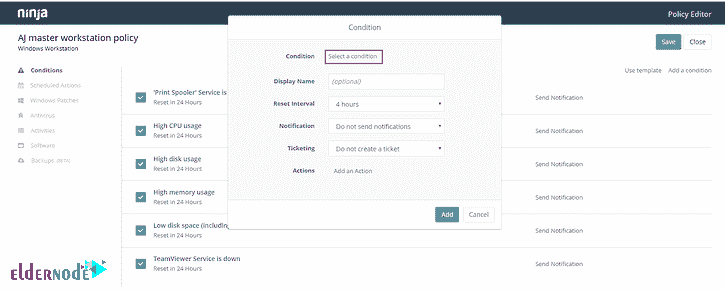
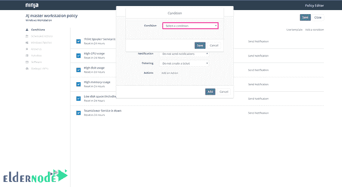
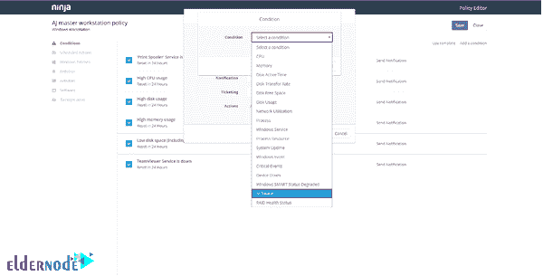
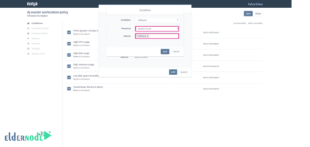
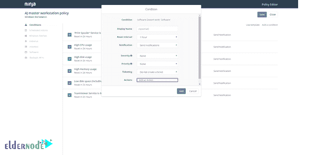
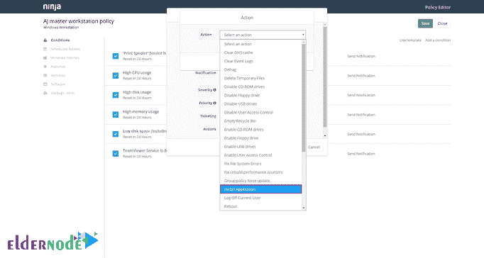

# 教程在 Windows 10 上连接 NinjaRMM 远程桌面- Eldernode

> 原文：<https://blog.eldernode.com/connect-ninjarmm-remote-desktop-on-windows-10/>

教程如何**在 Windows 10 上连接 NinjaRMM 远程桌面**。远程桌面或 [RDP](https://eldernode.com/buy-rdp/) 用图形界面帮助用户通过网络连接到另一台计算机，由微软开发。Windows 10 是最新的微软 [Windows](https://blog.eldernode.com/tag/windows/) 桌面版。您可以通过 [Eldernode](https://eldernode.com/) 24 小时支持和特别优惠购买 [Windows 10 远程桌面](https://eldernode.com/windows-10-rdp/)。

## 如何在 Windows 10 上连接 NinjaRMM 远程桌面

在下面的介绍远程桌面软件的教程中，我们将回顾 Ninja RMM 及其功能。当您连接到 Windows 10 上的 NinjaRMM 远程桌面时，您会看到它允许您从单一控制台访问 Windows 和 Mac 端点。好消息是，您不需要学习新工具或记住额外的登录来管理您的所有终端。使用此遥控器，您只需轻轻一点，即可控制有人值守或无人值守的终端，而且开箱即用，几乎无需任何设置。请随意使用 Splashtop、TeamViewer 或 [RDP](https://eldernode.com/buy-rdp/) ，因为 Ninja RMM 保证了快速、安全和稳定的连接，以帮助您更快地完成任务。

## 了解 Windows 10 上的 Connect NinjaRMM 远程桌面

### **什么是 RMM 软件？**

**R** emote **M** 监控和 **M** 管理用于从远程终端和网络收集信息，以评估其健康状况，并在不中断的情况下对其执行各种远程 IT 管理任务。作为托管服务提供商，您可以将此软件作为一个很好的解决方案。你在哪里并不重要，这些专业人士会为你提供 IT 支持。他们需要一种快速、可靠的方式来做到这一点，而不必亲临客户办公室提供现场支持。

### 忍者 RMM 的特点和优势

It 提供商使用 RMM 软件作为一种快速、安全的远程桌面软件来转变他们的运营，使他们更高效、更有效，并且在 MSP 的情况下更有利可图。让我们看看这些好处到底是什么。

**1-** 从一个中心位置实现全面的可见性和控制

**2-** 通过单一平台实现全面的 IT 管理

**3-** 自动化使支持变得可扩展

**4-** 主动支持而非被动支持

### 如何保护您终端的安全

通过安全的远程访问保护您终端的安全。由于所有远程会话都受到 TLS 和 256 位加密的保护，您可以确保终端的安全性。

### 如何在 NinjaRMM 中添加应用

要添加新的应用程序，您应该在策略设置中设置一个条件。让我们看看如何进行设置。

首先，转到 NinjaRMM 策略，为您想要确保安装了特定软件的设备选择相关策略。

然后，你应该点击**添加一个条件**，让它弹出一个带有选项的弹出框。

在这一步中，尝试点击选择一个条件。

如下图所示，会出现一个下拉菜单

现在是选择软件的时候了

当您看到下拉菜单显示**显示框**时，您可以选择检查软件是否不存在或已经存在于设备上的条件。之后，您需要为动作添加一个名称标签；单击保存。

在下一个下拉菜单中，您可以为条件添加一个**显示名称**和**重置互联网**。如果您急于发送通知，您可以选择严重性和优先级，如果您想使用 PSA 集成添加票证，也可以选择。

接下来，您只需单击添加操作。

通过下一个下拉菜单，您将看到所有可供选择的操作。

如果你看下面的图片，你可以看到你可以选择架构，添加上传文件，名称，MSI 或 EXE 下载的网址，你也可以添加参数的命令行功能，你也可以选择是否要运行作为系统或作为当前用户。

结论

在本文中，您学习了如何连接 NinjaRMM 远程桌面。Ninja 更容易，与你想要的工具集成得更好。从现在起，您可以在其网站上将该软件用作云基础，并在您的 Windows 上安装代理，以将您的数据发送到网络基础。如果您有兴趣阅读更多内容，请查看我们关于如何在 Windows 10 上连接 Teamviewer 远程桌面的文章。

In this article, you learned How To Connect NinjaRMM Remote Desktop. Ninja is easier and integrated better with the tools you want. From now on, you can use this software on its website as a cloud base and install the agent on your Windows to send your data to the web base. In case you are interested in reading more, find our article on [How to Connect Teamviewer Remote Desktop On Windows 10](https://blog.eldernode.com/how-to-connect-teamviewer-remote-desktop-on-windows-10/).