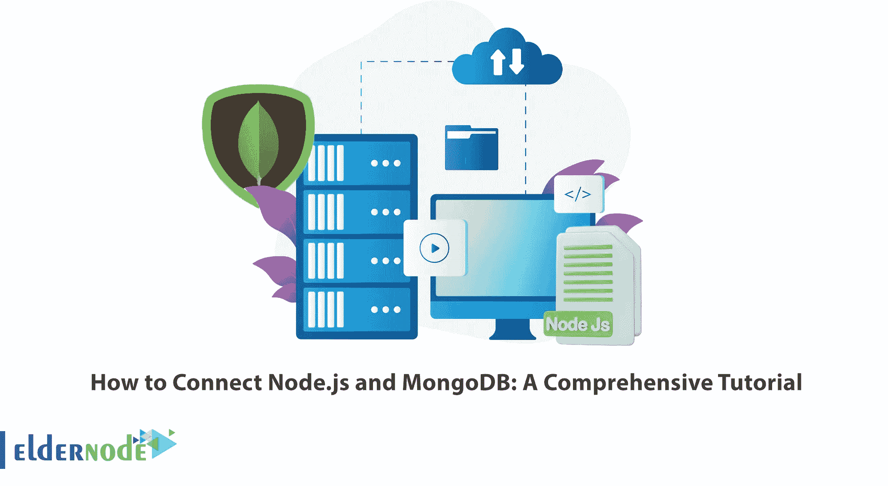

# 如何连接 Node.js 和 MongoDB:综合教程

> 原文：<https://blog.eldernode.com/connect-node-js-and-mongodb/>



由于其存储和查询的类型，MongoDB 数据库一直很受 Node.js 开发人员的欢迎。在本文中，我们打算全面教您如何连接 Node.js 和 MongoDB。如果您想[购买 VPS](https://eldernode.com/vps/) 服务器，您可以访问 Eldernode 网站上提供的各种计划。

## **教程连接 Node.js 和 MongoDB**

### **node . js 是什么？**

Node.js 是基于谷歌 Chrome JavaScript 引擎(V8 引擎)的服务器端平台。节点。JS 提供了运行用 JavaScript 编写的程序所需的一切。

Ryan Dahl 先生介绍了 Node。JS 来展示 JavaScript 比仅仅用于前端动态网页更强大。事实上，在 Node.js 的帮助下，JavaScript 编程语言正在服务器环境中执行，而不是在浏览器中。Node.js 允许您轻松简单地编写可伸缩的大型网络应用程序。

自 1995 年以来，JavaScript 一直在发展。虽然这种语言直到很久以前才在服务器端成功出现，并且程序员所做的努力随着时间的推移逐渐从其他开发人员的脑海中消失。直到 2009 年 Node.js 的引入，随着时间的推移，JavaScript 在服务器端的使用越来越多。

### node . js 有哪些用途？

允许程序员在服务器端运行他们的 JavaScript 代码的环境之一就是 Node.js，在下面，我们将向您解释 Node.js 的一些重要应用。

**1。创建单页应用程序(SPA)**

SPA 是指所有部分都在一个页面中实现的程序。因为 Node.js 很好地支持异步编程，所以被认为是构建 SPA 应用程序的好选择。

**2。制作 RTA 程序**

RTA 代表实时应用程序。也就是实时有各种变化的程序。通常，交互式应用程序、项目管理工具、视频和音频会议以及其他 RTA 应用程序会执行繁重的 I/O 操作。

**3。创建聊天室**

RTA 应用程序最著名的例子之一是聊天室和信使。事实上，Node.js 是构建聊天室的绝佳选择。如果你打算做这样的产品，你应该注意各种事情，如容忍大量的用户流量，产品的轻便性，发送消息的高速率等。所有这些都可以借助 Node.js 和 Express.js 这样的 JavaScript 框架在服务器端实现。

**4。在网络浏览器下创建网络游戏**

借助 Node.js，可以开发网页游戏。事实上，通过结合 HTML5 技术和 JavaScript 工具，你可以创建吸引人的 2D 游戏，如《上古野兽》或《绘画战争》。

### **什么是 MongoDB？**

MongoDB 是最著名的非 SQL 数据库之一。该数据库具有灵活的结构，主要用于具有大量数据的项目。该数据库是一个免费的开源平台，使用面向文档的数据模型，可以在 Windows、Macintosh 和 Linux 上使用。存储在 MongoDB 中的数据值使用两个主键(主键)和辅键(辅键)。

MongoDB 包含一个值数组。这些值以文档的形式存在，包含不同大小的不同类型的数据。这个问题使得 MongoDB 能够存储具有复杂结构的数据，如分层或数组数据。

### **MongoDB**的特性

由于面向文档的数据存储模型， [MongoDB](https://blog.eldernode.com/install-mongodb-on-windows/) 比关系数据库更加灵活和可伸缩，它解决了许多业务需求。

这个数据库使用分片来划分数据，更好地管理系统。分片意味着分成多个部分，并在网络的最高负载上完成。通过这种方式，数据库被分成几个子部分，以使响应来自服务器的请求的过程更容易。

可以使用两个主键和辅键来访问数据，并且每个字段都可以被键入。这使得数据访问和处理时间非常快。

复制是 MongoDB 的另一个重要特性。在这种技术中，副本是由作为主数据的数据和数据库系统的其他部分存储的数据组成的。如果此数据丢失或损坏，复制的数据将用作原始数据和替代数据。

在本文的其余部分，在学习了如何安装 MongoDB Node.js 驱动程序之后，我们将教您如何连接 Node.js 和 MongoDB。

### **如何安装 MongoDB Node.js 驱动**

在这一节中，我们将教你如何安装 MongoDB Node.js 驱动程序。安装 MongoDB Node.js 驱动程序的原因是为了让您能够在 Node.js 应用程序中轻松地与 MongoDB 数据库进行交互。因此，您需要一个驱动程序来连接到数据库并执行您想要的活动。

您可以通过运行以下命令轻松安装 MongoDB Node.js:

```
npm install mongodb
```

安装完 MongoDB Node.js 驱动程序后，现在应该创建一个免费的 MongoDB Atlas 集群。

考虑到您需要一个 MongoDB 数据库，我们建议您使用 Atlas。应该注意的是，这个数据库是完全作为服务来管理的。

1.为此，只需转到 Atlas 并在空闲行中创建一个新的集群。

2.然后，您可以下载示例数据。

3.最后一步是为集群的连接做准备。

4.建立一个集群连接，你需要在 Atlas 中进入你的集群，点击**连接**。

5.然后将向您显示群集连接向导。

*请注意，向导会要求您将当前 IP 地址添加到 IP 访问列表中。要添加 IP，您需要创建一个 MongoDB 用户。*

6.然后你需要选择一种连接方式。

7.在下一步中，您可以选择连接应用程序。

**注意:**必须选择 Node.js 和 3.6 以上版本。

8.最后，您可以复制提供的连接字符串。

## **如何从节点连接数据库. js**

现在您可以了解如何连接 Node.js 和 MongoDB。我们将编写一个连接到数据库的 Node.js 脚本。这样做会列出集群中的数据库。第一步是导入 MongoClient。您可以使用以下命令来使用 MongoClient 的实例。这样，您可以使用连接到集群，访问该集群中的数据库，并关闭到该集群的连接:

```
const {MongoClient} = require('mongodb');
```

我们建议您在下一步创建一个名为 main()的异步函数。使用您看到的这个函数，您将能够连接到您的 MongoDB 集群并调用所需的函数:

```
async function main() {  // we'll add code here soon  }
```

您必须在 main()中为您的连接 URI 创建一个常量。粘贴连接字符串时，将 **<用户名>** 和 **<密码>** 更新为您在上一节中创建的用户凭证。

连接字符串包含一个 **< dbname >** 占位符。在以下命令中，考虑到使用了 **sample_airbnb** 数据库，需要将 **< dbname >** 替换为 **sample_airbnb** :

```
/**  * Connection URI. Update <username>, <password>, and <your-cluster-url> to reflect your cluster.  * See https://docs.mongodb.com/ecosystem/drivers/node/ for more details  */  const uri = "mongodb+srv://<username>:<password>@<your-cluster-url>/test?retryWrites=true&w=majority";
```

创建一个 MongoClient 实例:

```
const client = new MongoClient(uri);
```

现在可以使用 **MongoClient** 连接到集群。client.connect()返回一个承诺。用 **await** 调用 **client.connect()** 意味着进一步的执行将被阻塞，直到该操作完成:

```
await client.connect();
```

在下一步中，创建一个函数来打印该集群中数据库的名称。因此，可以使用以下命令调用名为 listDatabases()的函数:

```
await list Databases(client);
```

要处理错误，请通过执行以下命令来关闭对与数据库交互的函数的调用:

```
try {  await client.connect();    await listDatabases(client);    } catch (e) {  console.error(e);  }
```

运行以下命令以确保集群已关闭:

```
finally {  await client.close();  }
```

然后，您可以将错误发送到控制台:

```
main().catch(console.error);
```

最后，通过将 main()函数和调用命令放在一起，它将类似于以下命令:

```
async function main(){  /**  * Connection URI. Update <username>, <password>, and <your-cluster-url> to reflect your cluster.  * See https://docs.mongodb.com/ecosystem/drivers/node/ for more details  */  const uri = "mongodb+srv://<username>:<password>@<your-cluster-url>/test?retryWrites=true&w=majority";    const client = new MongoClient(uri);    try {  // Connect to the MongoDB cluster  await client.connect();    // Make the appropriate DB calls  await listDatabases(client);    } catch (e) {  console.error(e);  } finally {  await client.close();  }  }    main().catch(console.error);
```

您可以列出集群中的数据库，并在输出中打印和查看结果:

```
async function listDatabases(client){  databasesList = await client.db().admin().listDatabases();    console.log("Databases:");  databasesList.databases.forEach(db => console.log(` - ${db.name}`));  };
```

保存文件以应用更改，并将其命名为类似于 **connect.js** 的名称。

### **如何执行 Node.js 脚本**

成功完成上述步骤后，现在是测试代码的时候了。因此，您可以在以下命令的帮助下轻松运行您的脚本:

```
node connection.js
```

**输出:**

数据库:
–sample _ Airbnb
–sample _ 地理空间
–sample _ mflix
–sample _ supplies
–sample _ training
–sample _ weather data
–admin
–local

## 结论

在这篇文章中，我们试图向您介绍 Node.js 和 MongoDB。然后我们教你如何连接 Node.js 和 MongoDB。如果您有任何问题，可以在评论区询问支持专家。