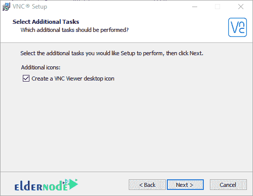

# 在 Windows 10 上连接 RealVNC 远程桌面的快速方法

> 原文：<https://blog.eldernode.com/connect-realvnc-remote-desktop-on-windows-10/>

在 Windows 10 上连接 RealVNC 远程桌面的快速方法。 [RealVNC](https://www.realvnc.com/) 是可以用来全面监控小型和大型计算机网络的软件名称。在该软件中，为网络管理员提供了能够远程监控网络系统而无需本地访问系统的设施。通过软件，你可以访问网络中所有系统的屏幕。借助这一特性，网络管理员可以很容易地全面了解网络用户的行为，并在出现问题时阻止他们访问网络。

通过这篇介绍，我们试着教你如何在 [Windows](https://blog.eldernode.com/tag/windows/) 10 上连接 realvnc 远程桌面。如果你需要[购买 Windows VPS](https://eldernode.com/windows-vps/) 服务器，你可以在 [Eldernode](https://eldernode.com/) 看到可用的包。

## 如何在 Windows 10 上安装 RealVNC 远程桌面

**1。** [先下载 RealVNC](https://www.realvnc.com/download/file/vnc.files/VNC-Server-6.7.2-Windows.exe) 。

**2。**要安装 VNC 软件，双击其安装文件运行安装向导。

***注意:*** 如果之前的版本正在运行，并且其他系统连接到您的系统，而您当前正在升级程序，那么您的连接将被暂时断开以升级程序。

**3。**点击**下一个**。

**4。**下一步，你会看到许可协议，是你和软件公司之间的合同。点击这里的第一个选项，**我接受协议**，表示您已经接受合同，点击**下一步**。

**5。**现在您需要指定如何使用该程序，这意味着如果您希望其他系统连接到您的系统并能够使用您的系统，则必须启用 **VNC 服务器**选项。此外，如果您想要连接到其他系统并能够使用这些系统，必须启用 **VNC 浏览器**选项。

软件本身建议您在系统上安装这两个组件。如果你是一个网络的管理员，你想只连接你自己的其他网络客户端，而其他客户端不能互相连接，客户端最好只勾选 **VNC 服务器**选项，并为你自己启用 **VNC 浏览器**选项。

**6。**在下一步中，应该会显示 VNC 服务器文件的存储位置，您可以根据需要更改存储位置。

**7。**在第七步中，您必须指定 VNC 浏览器程序的存储位置。然后点击**下一个**。

**8。**在第八步中，您可以启用**创建 VNC 浏览器桌面图标**复选框，在安装后将程序图标放置在桌面屏幕上。

**9。**如果你想安装 **VNC 服务器组件**，你会遇到这一步。这一步告诉你这个程序应该在你的防火墙中创建一个 roll，这样其他人就可以远程访问你的系统。因此，如果您取消选中向 VNC 服务器的防火墙添加例外，将不会为您创建此角色，并且当您尝试远程访问此系统时会遇到问题。

10。在这一步中，它会显示您在前面步骤中所做工作的报告，点击**安装**安装程序。

**11。**最后，点击**完成**。

## 如何在 Windows 10 上连接 RealVNC 远程桌面

为了远程连接到使用 VNC 软件的系统，打开您系统中的 VNC 浏览器软件，在您想要连接的系统中，您必须打开 VNC 服务器软件。

***注:*** **VNC 服务器**软件不能连接任何电脑但提供了一个环境供其他电脑连接，而 **VNC 查看器**软件只能连接其他运行 VNC 服务器软件的电脑。

**1。**在运行 **VNC 浏览器**软件的同一系统的第一台计算机上，从**文件**菜单中选择**新连接**。

**2。**在打开的窗口中，您必须在 VNC 服务器框中输入第二台计算机的信息。您必须在运行 VNC 服务器软件的第二台计算机上输入第二台计算机的 IP 地址。

**3。**您也可以在**名称框**中选择一个名称。

**4。**在**安全**部分，您可以指定对第二台计算机的连接进行加密，以提高安全性。

**5。**在**加密列表中有几个选项**:

**–**让 VNC 服务器选择

**–****始终最大**为连接使用最强的加密能力，它使用 256 位加密。

**–****始终开启**不支持未加密的连接，使用 128 位加密。

**–****如果可能的话，最好使用加密连接打开**。

**–****首选关闭**不使用加密进行连接。该选项降低了连接安全性。

***注意:*** 如果不勾选自动更新桌面预览，第二台电脑屏幕预览将不再显示。

**6。**好了，现在点击**确定**。

**7。**要连接，只需右击添加到列表中的计算机，然后点击**连接**。在打开的页面中，在用户名字段中输入第二台计算机的**用户名**，在密码字段中输入第二台计算机的**密码**。

***注意:*** 如果您勾选了记住**密码**选项，下次您想要远程连接第二台电脑时，它将不再询问您的用户名和密码。

**8。**点击**确定**连接第二台电脑。

然后你会看到第二个电脑屏幕的连接，你可以做任何你想做的事情。

## 结论

VNC 在 Windows 操作系统中，远程桌面连接或 RDC 用于与 [VPS 服务器](https://eldernode.com/vps/)或专用服务器通信。VNC 通常用于类 UNIX 服务器。在 VNC 的帮助下，您可以通过图形界面连接到服务器并执行所需的操作。由于 RealVNC 对网络管理员的重要性，在本文中，我们试图教授如何在 Windows 10 上连接 RealVNC 远程桌面。