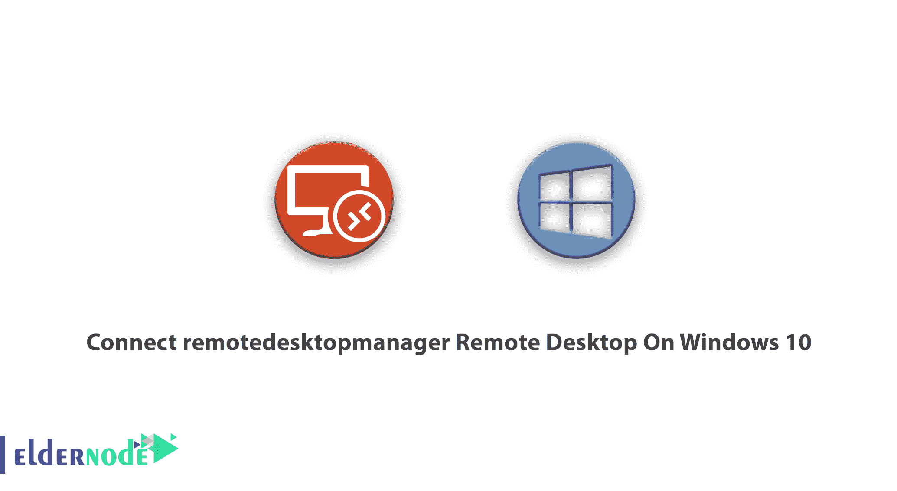
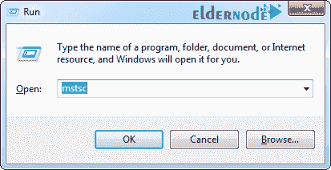
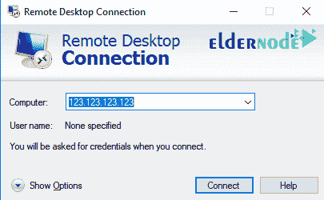
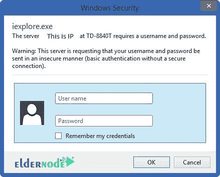
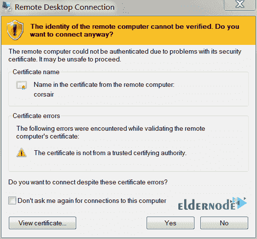

# 在 Windows 10 上连接 remotedesktopmanager 远程桌面

> 原文：<https://blog.eldernode.com/connect-remotedesktopmanager-remote-desktop-on-windows-10/>

Tutorail 如何在 Windows 10 上连接 remotedesktopmanager 远程桌面。Windows Server 是最流行的服务器操作系统之一，其图形环境类似于 home Windows，易于使用，可以轻松管理 [VPS 服务器](https://eldernode.com/vps/) / Windows 专用服务器。默认情况下，Windows 操作系统上有一个名为远程桌面连接的软件，也称为远程桌面协议或 RDP。Windows 用户可以使用该软件轻松连接到 Windows Server 并访问他们的服务器。在本文中，我们将教你如何在 Windows 10 上通过远程桌面连接到 Windows 服务器。在[服务器节点](https://eldernode.com/)市场上有几个 [RDP 管理](https://eldernode.com/buy-rdp/)服务器服务。你可以选择其中一个计划。

跟随我们关于用 RDP 连接到 Windows 服务器的教程，教你如何远程连接到一个 [Windows VPS](https://eldernode.com/windows-vps/) 服务器。

## 如何在 Windows 10 上连接 remotedesktopmanager 远程桌面

您必须使用的第一个程序是远程桌面连接，它为您提供了一种从自己的计算机与服务器或任何其他计算机进行通信的方式，并使目标系统处于您的控制和支配之下，您可以详细访问所有设置。

若要开始，您需要在 Windows PC 上运行远程桌面连接。然后搜索**开始菜单**，搜索**远程桌面**连接并运行。

也可以通过**运行**打开键盘，用 **Windows + R** 组合键运行，键入单词 mstsc，点击 **OK** 运行远程桌面连接。

打开远程桌面连接程序后，在单词“计算机”前面的框中，输入要连接的服务器或计算机的 IP，然后单击“连接”按钮。

在名为 Windows Security 的新窗口中，您必须输入您的用户名和密码才能连接并登录到服务器。

***注意:*** 如果选择了特定的用户名和密码，使用相同的，否则可以创建管理员，成为主管理员。

您可以通过选中记住我的凭据选项来保存输入的信息。

**最后**，点击**确定**连接到你想要的服务器。

在某些情况下，或者如果这是您第一次使用远程桌面连接，您可能会看到如下消息:

在这种情况下，您可以选中**不要再询问我是否连接到这台计算机**选项，然后单击**是**，这样当您尝试连接到服务器时，该消息就不会再出现。

最后，您连接到服务器。如果您在连接到 Windows Server 时遇到认证错误或 **CredSSP 加密 Oracle** ，您可以使用[修复远程](https://blog.eldernode.com/fix-credssp-encryption-oracle-error-in-remote/)中的 CredSSP 加密 Oracle 错误。

## 结论

对于那些不知道什么是远程桌面或 RDP 的用户，我必须解释一下，第一个远程桌面工具是在 Windows XP 中介绍给 Windows 用户的。您可以使用 remote desktop 来远程控制另一台电脑，而不必坐在它后面。本文介绍了如何在 Windows 10 上连接 remotedesktopmanager 远程桌面。