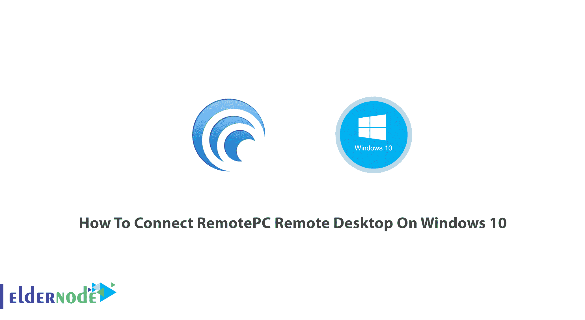
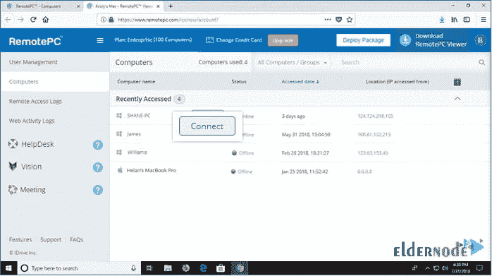
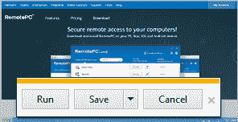
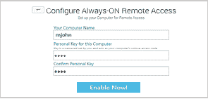
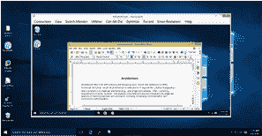
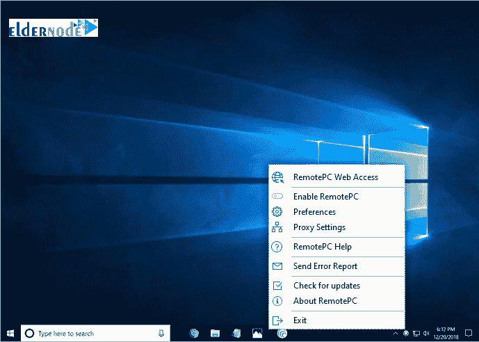

# 如何在 Windows 10 上连接 RemotePC 远程桌面

> 原文：<https://blog.eldernode.com/connect-remotepc-remote-desktop-on-windows-10/>

教程如何**在 Windows 10 上连接 RemotePC 远程桌面**。组织使用远程 PC 桌面能够让他们的员工以安全的方式轻松地远程访问公司资源。你可以以令人难以置信的价格购买[管理 RDP 服务器](https://eldernode.com/admin-rdp-server/)，更好地体验本指南的提示。您可以通过允许用户访问他们的物理办公电脑来确保这种安全访问。开始吧！您所需要的只是一个活跃的互联网连接和安装在远程计算机上的 RemotePC 应用程序。

## 如何一步一步连接 Windows 10 上的 RemotePC 远程桌面

加入我们，了解用户如何访问他们的办公电脑。当您使用远程 PC 访问时，您不需要引入和提供其他工具(虚拟桌面或应用程序)来适应远程工作。在 [Windows 10 rdp](https://eldernode.com/windows-10-rdp/) 上连接远程访问桌面，访问他们工作所需的所有应用、数据和资源。要随时通过 Internet 完全控制您的计算机，请将您的计算机配置为远程访问。远程 Pc 桌面支持 [Windows](https://blog.eldernode.com/tag/windows/) 10、Windows 8.1、Windows 8、Windows 7、Windows 2016 Server、Windows 2012 Server、Windows Server 2008 R2。

### Windows 10 上的 RemotePC 远程桌面功能

使用该软件，您可以通过指定 ou 批量添加电脑来添加机器。此外，它将支持每个单个用户和多个用户的分配，因为能够根据登录到 office Windows PC 的用户自动分配用户。通过使用其他类型的机器目录，Citrix 虚拟应用程序和桌面可以容纳更多使用情形，因为物理 Linux 和 PCsPooled 物理 PC 用于物理 PC。看看下面的其他一些:

**1-** 始终在线远程访问

**2-** 一次性即时存取

**3-** 通过网络访问

**4-** 独立于平台

**5-** 安全远程访问

**6-** 可扩展

**7-** 文件传输

**8-** 聊天

**9-** 远程打印

**10-** 远程重启

**11-** 白板

**12-** 远程播放声音

**13-** 邀请合作

**14-** 记录远程会话

**15-** 拖拽

**16-** 多对多监视器

**17-** 日志和报告

**18-** 符合性

### **如何通过 Web 访问连接远程电脑**

是啊！好消息是。要连接您的在线远程计算机，您只需要有一个网络浏览器，现在您可以停止搜索如何下载或安装它。这样，您就可以直接在浏览器中连接到远程计算机，而不需要其他软件。

**如何通过网络连接**

配置后，您需要输入个人密钥，才能连接到远程计算机。

接下来是控制步骤，连接后，你可以控制远程计算机，就好像你就坐在它的前面一样。

毕竟，您会体验到以下功能:

1-锁定屏幕

2-空白主机屏幕

3-远程打印

4 开关监控器

5-聊天

6-在会话期间在计算机之间拖放文件。

### 授予对您电脑的远程访问权限

让我们看看如何下载适用于 Pc、Mac、Linux、iOS 和 Android 的 RemoteP 应用程序。

首先，在您的计算机上安装并运行 RemotePC。

其次，设置您的计算机进行远程访问。

最后，您可以处理文件和文件夹、传输数据、打印等等。

**什么是“计算机名”**

您的计算机的默认名称称为计算机名，用于在远程访问时识别它。您可以随时编辑电脑名称。

**什么是‘个人密钥’**

您设置的密码称为个人密钥，作为您计算机的唯一访问代码。它仅存储在您的计算机上，而不存储在 RemotePC 服务器上。

### 远程电脑选项登录时的含义:

若要开始，请下载 RemotePC 应用程序并将其安装在您的计算机上。设置并运行应用程序后，您将被重定向到登录页面。登录到您的 RemotePC 桌面应用，并为远程访问配置您的计算机。

**RemotePC Web 访问**:登录您的 RemotePC Web 帐户

**启用 RemotePC** :您可以启用 RemotePC 应用程序

**首选项**:管理壁纸、主题、字体等，并更改代理设置

**代理设置**:配置代理设置以使用 RemotePC 应用程序

RemotePC 帮助:remote PC 的在线帮助指南

**发送错误报告**:如有疑问、建议或反馈，请联系 RemotePC 支持团队

**检查更新**:查看您的 RemotePC 版本是否是最新的

**关于 RemotePC** :查看您的 RemotePC 版本、安装日期等。

**退出**:退出应用程序

### 注销时远程电脑选项的含义是什么(适用于 Windows)

**RemotePC Web 访问**:登录您的 RemotePC Web 帐户

**首选项**:管理壁纸、主题、字体等，并更改代理设置

**代理设置**:配置代理设置以使用 RemotePC 应用程序

RemotePC 帮助:remote PC 的在线帮助指南

**发送错误报告**:如有疑问、建议或反馈，请联系 RemotePC 支持团队

**检查更新**:查看您的 RemotePC 版本是否是最新的

**关于 RemotePC** :查看您的 RemotePC 版本、安装日期等。

**退出**:退出应用程序

**结论**

在本文中，您学习了如何在 Windows 10 上连接 RemotePC 远程桌面。从现在起，您可以在 Windows 上运行它，并使用它的几个功能从家里或办公室控制您的目标系统。此外，你可以阅读更多关于如何在 Windows 10 上连接 Iperius 远程桌面的[。](https://blog.eldernode.com/connect-iperius-remote-desktop-on-windows-10/)

In this article, you learned How To Connect RemotePC Remote Desktop On Windows 10\. From now on, you can run it on your Windows and use its several features to control your target systems from home or office. Also, you can read more on [How To Connect Iperius Remote Desktop On Windows 10](https://blog.eldernode.com/connect-iperius-remote-desktop-on-windows-10/).