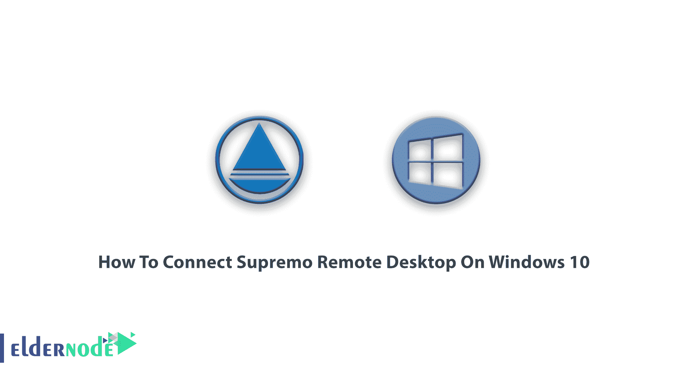
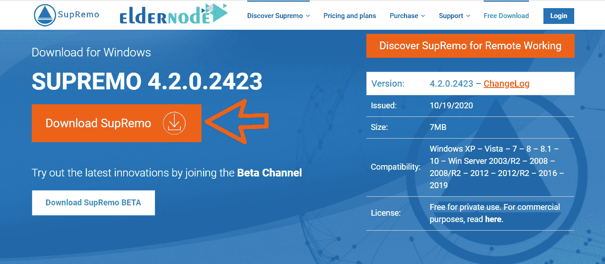
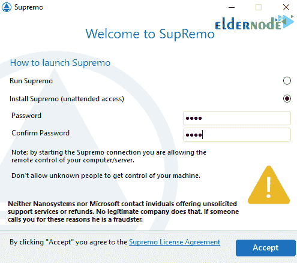
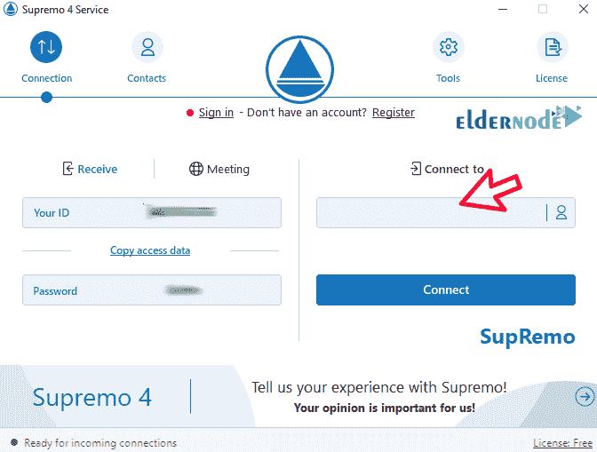

# 如何在 Windows 10 上连接 Supremo 远程桌面- Eldernode

> 原文：<https://blog.eldernode.com/connect-supremo-remote-desktop-on-windows-10/>

教程如何**在 Windows 10 上连接 Supremo 远程桌面**。Supremo Remote Desktop 是远程连接和控制计算机的应用程序之一。该程序用于通过互联网连接和控制其他系统。Supremo 远程桌面不需要特殊设置。借助该程序，您可以远程连接到目标系统并对其进行管理和控制。如果你需要[购买 Windows VPS](https://eldernode.com/windows-vps/) 服务器或者 [RDP 管理员](https://eldernode.com/buy-rdp/)，可以访问 [Eldernode](https://eldernode.com/) 中提供的包。

## 教程 Windows 10 上的 Connect Supremo 远程桌面

如果您在家中，想要访问您的工作系统，借助远程桌面程序，您可以远程控制和监控您的系统。例如，如果公司经理想要监控和管理其员工的系统，这可以通过远程桌面程序来实现。当系统出现问题而用户无法解决问题时，远程桌面程序可以远程连接到系统并解决问题。这就是为什么我们决定在本文中教你如何在 [Windows](https://blog.eldernode.com/tag/windows/) 10 上连接 Supremo Remote Desktop。

## Supremo 远程桌面应用程序的功能

Supremo 远程桌面环境简单，安全性高。这个程序支持用户使用一种叫做 HTTPS 的安全协议，SSL 来实现系统之间的远程通信。该程序通过 HTTPS SSL 安全协议为源计算机和目标计算机之间的文件交换提供安全连接。使用安全协议和强大的加密，这个程序提高了连接两个远程系统时的安全级别。

这个程序的另一个特点是支持几个用户同时连接到一台计算机上。例如，一个公司的所有成员都可以通过这个程序连接到一台远程计算机，看到你所有的活动和工作过程。这个程序最重要的特点之一是可以通过 FTP 协议或拖放操作在两台源计算机和目的计算机之间交换文件。此功能允许您用鼠标轻松点击目标计算机中的文件，选择并保存到您的系统中。许多用户希望通过远程桌面应用程序将他们的文件传输到另一个系统。Supremo 远程桌面程序使这成为可能。

### Supremo 远程桌面的功能

**–**体积非常小，非常适用

**–**完全支持 SSL 标准

**–**兼容大多数窗口

**–**轻松连接各种远程计算机

**–**支持强大的加密算法

**–**无需特殊配置和设置，例如:防火墙和路由器

**–**能够将多个用户同时连接到一个系统

**–**高安全性和加密

**–**能够通过 FTP 协议传输文件和文件夹

**–**能够边交流边聊天

在 windows 10 上使用 Supremo 远程桌面软件非常容易。为此，只需遵循以下步骤:

**1。**首先，进入 [Superimo 网站](https://www.supremocontrol.com/download-supremo/)，下载 Superimo 软件，如下图所示:

**2。**然后到你下载文件的地方，双击**掌门**文件运行。

**3。**要安装 Supremo，只需选择**安装 Supremo** 选项。您必须在密码字段中输入您想要的**密码**，并在确认密码中再次输入，然后点击**接受**。

**4。**最后，在连接到部分输入目的计算机的 **ID** 并点击**连接**即可，这样在计算机确认后，您想要的通信就会发生。

***注:*** 要在两台电脑之间进行远程控制，两台电脑都必须在线。

结论

Windows 操作系统和其他操作系统为了与其他用户通信并连接到他们的系统，无论是文本、音频还是视频，通常都有内置的远程桌面或 messenger 程序。但有时这些程序背后会有许多问题，例如所用版本和可用操作系统的差异，以及其他问题。这就是我们推荐 supremo 电信项目的原因。这款软件在远程桌面、连接速度、消息传递以及在大多数平台和操作系统上运行方面都非常出色。它还适用于虚拟系统，如虚拟 vmware 等。在这篇文章中，我们试图教你如何在 Windows 10 上下载、安装和连接 Supremo Remote Desktop。

Windows operating system and other operating systems To communicate with other users and connect to their system, whether text, audio or video, usually have a built-in remote desktop or messenger program. But sometimes there are a number of problems behind these programs, such as differences in the versions used and the operating system available, and other problems. That’s why we recommend the supremo telecommunications program. This software is excellent in terms of remote desktop, connection speed, messaging and running on most platforms and operating systems. It also works on virtual systems such as virtual vmware and so on. In this article, we tried to teach you how to download, install and connect Supremo Remote Desktop On Windows 10.