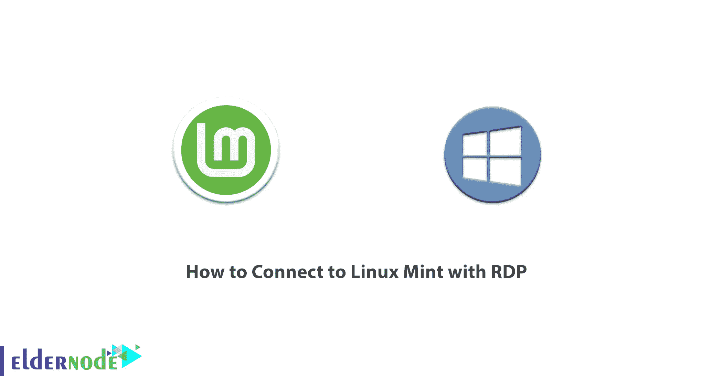
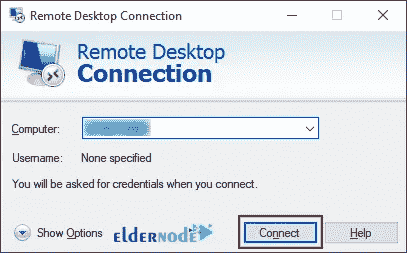
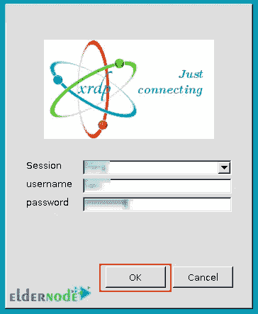

# 如何用 RDP -埃尔德诺德博客连接到 Linux Mint

> 原文：<https://blog.eldernode.com/connect-to-linux-mint-with-rdp/>



RDP 为用户提供了通过网络连接到另一台计算机的图形界面。在这篇文章中，我们将教你如何用 RDP 连接到 Linux Mint。此外，如果你想购买一个 [**管理 RDP 服务器**](https://eldernode.com/buy-rdp/) 托管，你可以访问 [Eldernode](https://eldernode.com/) 中可用的软件包。

## **教程用 RDP** 连接 Linux Mint】

### **什么是 RDP？**

RDP 代表**R**emote**D**esktop**P**rotocol，是一种远程使用台式电脑的协议。RDP 由微软提供，允许用户远程连接到另一台计算机。它为通过网络连接到另一台计算机提供了图形用户界面(GUI)。通过 RDP 协议的远程访问用户体验非常接近直接访问。RDP 可以在本地网络上设置和启用，也可以使用 RDP 通过互联网连接到另一台远程计算机。

### **Linux 造币厂简介**

Linux Mint 是一个基于 Ubuntu 和 Debian 的免费开源操作系统发行版。Linux Mint 包括专有的第三方浏览器插件、Java、多媒体支持和其他组件，以支持普遍接受的标准。这种支持允许 DVD 和蓝光回放以及 flash 播放媒体。Linux Mint 由几个不同的软件包组成，其中大部分是在一个免费许可证下发布的。Linux Mint 的主要许可是 LGPL 的 GNU GPL。

## **用 RDP 连接 Linux Mint(远程桌面)**

首先，您应该**在您的系统上安装 XRDP** 。为此，请运行以下命令:

```
sudo apt install xrdp -y
```

现在运行下面的命令来启动 XRDP 服务:

```
sudo systemctl start xrdp
```

您可以**启用 XRDP** 服务:

```
sudo systemctl enable xrdp
```

要检查 XRDP 的状态，只需使用以下命令:

```
sudo systemctl status xrdp
```

如果在输出中显示 active(running ),则表明 XRDP 服务正在运行。

默认情况下，XRDP 使用**/etc/SSL/private/ssl-cert-snake oil . key**文件，该文件只能由 SSL-cert 组的成员读取。通过运行以下命令，您可以**将 XRDP 用户**添加到 **ssl-cert 组**:

```
sudo adduser xrdp ssl-cert
```

然后**重启 XRDP** 服务:

```
sudo systemctl restart xrdp
```

您可以使用以下命令检查防火墙在您的系统上是否处于活动状态:

```
UFW status : inactive
```

现在，您可以使用以下命令**允许防火墙上的端口 3389** :

```
sudo ufw allow 3389/tcp
```

然后检查防火墙状态，查看是否允许 3389 端口:

```
sudo ufw status
```

在这一步中，您可以使用以下命令获得 Linux 机器的 IP:

```
ifconfig
```

现在，您应该从系统中注销。

最后，你应该打开**远程桌面**连接和**输入你的 IP** 和 Linux 机器的用户名连接到 Linux 机器并点击**连接**。



然后输入您的会话、**用户名**和**密码**，点击**确定**。



没错。你可以在 Linux Mint 中使用 RDP。

## 结论

RDP 用于将计算机连接到远程计算机，它允许客户端计算机查看远程计算机屏幕。在本文中，我们通过 RDP 教你如何使用和连接 Linux Mint。我希望这篇文章对你有用。