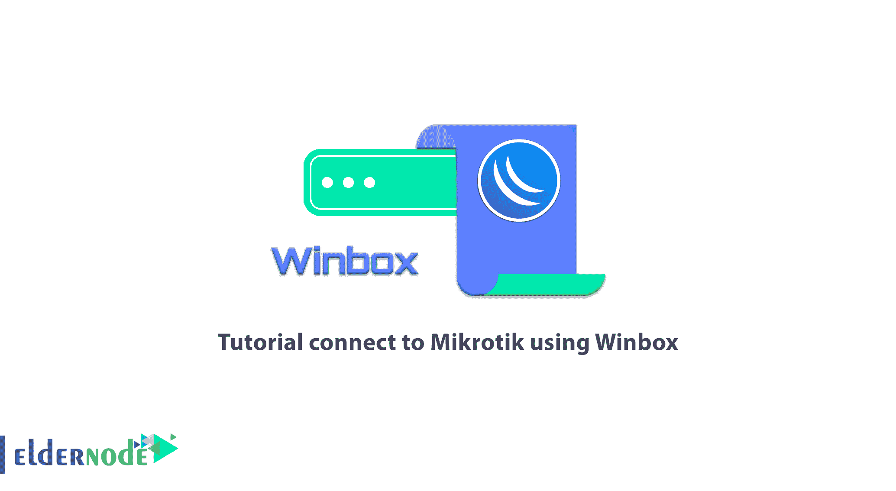
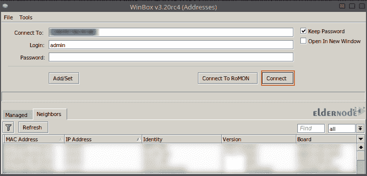
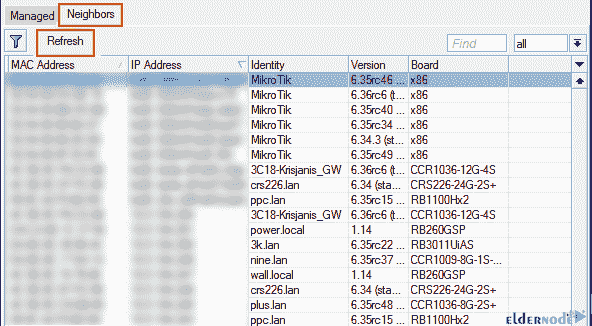
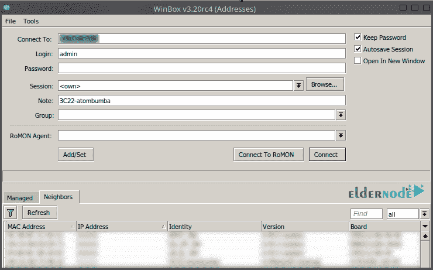
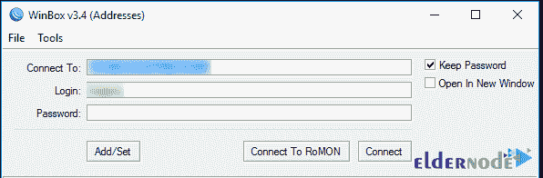
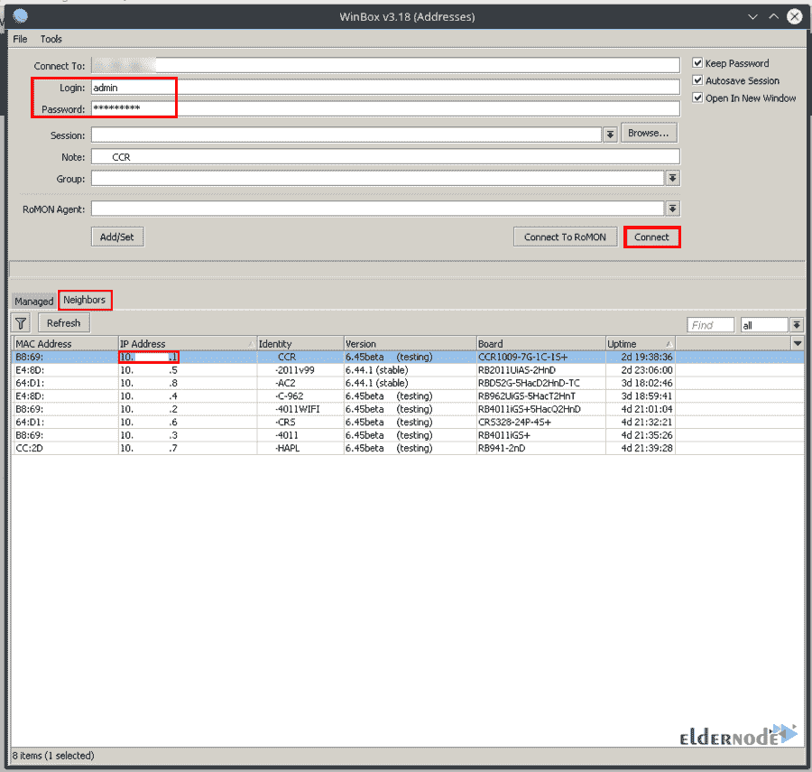
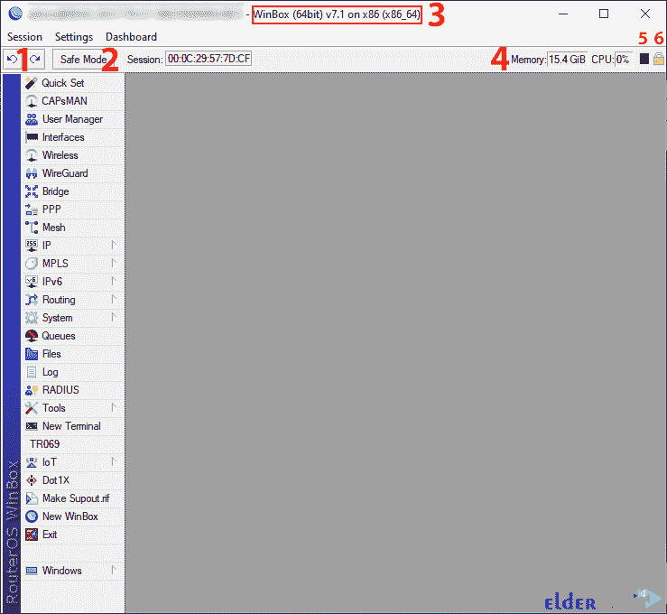

# 教程使用 Winbox - Eldernode 博客连接到 Mikrotik

> 原文：<https://blog.eldernode.com/connect-to-mikrotik-using-winbox/>



连接到 Mikrotik 路由器的一种方法是使用 Winbox。该软件通过控制带宽来管理 Mikrotik 虚拟服务器。在本文中，您将熟悉 Winbox 的各种特性，并了解如何使用 Winbox 连接到 Mikrotik。如果您想购买 [**Mikrotik VPS 服务器**](https://eldernode.com/mikrotik-vps-server/) **，我们建议您查看 [Eldernode](https://eldernode.com/) 网站上提供的套装。**

## **如何使用 Winbox** 连接到 Mikrotik】

### **Winbox 是什么？**

Winbox 是一款专为网络使用而设计的软件，专注于带宽控制。Winbox 允许人们连接到 [Mikrotik](https://blog.eldernode.com/tag/mikrotik/) 路由器。它还用于管理 Mikrotik 虚拟服务器。你不需要在 Mac 或运行 Linux 的服务器上运行 Winbox。只需在您的系统上安装 Winbox，并使用 Mikrotik IP 服务器连接到它。这是 Win32 的一个配对元素，但是可以在使用 Wine 的 Linux 和 MacOS 上运行。

### **Winbox**入门

首先[从 **Mikrotik 下载页面**下载 Winbox 加载程序](https://mikrotik.com/download)。然后双击 Winbox.exe 的**运行 Winbox loader。Winbox 加载程序有两种模式:**

–>简单模式

–>高级模式

#### **简单模式**

Winbox 加载程序的默认布局是简单模式。输入**路由器的 IP** 或 **MAC 地址**，输入你的**用户名**和**密码**，点击**连接**按钮连接路由器:



另一种选择是在 IP 地址后输入端口号，就像这样:your_IP_address:9999。您可以从 RouterOS 服务菜单中更改端口。

就安全性而言，重要的一点是使用单个 IP 地址。

您可以从**邻居**选项卡中看到可用路由器的列表。从检测到的路由器列表中，如果你点击 **IP 地址**，该 IP 用于连接，但是如果你点击 **MAC 地址**，该 MAC 地址用于连接路由器:



在上面的列表中，您会看到与 Winbox 不兼容的设备，例如 Cisco 路由器或任何其他使用 CDP (Cisco 检测协议)的设备。正在通过 web 浏览器建立与 SwOS 设备的连接。

#### **高级模式**

必须启用带有**工具的高级模式— >高级模式**，以显示额外的 Winbox 加载程序参数:



### **如何通过命令行访问 Winbox**

您可以使用命令行自动传递连接参数、用户和密码:

```
winbox.exe [<connect-to> [<login> [<password>]]]
```

通过将 RoMON 代理保存在被管理的路由器列表中，您可以使用以下命令自动传输连接、用户和密码参数以连接到路由器:

```
winbox.exe --romon [<romon-agent> [<connect-to> [<login> [<password>]]]]
```

### **IPv6 连接**

Winbox 的另一个特性是支持 IPv6 连接。要连接到路由器的 IPv6 地址，您可以将其放在方括号中，例如当 web 浏览器连接到 IPv6 服务器时:



## **从 Winbox** 连接到 Mikrotik】

–>首先运行 **Winbox** 工具。

–>然后去**邻居**。

–>在这一步，Winbox 必须找到你的路由器和 **MAC 地址**。

–>在列表中找到您的路由器，然后单击 IP/MAC 地址。

–>最后按下**连接**按钮。



下载完 Winbox 插件并完成身份验证后，您将会看到 Winbox 的主窗口。

### **Winbox 界面项**

界面功能如下:

–>它的设计对大多数用户来说很直观。

–>用户可以向主工具栏(顶部)添加各种信息字段，如 CPU 使用率和内存。

–>菜单栏(左侧)显示所有可用菜单和子菜单的列表，并根据安装的软件包而变化。

–>打开所有菜单窗口的工作区。



1->**撤销**和**重做**

2 –>**安全模式**:该选项防止路由器在配置时变得不可访问。

3 –>**标题栏**:标题栏包含指定 Winbox 会话使用哪个路由器打开的信息。信息以下列格式显示:

```
[username]@[Router's IP or MAC] ( [RouterID] ) - Winbox [ROS version] on [RB model] ([platform])
```

4->**内存**

5->**Winbox 流量**

6->**安全模式**

## 结论

正如我们所见，Winbox 是一个配置工具，可以通过 MAC 或 IP 协议连接到 mikrotik 路由器。在本文中，我们回顾了 Winbox 的特性，您了解了如何使用 Winbox 连接到 Mikrotik。