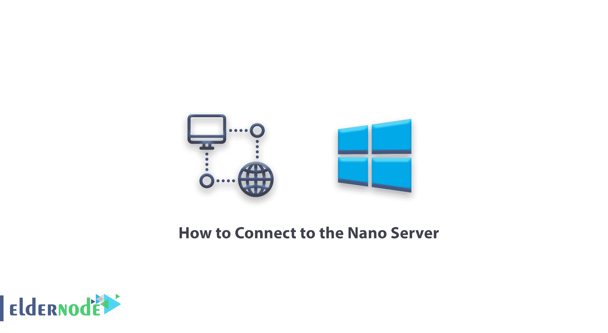

# 如何连接到纳米服务器-教程纳米服务器

> 原文：<https://blog.eldernode.com/connect-to-nano-server/>



如何连接到 Nano 服务器？安装完纳米服务器后，你脑海中浮现的第一个问题就是如何使用它。在上一篇文章中，我们教你[如何安装纳米服务器](https://eldernode.com/install-nano-server/)。在这篇文章中，我们将通过[系列纳米服务器培训](https://eldernode.com/tag/nano-server/)教你如何连接到纳米服务器，这样你就可以利用这款安全的微软 Windows 服务器的优势。

**[购买 Windows 虚拟专用服务器](https://eldernode.com/windows-vps/)**

## 纳米服务器连接教程

在普通 Windows 中，您可以使用远程桌面或 RDP 连接到您的 Windows 服务器并使用其功能。 同样在 Windows Core 中，通过在另一个 Windows 中安装管理工具，可以连接到你的 Windows Core 并对其进行管理。

纳米服务器的情况完全不同，你得用 [PowerShell](https://docs.microsoft.com/en-us/powershell/scripting/overview#:~:text=PowerShell%20is%20a%20cross%2Dplatform,NET%20objects.) 连接纳米服务器。

### 用 PowerShell 连接 Nano 服务器的步骤

**1。T5 首先，在你的系统中用管理员权限打开 PowerShell 。**

**2。** 然后输入以下命令将您的 Nano 服务器放入有效机器列表中。

如果您在安全网络中工作，您可以使用 ***** 符号来代替目的服务器的 IP 地址，如以下命令所示。

**3。** 然后依次输入以下命令:

```
Enter-PSSession –ComputerName "192.168.1.10" -Credential ~\Administrator
```

**注意** 你要写的是你的 Nano 服务器的 IP 地址，而不是提到的 IP。

输入上述命令后，会打开一个窗口让你输入你的服务器密码。

输入密码，点击确定。

**4。** 片刻之后，您将连接到服务器。

此时，您输入的所有命令都将在 Nano 服务器上执行。

**5。** 要退出 Nano 服务器，您可以输入 Exit 命令，但是通过输入它，会话将保持打开。 最好使用下面的命令结束并退出Nano 服务器:

```
Exit-PSSession
```

**亦作，见:**

[如何安装 Nano 服务器](https://eldernode.com/install-nano-server/)

**尊敬的用户**，我们希望您能喜欢这个[教程](https://eldernode.com/category/tutorial/)，您可以在评论区提出关于本次培训的问题，或者解决[老年人节点培训](https://eldernode.com/blog/)领域的其他问题，请参考[提问页面](https://eldernode.com/ask)部分，并尽快提出您的问题。腾出时间给其他用户和专家来回答你的问题。

好运。