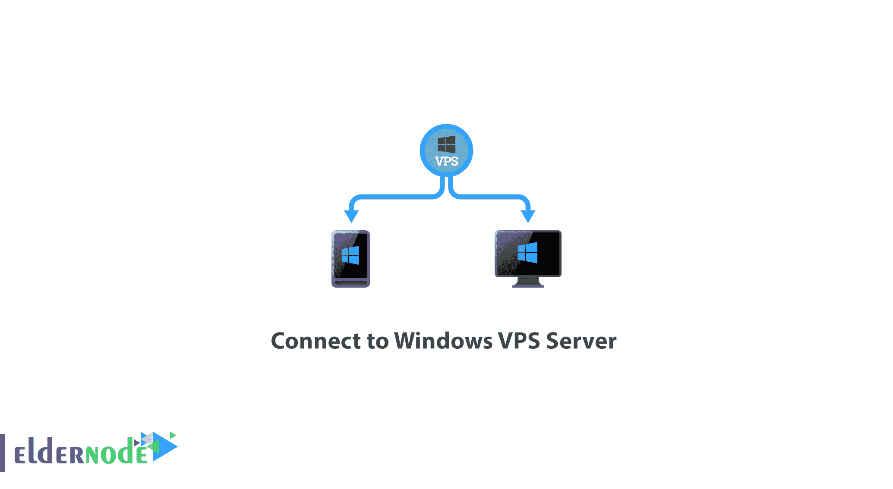
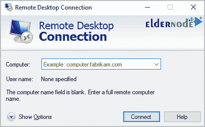
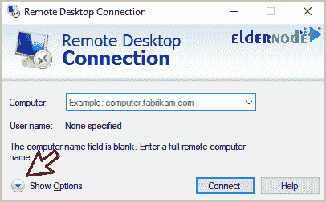
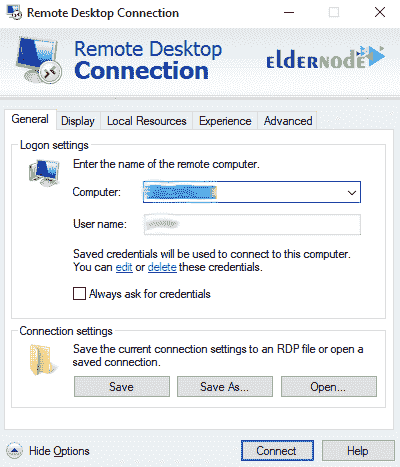
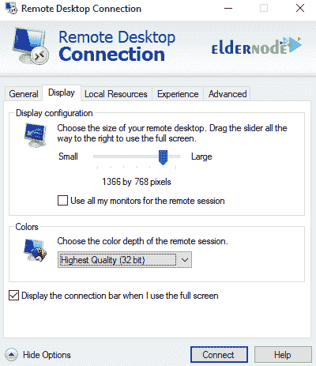
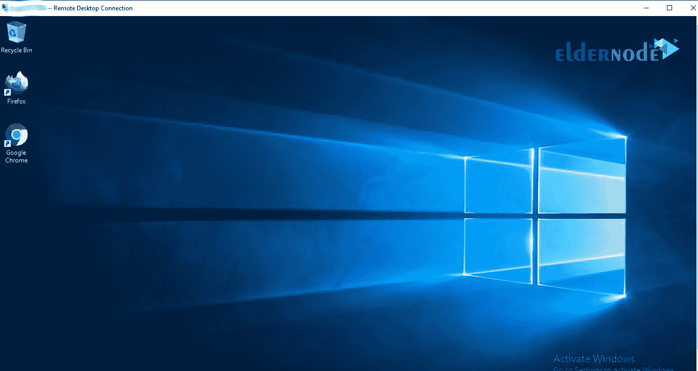

# 如何连接到 Windows VPS 服务器- ElderNode 博客

> 原文：<https://blog.eldernode.com/connect-to-windows-vps-server/>

如何连接到 Windows [VPS 服务器](https://eldernode.com/vps/)。 VPS ( **虚拟专用服务器**)是互联网托管服务提供的虚拟机。一台 [VPS](https://en.wikipedia.org/wiki/Virtual_private_server) 服务器有一个独立的操作系统，客户拥有对该操作系统的超级用户或根访问权限。因此，他们可以在该服务器上安装任何他们想要的软件。

VPS 服务器实际上等同于专用的物理服务器，不同之处在于这些类型的服务器更容易设置和配置。换句话说，利用 Virtuozzo 、virtulizor、 Vmware 等技术。凭借强大而先进的硬件，一台物理服务器被划分为多个具有相同功能和不同资源的虚拟处理器。

在本文中，我们将教你如何通过远程桌面连接到 [Windows VPS](https://eldernode.com/windows-vps/) 服务器。请继续关注本文的其余部分。

### 连接到 Windows VPS 服务器的教程

**1。从的**开始菜单中的附件部分，**运行**的远程桌面连接程序。

您可以使用以下方法**快速打开**远程桌面连接窗口:

按下 WinKey + R 然后键入 mstsc 并点击 OK 。

**注意:** 你也可以从开始菜单中搜索然后运行远程桌面。

**2。** 然后点击显示选项。

**3。** 在计算机字段中，输入 ***Eldernode*** 为您的 Windows VPS 服务器分配的 IP ，在**用户名**字段中，输入您的用户名。

**4。** 转到显示选项卡到**设置**一个快速连接。

**5。** 从显示配置部分，根据您的屏幕尺寸选择远程窗口的尺寸。

**6。** 在色彩部分，将色彩质量设置为最低，这样你就可以更快地连接到服务器。

**7。** 点击连接选项。

**8。** 会出现一个窗口让你输入你的密码。

**注意:** 请记住，如果您使用的是较旧的 Windows 服务器，远程后会要求您输入密码。

**9。** 片刻之后，你将连接到 Windows 环境。

现在，您可以在 Windows 服务器上进行所有**所需的设置**，包括以下内容:

**—** 安装各种软件

**——**重启你的 VPS

**—** Windows 内部设置

**—** 安装 ISS 进行网络托管

**—** Windows 防火墙设置

**亦作，见:**

[如何从 android 设备连接 VPS](https://eldernode.com/how-to-connect-vps-from-an-android-device/)

[如何从 Mac 远程访问 Windows 服务器](https://eldernode.com/remote-to-windows-from-mac/)

**尊敬的用户**，我们希望您能喜欢这个[教程](https://eldernode.com/category/tutorial/)，您可以在评论区提出关于本次培训的问题，或者解决[老年人节点培训](https://eldernode.com/blog/)领域的其他问题，请参考[提问页面](https://eldernode.com/ask)部分，并尽快提出您的问题。腾出时间给其他用户和专家来回答你的问题。

好运。