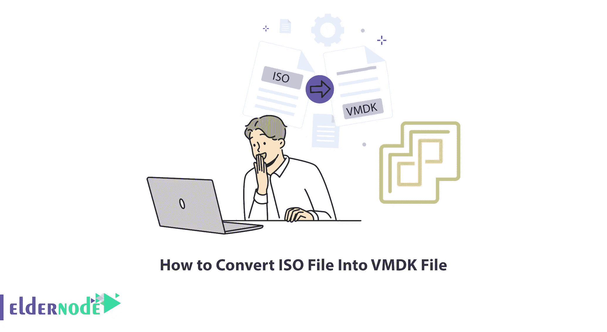
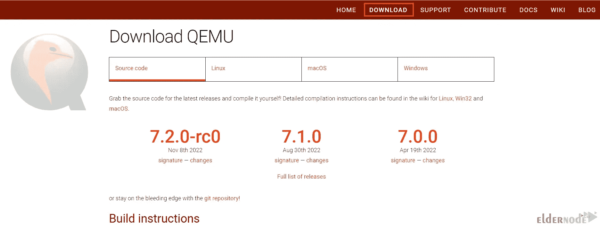
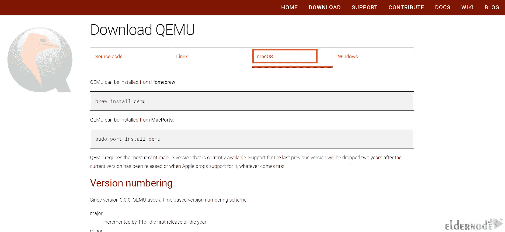

# 如何将 ISO 文件转换成 VMDK 文件

> 原文：<https://blog.eldernode.com/convert-iso-file-into-vmdk-file/>



安装操作系统最广泛使用的格式之一是 ISO 文件。您可以使用它立即启动虚拟系统中的任何操作系统，如 VMware ESXi。这篇文章将教你如何将 ISO 文件转换成 VMDK 文件。如果你打算购买一个专用服务器，你可以在[的网站上查看一下。](https://eldernode.com/)

## **教程将 ISO 文件转换成 VMDK 文件**

[VMware ESXi](https://blog.eldernode.com/setup-vmware-esxi-on-dedicated-server/) 是一款裸机虚拟机管理程序，是 VMware 公司的产品之一，在虚拟化服务器架构中用作虚拟化层。它被认为是一种无主机的操作系统，直接安装在硬件上。 [ESXi](https://blog.eldernode.com/what-is-esxi-install-esxi-on-your-computer/) 是 VMware 虚拟机管理程序的最新版本，可创建虚拟机。此外，它还为虚拟机分配资源。该软件的虚拟化层将物理主机的 CPU、存储、内存和网络资源抽象为多个虚拟机。

在来自 [Windows 教程](https://blog.eldernode.com/tag/windows/)系列的本教程中，我们将解释如何在 VMware ESXi 中将 ISO 文件转换为 VMDK 文件。

### **将 ISO 文件转换成 VMDK 文件**

使用 Qemu-img 软件可以将 ISO 文件转换成 VMDK 文件。这是一个用于 Windows 的磁盘映像实用程序，您可以使用该软件来转换、创建和检查各种虚拟磁盘格式的一致性。该实用程序与 VMware、VirtualBox、Hyper-V 和 Xen 虚拟化解决方案兼容。所以，首先导航到 [Qemu 官网](https://www.qemu.org/):选择**下载**版块:



现在，您应该选择要安装该软件的**操作系统**，并按照安装步骤进行操作。我们想在 Mac 操作系统上安装 Qemu-img。所以我们选择 macOS 选项:



如您所见，您可以在带有家酿和 Macports 的 macOS 上安装该实用程序。如果你想先从家酿安装，你应该安装家酿。然后输入下面的命令:

```
brew install qemu
```

要从 MacPorts 安装 Qemu，请运行以下命令:

```
sudo port install qemu
```

一旦在系统上安装了 Qemu-img，就应该将其解压到一个 ISO 文件夹中。

最后，您只需打开 PowerShell 并运行以下命令:

```
.\qemu-img.exe -O vmdk '.\mac-os.iso’ '.\mac-os.vmdk’
```

就是这样！

## 结论

VMDK 文件是存储 VMware 虚拟机硬盘内容的虚拟磁盘。在本文中，我们教您如何在 VMware ESXi 中将 ISO 文件转换为 VMDK 文件。我希望这篇教程对你有用。如果你有任何问题，你可以在评论区问我们。