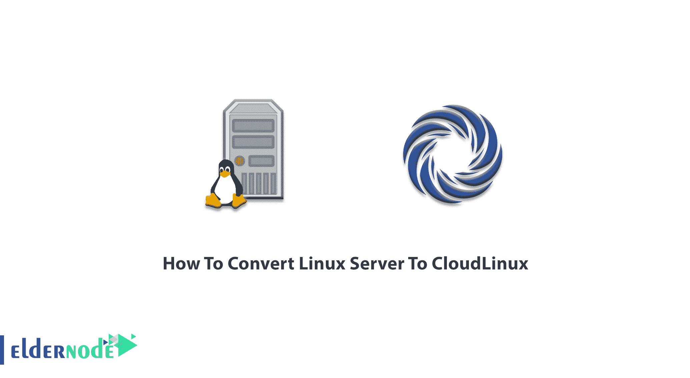
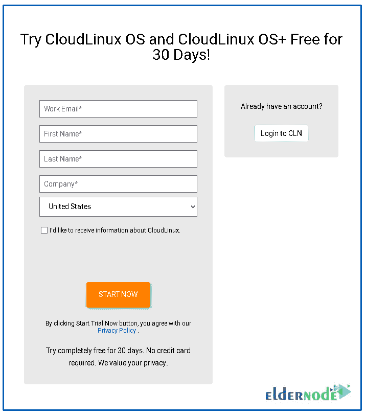

# 如何将 Linux 服务器转换为 CloudLinux - Eldernode 博客

> 原文：<https://blog.eldernode.com/convert-linux-server-to-cloudlinux/>



[Linux](https://blog.eldernode.com/tag/linux/) 服务器是构建在 Linux 开源操作系统上的服务器。为了向客户端提供内容、应用和服务，Linux 服务器为企业提供了一个低成本的选择。Linux server 因其性能、安全性、稳定性和可伸缩性而广为人知并广受欢迎。此外，CloudLinux 允许您拥有个性化的开发共享主机。该操作系统为共享主机提供商提供了高级自动化、深度性能分析和集中监控工具。根据 Cloudlinux 的特点，在本文中，你将学习**如何将 linux 服务器转换为 CloudLinux** 。要购买自己的 [Linux VPS](https://eldernode.com/linux-vps/) 或购买 [VPS 托管](https://eldernode.com/vps-hosting/)服务器，请访问 [Eldernode](https://eldernode.com/) 中提供的软件包。

## **教程一步一步把 Linux 服务器转换成 cloud Linux**

CloudLinux 提供了管理共享主机的特殊功能，并以特定和精确的方式限制每个用户使用的资源，以防止其他用户因一个用户过度使用资源而变慢。拥有大量站点和用户的托管公司或人员是 CloudLinux 的最多用户。

### **【cloud Linux OS+】(将 Centos Server 转换为 CloudLinux)**

开发 CloudLinux OS+时考虑到了共享主机。作为共享托管提供商，您将体验到 CloudLinux OS+的高级自动化、深度性能分析和集中监控工具。CloudLinux OS+有一些 CloudLinux OS 无法提供的新功能，您可以升级它以使用这些新功能。以下是 CloudLinux OS+的新优势:

**PHP X-Ray —新的 PHP 性能跟踪工具:**

*标识*:

缓慢的基于 PHP 的 CMS 模块、缓慢的数据库查询、缓慢的 PHP 函数和缓慢的外部调用

**с集中监控—新的服务器性能监控工具:**

*监视器*:

硬件温度、用户数量、Apache 连接数、MySQL 连接数、虚拟机的 CPU 占用时间。它还监控用户的 CPU 使用情况、条目进程、物理内存使用情况、IOPS、IO 使用情况、进程数量、MySQL CPU 使用情况、MySQL IO 使用情况，以及 RAM、CPU、磁盘、系统负载、网络、打开文件、IO 的服务器性能。

自定义通知和警报

**优先支持**

## **将现有的 Linux 服务器转换为 CloudLinux** 安装 CloudLinux

由于 [CloudLinux](https://blog.eldernode.com/cloudlinux-almalinux-will-replace-centos/) OS 类似于 [CentOS](https://blog.eldernode.com/tag/centos/) ，我们将其基于 CentOS 转换为 CloudLinux。这是一个非常简单的过程，只需要几分钟。

### **CloudLinux 安装**

CloudLinux 有两种安装方式:

1-直接安装在服务器上

2-将操作系统转换为 CloudLinux

CloudLinux 支持和开发团队提供了一个工具，允许您将当前操作系统转换为 CloudLinux，而无需对托管网站进行任何更改。这似乎是一个相当大的优势。由于您可能已经设置了一台 [CentOS](https://blog.eldernode.com/tag/centos/) 服务器，并在其上安装了各种服务来托管多个网站，因此停止运行并迁移到新服务器是没有意义的。因此，您可以使用这个特性，迁移到 CloudLinux，而 nit 不会遇到任何故障。

### **CloudLinux 许可**

CloudLinux 不是免费的，你必须每月付费才能使用。但是你可以发送一个请求来测试并免费使用 30 天。留下所需信息，等待(大约 1 分钟)以查看您的临时系列。



### **如何准备**

你需要经过两步准备:

1- **获取激活密钥**

你可以注册[试用订阅](https://docs.cloudlinux.com/cloudlinux_installation/#getting-trial-license)，或者购买[完全订阅](https://cln.cloudlinux.com/console/purchase/cloudlinux/acquire?cl=1)。

2- **下载转换脚本**

您可以[从 CentOS CloudLinux 操作系统下载](https://repo.cloudlinux.com/cloudlinux/sources/cln/cldeploy)协调服务器的脚本。它帮助你用 EA4、Plesk、DirectAdmin 和 InterWorx 检测和支持 cPanel。

### **转换**

运行转换脚本。

如果您已经准备了激活密钥，请运行以下命令:

```
wget https://repo.cloudlinux.com/cloudlinux/sources/cln/cldeploy
```

```
sh cldeploy -k <activation_key>
```

Cloudlinux 同时提供基于 IP 和基于用户的系列。因此，如果您有基于 IP 的许可证，请键入以下命令，而不是上面的命令:

```
sh cldeploy -i
```

安装并升级 ClouldLinux 后，重新启动服务器:

```
reboot
```

### **套餐**

当服务器重启完成后，它将运行启用了 LVE 的 CloudLinux 内核。此外，Apache 模块、PAM 模块和命令行工具将由转换脚本和 LVE 管理器安装。

### **LVE 经理**

默认情况下，LVE 应该安装在 CloudLinux OS 服务器上。但是如果你发现它不是，使用下面的命令来安装它。

```
yum install lvemanager
```

## 结论

在本文中，您了解了如何将 Linux Server 转换为 CloudLinux。您可以轻松地从您的 Linux 服务器迁移到 CloudLinux，并使用它的特性。在 [Eldernode 社区](https://community.eldernode.com/)中讨论这个话题，看看其他人对服务器交换的看法。