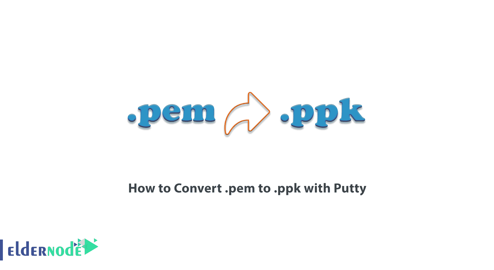
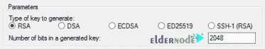
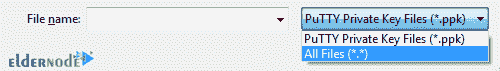

# 如何转换。pem to。ppk 与 Putty - Eldernode 博客

> 原文：<https://blog.eldernode.com/convert-pem-to-ppk-with-putty/>



PEM 格式是一种用于存储加密密钥和证书的文件存储格式。与大多数存储二进制内容的加密文件存储标准不同，PEM 格式使用 base64 进行编码，这使得文件传输和读取更加容易。另一方面，PPK 文件包含由 PuTTYgen 工具生成并由 PuTTY 使用的私钥。PuTTY 是一个终端模拟器程序，可以作为原始 SSH、Telnet、rlogin 和 TCP 计算协议的客户端。在这篇文章中，我们试着教你如何转换。pem to。Windows 和 Linux 上带有 Putty 的 ppk。你可以访问 [Eldernode](https://eldernode.com/) 中提供的包来购买 [Linux VPS](https://eldernode.com/linux-vps/) 服务器和 [Windows VPS](https://eldernode.com/windows-vps/) 服务器。

## **教程转换。pem to。带油灰的 PPK**

在开始之前，您应该知道 [PuTTY](https://blog.eldernode.com/what-is-putty-and-what-does-it-do/) 本身并不支持私钥(。pem)由 Amazon EC2 制作的模板。因此，在使用 PuTTY 连接到您的实例之前，您需要将您的私钥转换为。ppk 文件。关注我们这篇文章，教你如何转换。pem to。ppk 带腻子。

PuTTYgen 是 PuTTY 开源网络客户端的一部分。它也是为服务器创建公共和私有 SSH 密钥的重要工具。应该注意，本机 PuTTY 文件格式是。ppk 文件。

用户可以使用 PuTTY 工具安全地将数据从本地主机连接和传输到远程系统。您还应该知道，要使用 PuTTY，主应用程序格式中必须有私钥。

假设作为 EC2，云计算操作系统的核心部分创建了 PEM 文件格式。用户必须首先将文件转换为。ppk 文件格式。

应该注意的是，如果有人打算使用 [SSH PuTTY](https://blog.eldernode.com/setup-ssh-tunnel-with-putty/) 客户端进行连接，他们必须首先转换。pem 文件到。使用 PuTTYgen 的 ppk。一旦完成，它就可以使用 PuTTY 程序加入本地和远程主机。

### 对…的介绍。pem 文件格式

PEM 代表隐私增强邮件。这种文件扩展名主要用于数据、电子邮件和加密密钥的私人传输。PEM 格式也是一种非常安全可靠的存储和传输数据的方式。有趣的是知道。pem 文件格式使用二进制到文本的编码方案(base64)对其进行编码，以便用 ASCII 字符串表示二进制数据。

### 对…的介绍。ppk 文件格式

PPK 文件是 PuTTY 私钥文件。的。ppk 文件扩展名告诉你哪个程序可以打开文件。应当注意，不同的应用程序可能对不同类型的数据使用相同的文件扩展名。因此，. ppk 打开程序可能无法打开所有类型的。ppk 文件。的。ppk 文件格式用于实现与具有相应公钥的远程清单的安全通信。

### 皈依。pem to。带油灰的 PPK

转换的主要要求。pem 文件到。ppk 格式是[下载 PuTTY](https://www.puttygen.com/download-putty) 然后安装。

注意，PuTTYgen 不需要单独下载。用户必须下载该程序的最新版本并安装整个程序集。成功安装 PuTTY 后，PuTTYgen 将准备好进行转换。pem 文件到。ppk 格式。

在这篇文章中，我们将向你学习在 [Windows](https://blog.eldernode.com/tag/windows/) 和 [Linux](https://blog.eldernode.com/tag/linux/) 操作系统中转换文件的步骤。请和我们在一起。

## **如何换算。pem to。Windows 上的 ppk 循序渐进**

安装油灰后，您必须遵循以下步骤。第一步，你必须从**开始菜单**中搜索。然后运行 PuTTYgen。现在你需要在生成密钥类型下选择 **RSA** 。需要注意的是，如果你的 PuTTYgen 版本不包含这个选项，你可以选择 **SSH-2 RSA** 。



在下一个窗口中，您必须点击" **Load** "选项。因为 [Putty](https://blog.eldernode.com/how-to-login-into-vps-with-putty/) 支持其本地文件格式，所以它只显示具有。ppk 文件扩展名。选择显示文件类型的选项以找到您的。pem 文件。所以选择**所有文件**选项来显示所有文件。



下一步，您必须选择您的**。pem 文件**，然后选择**打开**。

然后，要转换并保存密钥文件，您必须点击“**保存私钥**”。

当 PuTTYgen 显示一条关于保存密钥而不使用密码短语的警告时，您必须选择 **Yes** 。

最后，在最后一步中，您必须指定文件的名称。然后 PuTTYgen 会自动添加**。ppk** 文件扩展名。

## **如何换算。pem to。Linux 服务器上的 PPK**

皈依。pem to。Linux 上的 ppk，按照下面的步骤就可以了。在开始转换之前，如果您的系统上没有安装 PuTTY，您可以通过运行以下命令之一来安装它。

在基于 **RPM 的**系统中，您可以使用以下命令来安装**油灰**:

```
$ sudo yum install putty
```

您还可以使用以下命令在基于 **Dpkg 的**系统上安装 putty:

```
$sudo apt-get install putty-tools
```

现在，您可以轻松地转换您的。pem 文件保存到 an。在示例 shell 中使用以下命令创建 ppk 文件:

```
$ sudo puttygen pemKey.pem -o ppkKey.ppk -O private
```

## 结论

在本文中，我们试图向您介绍。pem 和。第一步 ppk 文件格式。然后我们试着教你如何皈依。pem to。在 Windows 和 Linux 上使用 Putty 的 ppk。