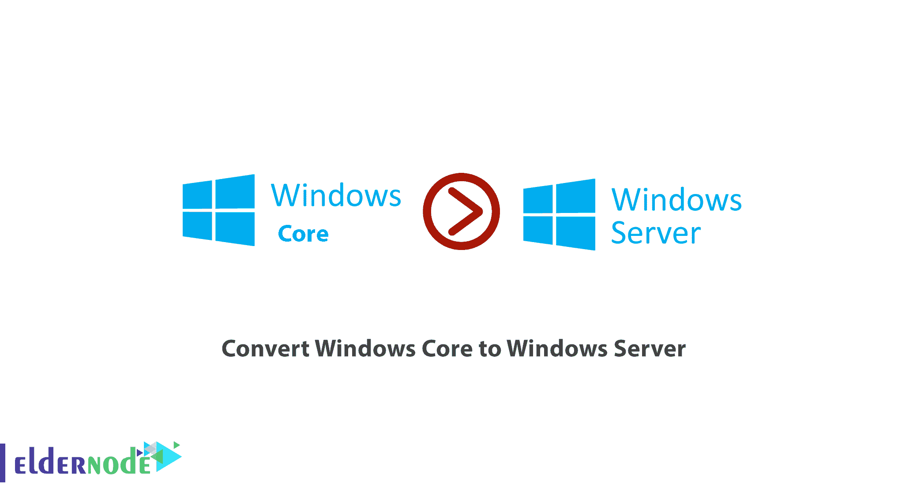
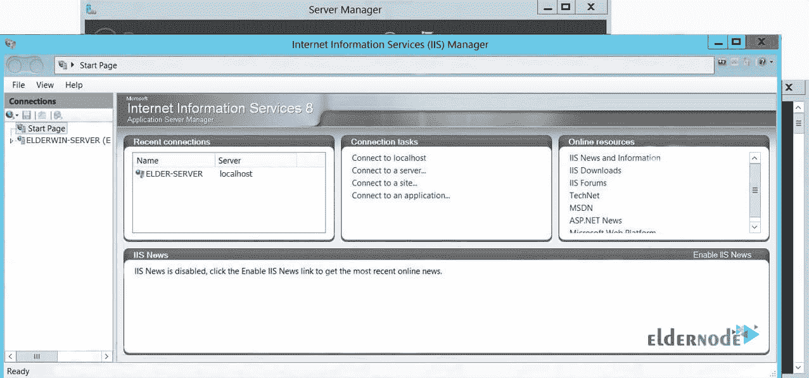
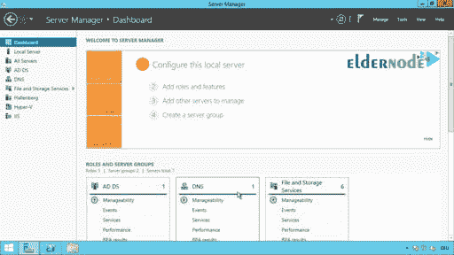

# 如何将 Windows Core 转换为 Windows Server - ElderNode 博客

> 原文：<https://blog.eldernode.com/convert-windows-core-to-windows-server/>



如何**将 Windows Core 转换成 Windows Server** 。Windows Core 是一个允许[微软](https://www.microsoft.com/)在短时间内为新设备和新体验准备新版本 Windows 的项目。Windows Server 2012 和更高版本有三种不同的工作环境，用户可以选择这三种环境中的任何一种来使用服务器。在本教程中，我们将用图形环境将 ***Windows 内核*** 转换为 ***Windows 服务器*** 。你可以在 [Eldernode](https://eldernode.com/) 中选择你最完美的 [Windows VPS](https://eldernode.com/windows-vps/) 服务器包。

## 如何将 Windows Core 转换成 Windows Server

要将 Windows Core 转换为 Windows Server，Windows Server 2012 有三种模式，下面我们将分别解释这三种方法:

**1。** ***Windows 全图形环境*** :这种模式被称为 Windows Server 全 GUI 特性。它具有 Windows 的所有功能和角色，图形环境已完全安装，与以前版本的 Windows 相同。

**2。** ***最小图形的 Windows***:这个 Windows Server 桌面被称为 Windows Server Minimal GUI。这将引导 Windows 与最少的图形，并为您提供所有的角色和管理控制台，并没有一个美丽的和引人注目的 Windows 环境。

**3。 *Windows Core*** :这种模式俗称 Windows Core，一般没有图形环境。安装 Windows 后你只会看到一个 [CMD](https://docs.microsoft.com/en-us/windows-server/administration/windows-commands/cmd) 窗口，在其中你也可以打开 PowerShell，只使用 Windows PowerShell 和 CMD 命令。

***注意:*** 以下所有命令都是 PowerShell 命令，必须在 PowerShell 环境中输入。

### 教程用最少的图形将 Windows Core 转换成 Windows Server

**A.** 以管理员权限打开 **PowerShell** 。

**B.** 输入以下命令进入服务器管理器模块:

```
Import-module Servermanager
```

**C.** 然后输入以下命令，将 Windows Core 转换为具有最小图形环境的 Windows:

```
Add-WindowsFeatures Sever-Gui-Mgmt-Infra -Restart
```

通过输入上述命令，Windows 将从核心模式切换到 Windows 最小模式。

在**重启**后，你会看到如下所示的 Windows 环境:



### 如何将最小图形的 Windows server 转换成完整图形环境的 Windows server

**A.** 以管理员权限打开 **PowerShell** 。

```
Import-module Servermanager
```

**B.** 然后输入下面的命令，完全安装图形环境。

```
Add-WindowsFeatures Server-Gui-Shell -Restart
```

**重启****Windows 服务器**的图形环境。



### 了解如何将 Windows Server Core 转换为带有完整显卡的 Windows Server

**A .首先**，打开 **PowerShell** ，输入以下命令进入服务器管理器模块。

```
Import-module ServerManager
```

**B.** 然后输入以下命令**将**窗口从**核心模式**转换为**全 GUI** :

```
Add-WindowsFeatures Server-Gui-Shell,Server-Gui-Mgmt-Infra -restart
```

**重启**看到**醒目**和**完整**的 Windows Server 图形环境。

您可以阅读[如何检查 Windows 服务器上的服务器负载](https://blog.eldernode.com/check-server-load-on-windows-server/)以了解更多关于服务器负载的信息。

**结论**

自 2012 年以来，Windows Server 有三种不同的工作环境，用户可以选择这三种环境中的任何一种来使用服务器。在本文中，我们用三种方法解释了如何将 Windows Core 转换为 Windows Server:最小图形、完全图形环境和完全图形。