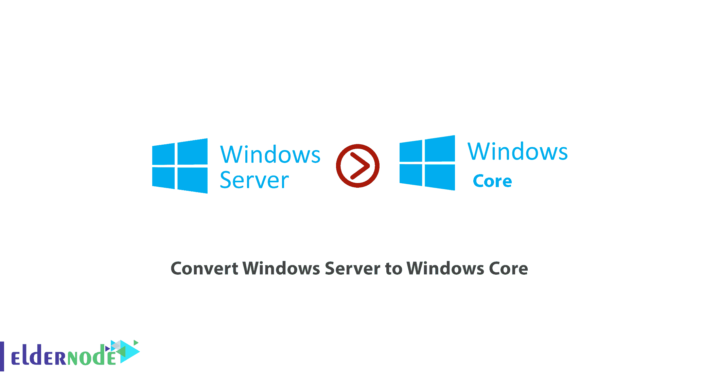
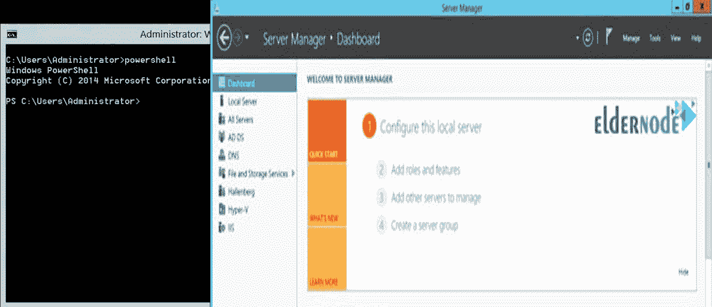
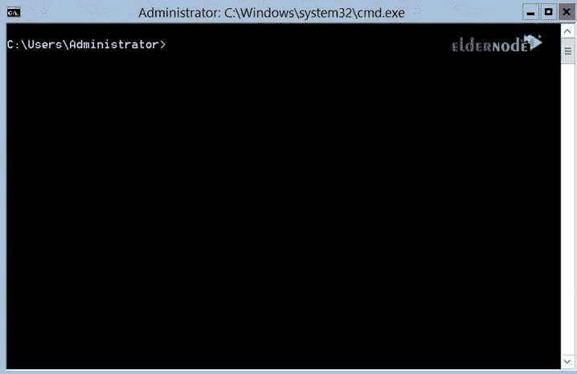

# 如何将 Windows Server 转换为 Windows Core - ElderNode 博客

> 原文：<https://blog.eldernode.com/convert-windows-server-to-windows-core/>



如何将 [Windows Server](http://eldernode.com/tag/windows-server) 转换成 Windows Core？在上一篇文章中，我们教了你[如何将 Windows Core 转换成 Windows Server](https://eldernode.com/convert-windows-core-to-windows-server/) 。在这篇文章中，我们将教你如何将 Windows Server 转换成 Windows Core。

加入我们继续本教程。

如您所知， [Windows Server 2012](http://eldernode.com/tag/windows-server-2012) 有三种不同的工作环境，用户可以选择这三种环境中的每一种来使用服务器。在本文的续篇中，我们将解释 Windows Server 2012 的三种模式。

[***在 Eldernode***](https://eldernode.com/windows-vps/) 选择您的完美 Windows 虚拟专用服务器包

## Windows Server 2012 的三种模式

### 1。全图形环境的 Windows】

这种模式被称为Windows Server Full GUI Features，拥有 Windows 的所有功能和角色，图形环境是完全安装的，与普通版本的 Windows 相似。

### 2。最小图形窗口

这种 Windows 服务器桌面被称为 Windows 服务器最小 GUI ，启动 Windows 时只显示最小图形。

它为你提供了所有的管理角色和控制台，再也没有关于它里面有漂亮抢眼的 Windows 环境和开始菜单的新闻了。

### 3。 Windows 核心

这种模式俗称 [Windows 核心](https://en.wikipedia.org/wiki/Server_Core)，完全没有图形环境。安装 Windows 后你只会看到一个 CMD 窗口，它也可以打开 [PowerShell](https://eldernode.com/tag/powershell-commands/) 并且只能使用 PowerShell 和 CMD 命令。

> 下面，我们将教你如何将带有完整图形环境的 Windows 转换为 Windows Core 和带有最小图形环境的 Windows。

**注意:** 以下所有命令都是 PowerShell 命令，必须进入 PowerShell 环境。

## 了解如何将 Windows Server 转换为 Windows Core

### A) 将最大图形窗口转换为最小图形窗口

**1。**T3 打开 PowerShell 拥有**管理员权限**。

**2。**T3 输入以下命令进入服务器管理器模块:

```
Import-module Servermanager
```

**3。** 然后输入下面的命令来最小化整个 Windows 图形环境:

```
Uninstall-WindowsFeatures Server-Gui-Shell -Restart
```

通过输入上述命令，您的 Windows 将在操作后重启。

您最终将获得如下所示的环境:



### B) 将最小图形的 Windows 转换为 Windows 核心

**1。**T3 打开 PowerShell 拥有**管理员权限**。

```
Import-module Servermanager
```

**2。** 输入以下命令**删除**窗口的最小图形并引导 Windows 为核心。

```
Uninstall-WindowsFeatures Server-Gui-Mgmt-Infra -Restart
```

进入上面的**命令**后，图形环境至少会被移除，Windows 会重启，启动后会看到如下图:



### C) 将全图形的 Windows 转换为 Windows 核心

该命令用于将带有完整图形环境的 Windows 立即转换为 Windows 核心。

**1。** 首先进入 PowerShell ，输入以下命令进入服务器管理器模块:

```
import-module ServerManager
```

**2。** 输入以下命令将 Windows 从全 GUI 模式转换为核心。

```
Uninstall-WindowsFeatures Server-Gui-Shell,Server-Gui-Mgmt-Infra -restart
```

输入上述命令后，PowerShell将开始完全删除**图形环境**， Windows Server 将在重启后作为核心启动。

通过这种方式，你可以轻松地将具有**完整图形环境**的 Windows 转换为具有**最小图形环境**的 Windows，然后转换为 Windows 内核。

**亦作，见:**

[1。如何在 Windows 服务器上检查服务器负载](https://eldernode.com/check-server-load-on-windows-server/)

[2。如何在 Windows 服务器上设置 RDP 限制](https://eldernode.com/rdp-limit-on-windows-server/)

[3。如何使用 RDP 将文件传输到 Windows 服务器](https://eldernode.com/transfer-file-using-rdp-to-windows-server/)

[4。如何在 vps 上更改 Windows 密码](https://eldernode.com/change-windows-password-on-vps/)

**尊敬的用户**，我们希望您能喜欢这个[教程](https://eldernode.com/category/tutorial/)，您可以在评论区提出关于本次培训的问题，或者解决[老年人节点培训](https://eldernode.com/blog/)领域的其他问题，请参考[提问页面](https://eldernode.com/ask)部分，并尽快提出您的问题。腾出时间给其他用户和专家来回答你的问题。

好运。