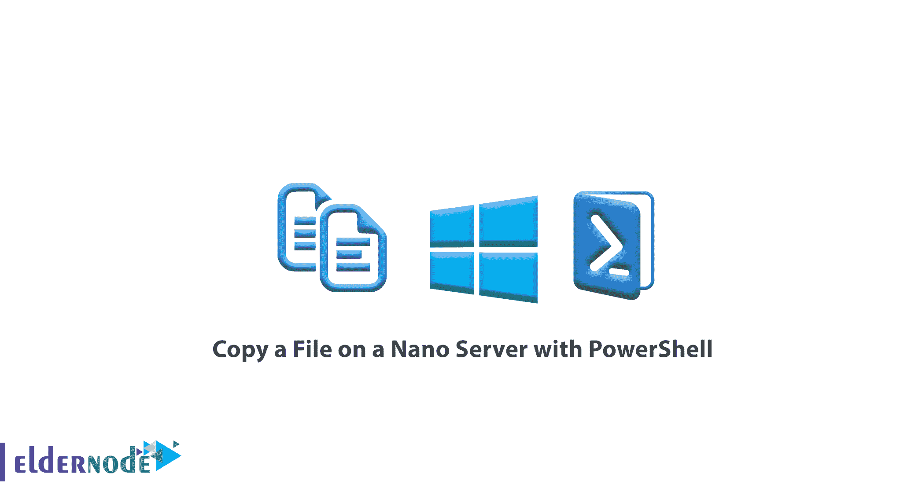

# 如何使用 Powershell 在 Nano 服务器上复制文件-教程 PowerShell

> 原文：<https://blog.eldernode.com/copy-file-on-nano-server/>



如何用 PowerShell 在 Nano 服务器上复制文件？如你所知， Nano Server 除了 PowerShell Direct 之外没有任何通信路径。在之前的文章中，我们解释了[如何连接到一个纳米服务器](https://eldernode.com/connect-to-nano-server/)。现在你可能会问，如何将文件发送到纳米服务器？或者怎么把需要的文件复制到 Nano 服务器上？

从[系列纳米服务器教程](https://eldernode.com/tag/nano-server/)、到本文中的，我们将教你如何用 [PowerShell](https://eldernode.com/tag/powershell-commands/) 在纳米服务器上复制文件。

乍一看，将文件上传到网站并使用 PowerShell 下载可以解决这个问题。是的，没错。这是一个简单的，当然也是 Linux 的方式。当连接到 SSH Linux 时，您将无法直接发送文件，但在 [PowerShell](https://docs.microsoft.com/en-us/powershell/scripting/overview#:~:text=PowerShell%20is%20a%20cross%2Dplatform,NET%20objects.) 中，可以将文件从主机复制到目的服务器，即 nano 服务器。

### 使用 PowerShell 将文件复制到 Nano 服务器

首先，在变量中输入连接或会话所需的信息，如下所示:

```
$session = New-PSSession -ComputerName 192.168.0.21 -Credential administrator
```

在上面的命令中， $session 是我们的变量名， 192.168.0.10 将是 Nano 服务器的 IP 地址。

最后，我们输入了姓名管理员作为**用户名**。

输入上述命令后，输入以下命令复制文件:

```
Copy-Item C:\VMs\NanoServer\* -Destination c:\files\Nano -recurse -ToSession $session -Verbose
```

输入上述命令后，您将把一个名为 Michael.txt 的文件从 C:\VMs\Nanoserver 复制到 C:\files\Nano 。

**注意 1:** 如果要求输入密码，输入上面的命令后输入你的纳米服务器密码。

**注 2:** 在目的地部分输入的 nano 服务器中输入的地址必须是预先创建的。

您只需将所需的文件复制到您的 nano 服务器上。

**亦作，见:**

[如何安装 Nano 服务器](https://eldernode.com/install-nano-server/)

[如何向 Nano 服务器添加角色包](https://eldernode.com/add-roles-to-nano-server/)

**尊敬的用户**，我们希望您能喜欢这个[教程](https://eldernode.com/category/tutorial/)，您可以在评论区提出关于本次培训的问题，或者想解决[老年人节点培训](https://eldernode.com/blog/)领域的其他问题，请参考[提问页面](https://eldernode.com/ask)部分，并尽快提出您的问题。腾出时间给其他用户和专家来回答你的问题。

好运。