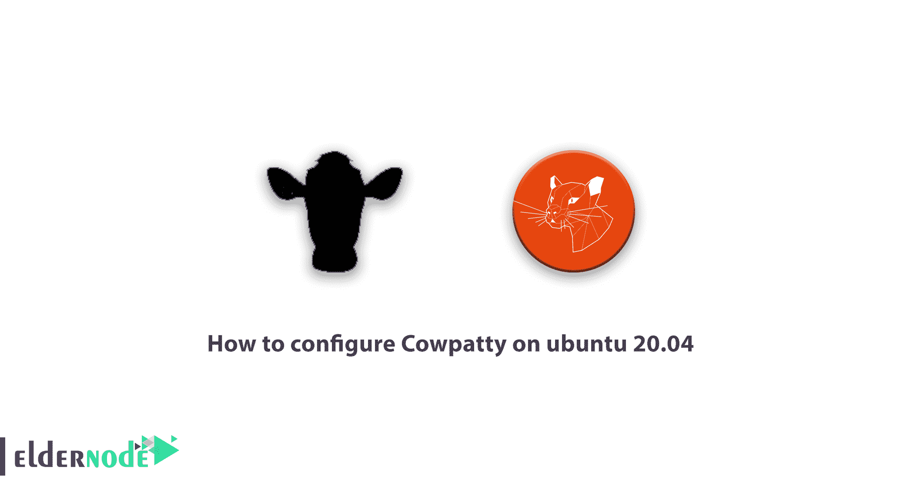

# 如何在 ubuntu 20.04 - Eldernode 博客上配置 Cowpatty

> 原文：<https://blog.eldernode.com/cowpatty-on-ubuntu-20-04/>



一步步学习如何在 ubuntu 20.04 上配置 Cowpatty。。Cowpatty 由 Joshua Wright 编写，用于攻击者、网络管理员和黑客针对 Wi-Fi 系统的离线攻击。Cowpatty 是针对使用基于 PSK 的认证的 WPA/WPA2 网络的离线字典攻击。在这篇文章中，在介绍和解释了 Cowpatty 及其工具之后，我们将学习如何在 [ubuntu](https://blog.eldernode.com/tag/ubuntu/) 20.04 上配置 Cowpatty。你可以在 [Eldernode](https://eldernode.com/) 看到可用的包来购买 [Ubuntu VPS](https://eldernode.com/ubuntu-vps/) 服务器。

### Cowpatty 中有哪些可用的工具？

Cowpatty 包中包含的工具包括:

**-f 字典文件:**该工具指定密码攻击中要使用的字典的文件和目录位置。

**-s 网络 SSID:** 该工具用于指定无线网络名称等服务 ID。

**-c** 检查 4 向框架是否有效，是否破裂。

***-d Hash 文件:*** 该工具可以减少无线系统的破解时间。它还用于显示文件的位置和文件列表。

***-r 数据包捕获文件:*** 指定在捕获运行后存储所有已存储数据包的文件。

***-V 版本:*** 这个工具会简单的显示你的 cowpatty 软件的版本信息。

***-v Verbose:*** 以详细模式运行命令。也会在终端窗口显示所有的后台进程和信息。

***-h 帮助:*** 打印帮助画面。

## 了解如何在 ubuntu 20.04 上配置 Cowpatty

在这一节，我们将教你如何在 Ubuntu 20.04 上**安装和配置 Cowpatty** 。为此，请打开终端并按照以下步骤操作。

### 在 ubuntu 20.04 上逐步安装 cow patty:

**1。**在第一步中，输入以下命令:

```
:~# cd Desktop/
```

**2。**然后，在第二步中，您必须输入以下命令:

```
: ~ # sudo apt-get install libpcap-dev libssl-dev
```

**3。**到**下载** Cowpatty，您需要在下一步使用以下命令:

```
:~# wget http://www.willhackforsushi.com/code/cowpatty/4.6/cowpatty-4.6.tgz
```

**4。**使用以下命令解压缩下载的 Cowpatty 文件:

```
:~# tar zxfv cowpatty-4.6.tgz
```

**5。**在第五步中，键入以下命令:

```
: ~ # cd cowpatty-4.6
```

**6。**在第六步中，您必须输入以下命令:

```
: ~ # make cowpatty
```

7 .**。**最后，Cowpatty 安装将通过输入以下命令开始:

```
: ~ # sudo make install -d / usr / local / bin
```

Ubuntu 20.04 上的 Cowpatty 安装现已成功完成。你可以很容易地搜索和运行它。

## 结论

使用 cowpatty 工具，您可以针对 WPA/WPA2 网络实施离线字典攻击，这是基于 WPA 个人身份验证的。在本教程中，我们试图命名 Cowpatty 中可用的工具，然后教你如何在 ubuntu 20.04 上配置 Cowpatty。