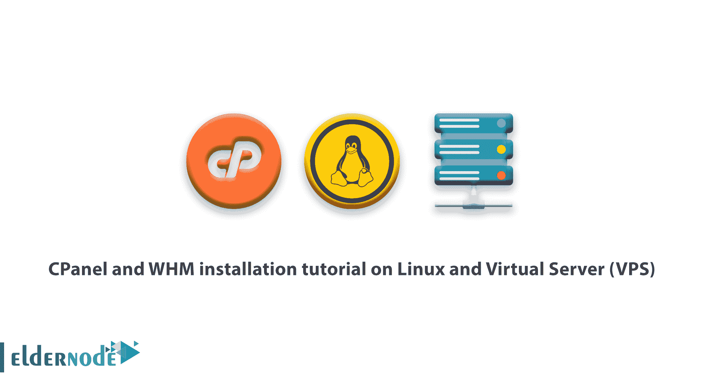

# Linux 和虚拟服务器(VPS)上的 CPanel 和 WHM 安装教程- Eldernode

> 原文：<https://blog.eldernode.com/cpanel-and-whm-installation-tutorial/>



如何 **CPanel 和 WHM 安装**教程关于 [Linux 服务器](https://eldernode.com/linux-vps/)和虚拟服务器( [VPS](https://eldernode.com/vps/) )。

CPanel 是世界上最受用户欢迎的主机控制面板之一，允许用户通过 GUI 界面而不是传统的命令行来管理服务器。这个面板是商用的，你需要定期付费才能使用。

硬件或系统要求

根据 CentOS 版本 6 或 7 的 cPanel 网站上提供的规格，最低频率为 226MHz 的处理器，建议版本 6 的 RAM 为 1 GB，版本 7 的 RAM 为 2 GB，硬盘为 40 GB。

安装前需要考虑的事项:

*   1)安装前关闭操作系统防火墙，重新安装后再进行配置。
*   2) CPanel 在安装后不为用户提供 Unistall 选项，您必须恢复服务器才能删除 CPanel。
*   3)要安装 cPanel，您必须拥有 root 访问权限。
*   4) cPanel 是用 Perl 语言编程的。您需要确保您的服务器上安装了 Perl。

注意:要开始使用 Putty 软件，请通过 [SSH](https://eldernode.com/tag/install-ssh-server/) 登录到服务器。

要安装 Perl，运行下面的命令:

```
yum -y install perl 
```

*   2)现在，用下面的命令设置您的主机名。
*   3)您也可以使用此命令来更改您的主机名。

+当然，在域名下面输入你想要的域名。
主机名 web.eldernode.com

然后输入以下命令来更新 [CentOS](https://eldernode.com/tag/centos/) :

```
yum update 
```

使用下面的命令，我们将从主站点接收程序安装文件。

```
cd home 
```

```
curl -o latest -L https://securedownloads.cpanel.net/latest 
```

输入以下命令运行安装文件:

```
sh latest 
```

根据您的服务器，这可能需要 4 个小时。当然，如果你有合适的服务器，大约需要 40 分钟。

要进入 whm 面板，请在浏览器中输入以下命令。当然，输入你的服务器的 10 个 IP 号码。根据以下命令之一使用的协议来执行此操作。2087 用于 https 协议，2086 用于使用 http。

```
http://10.10.10.10:2086    https://10.10.10.10:2087 
```

我希望你觉得 CPanel 和 WHM 安装教程有用。