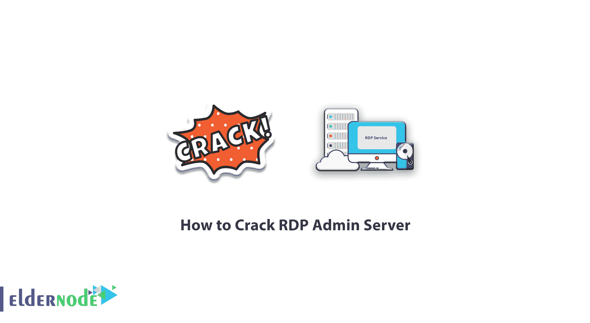

# 如何破解 RDP 管理服务器- Eldernode 博客

> 原文：<https://blog.eldernode.com/crack-rdp-admin-server/>

在 RDP 管理服务器上执行破解或暴力攻击意味着在期望的 RDP 管理服务器上测试密码列表，以便可以获得原始密码。不同的程序和网站可以用来破解 RDP 管理服务器。跟随我们这篇文章，学习如何破解 RDP 管理服务器。需要注意的是，你可以访问 [Eldernode](https://eldernode.com/) 提供的包来购买 [RDP Admin](https://eldernode.com/buy-rdp/) 服务器。

## **教程破解 RDP 管理服务器**

### 破解 RDP 管理服务器的先决条件

许多黑客使用蛮力访问 [VPS](https://eldernode.com/vps/) 或 RDP 管理服务器来破解服务器。这样，您需要以下先决条件来破解 RDP 管理服务器。

首先，你需要以下两个工具:

**1。KPORT 扫描:**在这个工具的帮助下，你可以检查你的 IP 范围来识别光明服务器。

**2。Nlbrute:** 运行暴力攻击的最佳软件之一。

*然后你需要 3 个列表来使用 Nlbrute 工具:*

**1。Passwordlist:** 包含 RDP 管理服务器管理员可能用作密码的密码。你可以从网上下载密码列表。你也可以用 crunch 这样的工具创建自己的自定义密码。

**2。Userlist:** 服务器管理员可能用作用户名的用户列表。

**3。IP 列表:**应该被攻击的明文 IP 服务器列表。

在本文的其余部分，请关注我们，了解如何破解 RDP 管理服务器。

### 破解 RDP 管理服务器

对于破解 RDP 管理服务器，在第一步，你必须进入 [countryipblocks](https://www.countryipblocks.net/acl.php) 网站。登录后，您需要指定想要哪个国家的 IP 列表。其实这个 IP 列表就是你要攻击那些服务器的列表。

现在，正如您在下图中看到的，您可以按洲或国家选择您的服务器列表:

然后勾选 **IP 范围**选项，然后点击**创建 acl** 。

请注意，将为您创建一个适合服务器破解的 IP 列表。

***注意:*** 此列表中的服务器并非全部开启，有些是关闭未使用的。因此，要找到打开的服务器列表，必须使用 **Kport 扫描**软件。

在下一步中，复制 IP 列表，然后将其粘贴到 Kport 扫描软件中。然后点击**开始**按钮。

#### Kport 扫描软件

Kport 扫描软件不需要特殊设置。所以进入 kport 扫描程序，在程序的左边输入你所有的 IP 范围。不要担心，如果你的列表中有额外的文本，它会被自动删除。

从下拉菜单中输入您的 IP 地址所属国家的名称。(可选)

将端口默认设置为 3389，这是默认的 rdp 服务端口。然后单击开始扫描 IPs。

Kport 扫描将打开的服务器列表存储在一个名为 **results.txt** 的文本文件中。

***注意:*** 为下一步保留活动的 IP 文件。

### 如何用 NL Brute 破解 RDP 管理服务器

此时，您需要运行 Nlbrute 软件。然后你要在软件里调用 3 个列表。(IP 列表、用户列表、密码列表)

运行 Nlbrute 后，转到**工作文件**选项卡。现在，您必须在服务器、用户和密码部分输入所有 3 个列表。最后，点击**生成**按钮进入列表。

在**设置**选项卡中不需要设置，默认设置是合适的。

进入**蛮力**标签，点击**开始**对你的服务器列表发起蛮力攻击。每一次服务器被破解，**良好计数**增加 1，并指示服务器被破解。完成后，服务器及其用户名和密码的列表将放在一个文本文件中。

## 结论

攻击的持续时间取决于你的 3 个列表的大小。列表越大，攻击时间越长，可能需要几天或几周。请注意，不要在您的个人电脑上执行此过程。因为速度低而且几天不能开机。所以你必须在 VPS 服务器上完成这个过程，以获得高速和强大的能力，你甚至可以持续攻击几天。

在这篇文章中，我们试图向你学习如何破解 RDP 管理服务器。如果愿意可以参考文章[如何破解 Linux VPS](https://blog.eldernode.com/how-to-crack-linux-vps/) 。