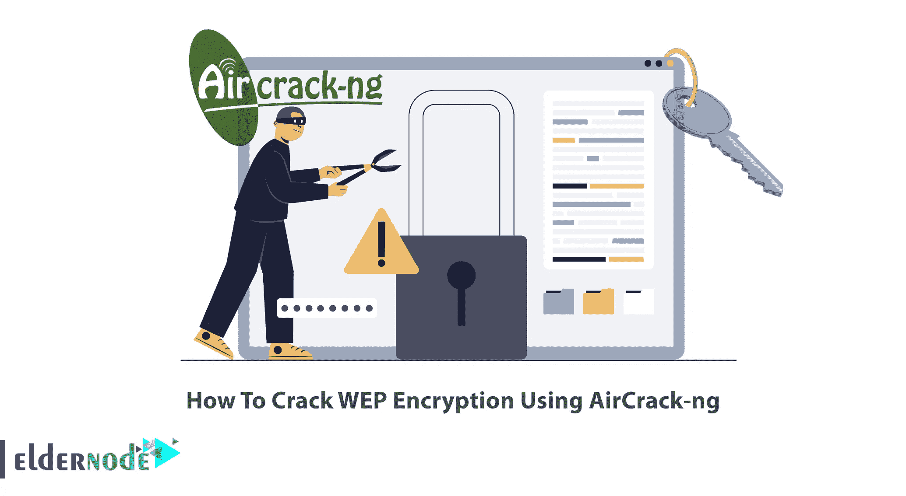
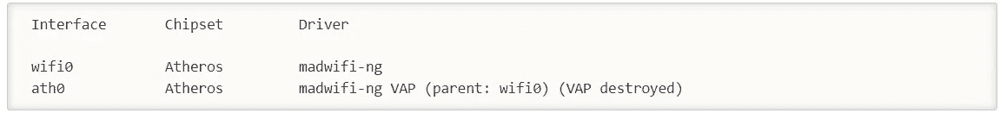
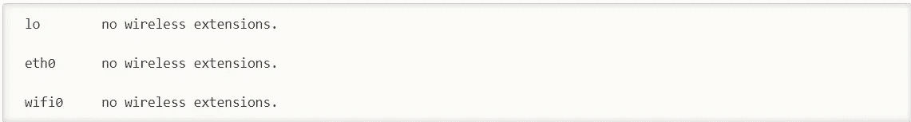
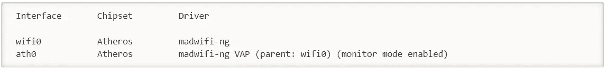
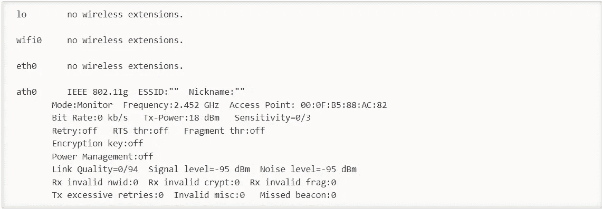
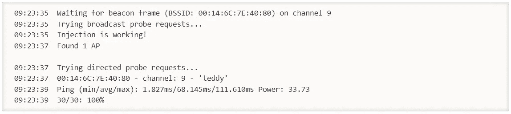
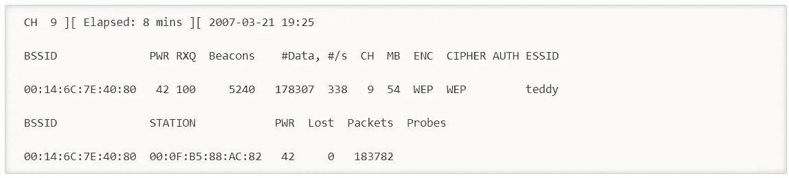
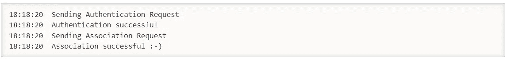
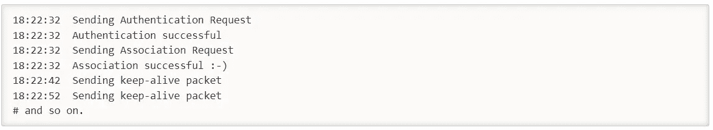
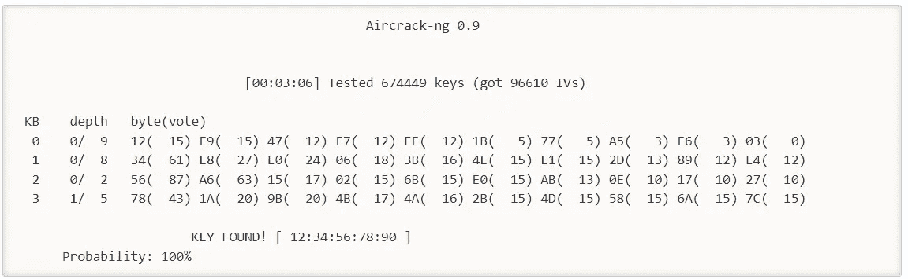

# 如何使用 AirCrack-ng 破解 WEP 加密

> 原文：<https://blog.eldernode.com/crack-wep-encryption-using-aircrack-ng/>



Kali Linux 中用于分析、渗透和攻击无线网络的强大软件包之一叫做 Aircrack-ng。这个软件包由几个非常有用的工具组成，用于分析、监听和渗透无线网络。这篇文章将教你如何使用 AirCrack-ng 破解 WEP 加密。如果你打算购买一台 [VPS](https://eldernode.com/vps/) 服务器，你可以查看 [Eldernode](https://eldernode.com/) 网站上提供的套装。

AirCrack-ng 是一套完整的工具，用于检测、记录和分析数据包，破解 WEP 和 PSK-WPA 密钥，以及评估 Wifi 网络安全。该工具具有攻击网络的能力，并允许黑客获取网络密码。它是十大黑客和安全工具之一，默认安装在 Kali Linux 操作系统中。Aircrack-ng 工具可以检测不同的标准，如 a/b/g/802.11。更多信息，你可以参考我们在 ubuntu 20.10 帖子上的[教程安装和使用 Aircrack-Ng。](https://blog.eldernode.com/aircrack-ng-on-ubuntu-20-10/)

### **利用 Aircrack-ng** 破解 WEP 加密

第一步，您应该在 AP 信道上以监控模式启动无线接口。在正常模式下，您的卡只能听到发给您的数据包。此时，您的卡将处于监控模式，在这种模式下，您的卡可以听到空中的任何数据包。

您需要借助以下命令创建第一个停靠点:

```
 airmon-ng stop ath0
```

系统响应如下:



现在确保没有其他的 athX 接口。为此，请运行以下命令:

```
 iwconfig
```

它应该如下所示:



记住停止任何剩余的 athX 接口。完成后，再次输入下面的命令以确保没有剩余:

```
 iwconfig
```

使用以下命令在 Ap 运行的信道上以监控模式启动无线网卡:

```
 airmon-ng start wifi0 channel-number
```

注意:记住用上面命令中的频道号替换 AP 运行的频道号。

接下来，将您的无线网卡锁定到 AP 频道。

我们使用“wifi0”而不是“ath0”的原因是因为使用了 madwifi-ng 驱动程序。如果您使用其他驱动程序，请使用无线接口名称，如“wlan0”或“rausb0”。

系统响应如下:



“ath0”如上所述被置于监控模式。

现在，通过运行以下命令确认接口设置正确:

```
 iwconfig
```

系统将做出如下响应:



上面的响应显示 ath0 处于 2.452 GHz 的监控模式，接入点显示您的无线网卡的 MAC 地址。只有 madwifi-ng 驱动显示你的无线网卡的 MAC 地址，其他驱动不显示。您应该在继续之前确认以上所有信息，以下步骤将无法正常工作。

### **测试无线设备数据包注入**

此步骤确保您的卡在 AP 的范围内，并且可以向其注入数据包。首先，输入下面的命令:

```
 aireplay-ng -9 -e teddy -a 00:14:6C:7E:40:80 ath0
```

在上面的命令中:

**–>-9:**是注射测试。

**–>-e 泰迪:**是无线网络名称。

**–>-a 00:14:6C:7E:40:80:**这是接入点 MAC 地址。

**–>ath 0:**是无线接口名称。

系统响应应该如下:



你应该得到 100%或者很高的百分比。否则，你离 AP 太远或太近。如果它说零，这表明注入不工作，你需要修补你的驱动程序或使用不同的驱动程序。

### **启动 airodump-ng 捕捉 IVs**

现在，您将从特定的访问点捕获生成的 IVs。

打开另一个控制台会话，并运行以下命令:

```
 airodump-ng -c 9 --bssid 00:14:6C:7E:40:80 -w output ath0
```

在上面的命令中:

**–>-C9:**是无线网络的通道。

**–>–bssid 00:14:6C:7E:40:80:**接入点 MAC 地址可消除外来流量。

**–>-w:**这是包含 IVs 的文件的文件名前缀。

**–>ath 0:**是接口名。

进行注射时，您将看到以下屏幕:



在这一步中，您可以使用 airplay-ng 对接入点进行假认证。对于接受数据包的接入点，源 MAC 地址应该已经关联。否则，AP 将忽略该数据包，并以明文形式发送一个“取消身份验证”数据包。没有创建新的 IV，因为 AP 忽略了所有注入的数据包。

注入失败的最大原因是缺乏与接入点的通信。您用于注入的 MAC 应该使用假认证或使用来自已经与 AP 关联的客户端的 MAC 与 AP 关联。

现在与一个接入点关联，使用如下所示的假认证:

```
 aireplay-ng -1 0 -e teddy -a 00:14:6C:7E:40:80 -h 00:0F:B5:88:AC:82 ath0
```

在上面的命令中:

**–>-1:**表示假认证。

**–>0:**以秒为单位显示重关联时间。

**–>-e 泰迪:**是无线网络名称。

**–>-a 00:14:6C:7E:40:80:**这是接入点 MAC 地址。

**–>-h00:0F:B5:88:AC:82:**是卡的 MAC 地址。

**–>ath 0:**是无线接口名称。

如果您收到以下信息，您已经成功了:



挑剔接入点的另一种变化如下:

```
aireplay-ng -1 6000 -o 1 -q 10 -e teddy -a 00:14:6C:7E:40:80 -h 00:0F:B5:88:AC:82 ath0
```

那就是:

**–>6000:**每 6000 秒重新认证一次。长周期也保持包存活。

**–>-O1:**一次发送一套套餐。缺省值是 multiple，这让一些 AP 感到困惑。

**–>-Q10:**每 10 秒发送一次保活数据包。

成功将看起来如下:



在成功实现假身份验证之前，您不应该继续下一步。

**在 ARP 请求重放模式下开始空中重放**

### 在本步骤中，您将开始在监听 ARP 请求并将它们注入网络的模式下运行。

AP 将重新广播 ARP 请求数据包并生成新的 IV。首先，您应该打开另一个控制台会话并运行以下命令:

它监听 ARP 请求，当它听到一个请求后，airplay-ng 立即开始注入它。在 air play-ng 注入 ARP 请求后，屏幕将如下所示:

```
 aireplay-ng -3 -b 00:14:6C:7E:40:80 -h 00:0F:B5:88:AC:82 ath0
```


检查您的 air dump-ng 屏幕以确认您正在注射。数据包应该会迅速增加。“#/s”应该是一个合适的数字，合适与否取决于各种因素。典型的范围是每秒 300 到 400 个数据包。可以达到每秒 100，最高每秒 500。

**运行 aircrack-ng 获取 WEP 密钥**

### 在这一步中，您将从前面步骤中收集的 IVs 中获取 WEP 密钥。

您可以在 AP 上使用 64 位 WEP 密钥来加速破解过程。要将密钥检查限制在 64 位，请包含“-n 64”。

将展示两种方法，即 PTW 和 FMS/Korek。如果您尝试这两种方法，您会发现与 FMS/Korek 方法相比，PTW 方法成功地确定了 WEP 密钥。PTW 方法仅适用于 arp 请求/回复数据包。要使用这种方法，您需要注入 ARP 请求数据包，并使用 airodump-ng 捕获完整的数据包。但是您不应该使用“–IVS”选项。

现在，您应该启动另一个控制台会话，并运行以下命令:

那就是:

```
 aircrack-ng -b 00:14:6C:7E:40:80 output*.cap
```

**–>-b 00:14:6C:7E:40:80:**它选择你想要的接入点，是可选的。当您捕获数据时，您应用了一个过滤器，只为这个 AP 捕获数据。

**–>输出*。cap:** 选择所有以“output”开头，以“.”结尾的文件。帽”。

您可以通过启动另一个控制台会话来使用 FMS/Korek 方法。为此，请输入以下命令:

那就是:

```
 aircrack-ng -K -b 00:14:6C:7E:40:80 output*.cap
```

**–>-K:**调用 FMS/Korek 方法。

**–>-b00:14:6C:7E:40:80:**选择一个接入点，可选。当您捕获数据时，您应用了一个过滤器来只捕获这个 AP 的数据。

**–>输出*。cap:** 选择所有以“output”开头，以“.”结尾的文件。帽”。

请注意，如果您使用的是 1.0-rc1，您应该为 FMS/Korek 攻击添加“-K”选项。

当数据包生成时，您可以运行上面的命令。128 位密钥大约需要 1，500，000 个 iv，64 位密钥需要 250，000 个 iv。如果使用 PTW 攻击，128 位需要 40，000 到 85，000 个数据包，64 位需要 20，000 个数据包。有这么多的变量，你实际上需要几个 iv 来破解一个 WEP 密钥。

成功看起来如下:



就是这样！你已经使用空中破解成功破解了 WEP 加密。

我们的网站提供经济实惠的 Linux VPS 包，如果你需要的话可以购买。

结论

AirCrack-ng 是破解 WEP 和 WPA-PSK 最著名的工具。在这篇文章中，我们教你如何使用 AirCrack-ng 破解 WEP 加密。我希望这篇教程能帮助你用 AirCrack-ng 破解 WEP 加密。如果你有任何疑问或问题，可以在评论区联系我们。

## Conclusion

AirCrack-ng is the best-known tool available for cracking WEP and WPA-PSK. In this article, we taught you how to crack WEP Encryption using AirCrack-ng. I hope this tutorial helps you to crack WEP Encryption with AirCrack-ng. If you have any questions or problems, you can contact us in the Comments section.