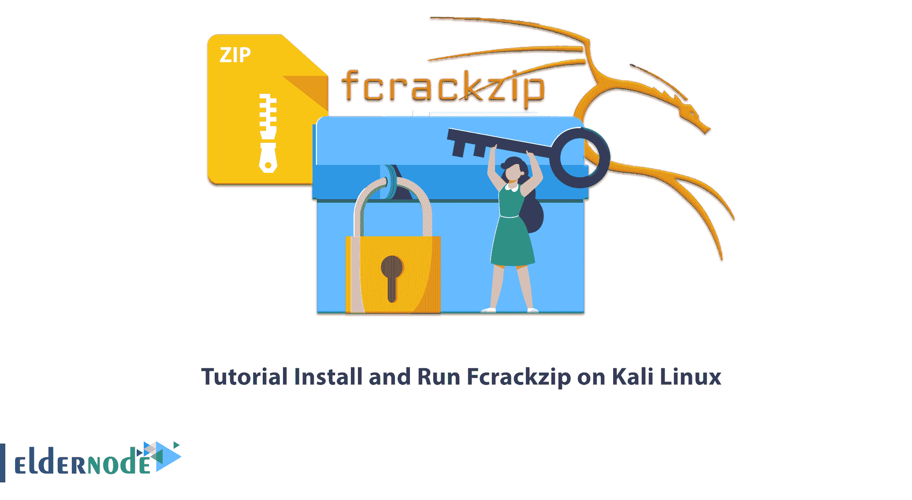

# 教程在 Kali Linux 上使用 Fcrackzip 破解 wifi 密码

> 原文：<https://blog.eldernode.com/crack-wifi-password-using-fcrackzip-on-kali/>



你在找一个功能强大的工具来破解 Kali Linux 上的密码吗？在本文中，我们将介绍 Fcrackzip，这是一个快速的密码破解工具。让我们来学习一下在 Kali Linux 上使用 Fcrackzip 破解 wifi 密码。如果您想 [**购买 Linux VPS**](https://eldernode.com/linux-vps/) 服务器，请在 [Eldernode](https://eldernode.com/) 网站上查看提供的套装。

## 如何用 Fcrackzip 破解 wifi 密码

Fcrackzip 是一个用于解密无线网络密码的开源工具。在本教程中，我们将向您展示如何在 kali linux 上使用 fcrackzip[破解](https://blog.eldernode.com/how-to-crack-linux-vps/) WPA/WPA 密码。

### **Fcrackzip 是什么？**

Fcrackzip 是一款用于恢复无线网络密码的开源工具。它支持 WEP 和 WPA 加密方案。Fcrackzip 是一个部分用汇编语言编写的密码破解工具。该工具在 zip 文件中搜索加密文件，并试图猜测密码。这种方法基于暴力或基于字典的攻击，并使用 unzip 测试结果。你也可以用 Fcrackzip 破解 cpmask 的图片。

在这篇来自 [Kali Linux 培训](https://blog.eldernode.com/tag/kali-linux/)系列的文章的续篇中，我们打算教你如何在 Kali Linux 上安装 Fcrackzip。

## **如何在 Kali Linux 上安装 Fcrackzip**

首先用下面的命令**更新系统包**:

```
sudo apt update
```

然后您可以使用下面的命令在 [Kali Linux](https://blog.eldernode.com/install-and-configure-kali-linux-on-vps/) 上**安装 Fcrackzip** :

```
sudo apt install fcrackzip
```

### **如何在 Kali Linux 上运行 Fcrackzip**

安装后，使用以下命令**运行 Fcrackzip 的不同工具**:

```
fcrackzip --help
```

要使用**强力算法**，运行以下命令:

```
fcrackzip -b
```

```
fcrackzip --brute-force
```

您可以**使用字典**运行以下命令:

```
fcrackzip -D
```

```
fcrackzip --dictionary
```

运行以下命令**执行一个小基准**:

```
fcrackzip -B
```

```
fcrackzip --benchmark
```

要**使用字符集**中的字符，运行以下命令:

```
fcrackzip -c
```

```
fcrackzip --charset characterset
```

要**显示程序的版本**,使用以下命令:

```
fcrackzip --version
```

为了**检查算法**的健全性，运行以下命令:

```
fcrackzip -V
```

```
fcrackzip --validate
```

要使**更加详细，请使用以下命令:**

```
fcrackzip -v
```

```
fcrackzip --verbose
```

通过运行以下命令，您可以使用 string 作为初始密码/文件:

```
fcrackzip -p
```

```
fcrackzip --init-password-string
```

运行以下命令**检查密码**，长度从最小到最大:

```
fcrackzip -l
```

```
fcrackzip --length min-max
```

您可以通过运行以下命令，使用 unzip 来清除错误的密码:

```
fcrackzip -u
```

```
fcrackzip --use-unzip
```

将方法号 **num** 与以下命令一起使用:

```
fcrackzip -m
```

```
fcrackzip --method num
```

运行下面的命令来**计算密码**的 1/m:

```
fcrackzip -2
```

```
fcrackzip --modulo r/m
```

## 结论

在本文中，您了解了 Fcrackzip，它是快速破解工具之一。此外，您还学习了如何在 Kali Linux 上使用 Fcrackzip 安装 WPA/WPA2 WiFi 密码，最后我们回顾了 Fcrackzip 的不同工具以及如何在 Kali Linux 上运行它们。