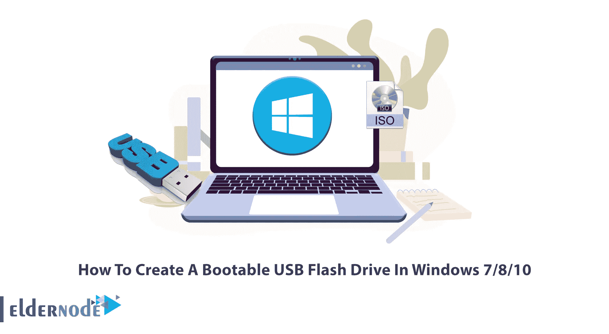

# 如何在 Windows 7/8/10 中创建可启动的 USB 闪存驱动器

> 原文：<https://blog.eldernode.com/create-a-bootable-usb-flash-drive-in-windows/>

如你所知，许多新一代的笔记本电脑和计算机由于其纤薄的设计而没有光驱来读取光盘。在这些笔记本电脑上安装 Windows 的唯一方法是使用 USB 驱动器。为此，您需要创建一个可引导的 Windows USB 驱动器，并将 Windows 安装文件放入其中。本文将教你如何在 Windows 7/8/10 中创建一个可引导的 USB 闪存驱动器。如果你想购买自己的 [**廉价 Windows VPS**](https://eldernode.com/windows-vps/) 服务器，可以查看 [Eldernode](https://eldernode.com/) 网站上提供的软件包。

本教程将向您展示如何从 ISO 映像制作可启动的闪存驱动器。

安装每个版本的 [Windows](https://blog.eldernode.com/tag/windows/) 都有不同的流程，需要不同的工具。要安装特定版本的 Windows，您需要使用以下工具并创建一个可引导的 Windows USB 驱动器。

### **如何下载适用于 Windows 7/8/10 的 ISO 文件**

您应该为您的操作系统下载一个 ISO 文件，以便能够在 [Windows](https://blog.eldernode.com/prevent-copying-of-data-on-usb/) 7/8/10 中创建一个可引导的 USB 闪存驱动器。您可以从 Microsoft 和使用媒体创建工具来完成此操作。

#### **从微软**下载 ISO 文件

首先，从任何基于 Chromium 的浏览器进入微软的下载窗口页面:

[**下载 Windows 7**](https://docs.microsoft.com/en-us/lifecycle/products/windows-7) | **[下载 Windows 8](https://www.microsoft.com/en-us/software-download/windows8ISO)** | **[下载 Windows 10](https://www.microsoft.com/en-us/software-download/windows10)**

你会发现，你只能使用 **Windows Update** 或**微软 Windows Media Creation Tool** 将你的 Windows 更新到新版本。

但是你可以把你的浏览器用户换成非 Windows 操作系统来欺骗微软的 Windows 下载页面提供 ISO 镜像。

现在点击 Chrome 菜单，进入**更多工具>开发者工具**路径:

按下 **Ctrl+Shift+M** 组合键打开设备工具栏。借助此工具栏，您可以模拟另一台设备。设备工具栏还可以更改浏览器的用户代理，当切换到另一个设备时，网站使用该代理来识别访问者的操作系统。

现在，为了更好地查看页面，点击**响应式**菜单，选择 iPad 或 iPad Pro:

你会看到屏幕大小设置为 50%。再次将其更改为 100%:

现在按下 **F5** 刷新页面。你会看到微软网站提供的是 Windows 版本的 ISO，而不是媒体制作工具。

然后点击**选择版本**下拉菜单，选择最新功能更新名称下的 Windows 选项。选择完毕后，点击**确认**。

在此步骤中，系统将提示您选择产品语言 ISO。一旦选定，点击**确认**:

你应该选择是要下载一个 **32 位**还是 **64 位**版本的 Windows ISO，然后点击下载。然后选择你想要保存 ISO 文件的文件夹，点击**保存**下载。

等待下载完成，当下载完成时，该过程也将完成。

#### **使用媒体制作工具** 下载 ISO 文件

媒体创建工具是微软的工具之一，允许您将最新的 Windows ISO 下载到文件或刻录到 USB 驱动器。

首先，进入 [Windows 下载](https://www.microsoft.com/en-us/software-download/)页面，选择你想要的版本。本教程我们会选择 Windows 10 版本。

然后点击**上的**下载工具 now** 链接创建 Windows 10 安装介质**。

下载完成后，允许 Windows 运行该程序:

现在，通过点击**接受**来接受许可协议。

接下来，您应该选择'**为另一台 PC 创建安装介质(USB 闪存驱动器、DVD 或 ISO 文件)**，并按下**下一步**:

等待必要的文件下载并通过媒体创建工具验证:

下载过程完成后，将要求您为您的 ISO 映像选择语言、体系结构和 Windows 版本。如果您不想使用推荐的选项，您可以取消选中**‘为这台电脑使用推荐的选项’**复选框。完成后，点击**下一个**:

现在选择 **ISO 文件**，点击**下一步**:

然后选择一个文件夹来保存 ISO 文件。ISO 文件将在指定位置创建。

最后，点击**完成**关闭程序。

这就是下载 Windows 7/8/10 的 ISO 文件所需的全部内容。

## **从 ISO 镜像创建可启动的 u 盘**

本教程将教你如何从一个 ISO 映像制作一个可启动的闪存驱动器。这将允许您从 u 盘安装 Windows，而不必先刻录到 CD 或 DVD 上。

安装完成后，您可以使用 Rufus 和 PowerISO 工具将 USB 转换为可引导设备。

### 如何使用 Rufus 创建可启动的 u 盘

按照以下步骤使用 Rufus 创建一个可引导的 USB 闪存驱动器:

1->从[官网](https://github.com/pbatard/rufus/releases/download/v2.7/rufus-2.7.exe)下载 Rufus。下载完成后，双击应用程序，软件会自动启动程序。

2 –>插入 USB 闪存驱动器。你可以看到你面前的选项列表。

3->在**“新卷标”**选项卡中命名您的可引导 USB 设备。

4 –>单击光驱图标选择。您要使用的 iso 文件。选择完毕后，点击开始:

5 –>然后会提示您删除 USB 驱动器中的所有数据:

6 –>最后，等待 Rufus 完成他们的工作。

### **如何使用 PowerISO** 创建一个可启动的 u 盘

**如果要使用 PowerISO 创建可引导的 USB 闪存驱动器，请按照以下步骤操作:**

**1 –>从[官网](http://www.poweriso.com/download.php)下载 PowerISO 并安装到您的 PC 上。**

**2 –>插入 USB 驱动器。**

**3 –>运行 PowerISO 并转到**工具>创建可引导 USB 驱动器**路径:**

****

**4->点击 **OK** 以管理员身份使用 PowerISO:**

****

**5 –>单击文件夹选项浏览。您想使之成为可引导的 iso 文件:**

****

**6 –>点击**目标 USB 驱动器**选择您想要启动的适当 USB 驱动器。**

**7 ->选择书写方式并点击**开始**:**

****

**8 –>等待 PowerISO 完成其工作。**

**就是这样！您于 2010 年 7 月 8 日在 [Windows](https://blog.eldernode.com/tag/windows/) 中成功创建了一个可启动的 USB 闪存驱动器。**

## **结论**

**USB 技术取代了 CD 和 DVD，可引导磁盘已经过时。可引导 USB 对于引导操作系统是可靠的。在本文中，我们教你如何下载 ISO 文件，以及如何在 Windows 7/8/10 中创建一个可引导的 USB 闪存驱动器。我希望这个教程对你有用。如果你面临任何问题，有任何疑问或建议，可以在评论区联系我们。**