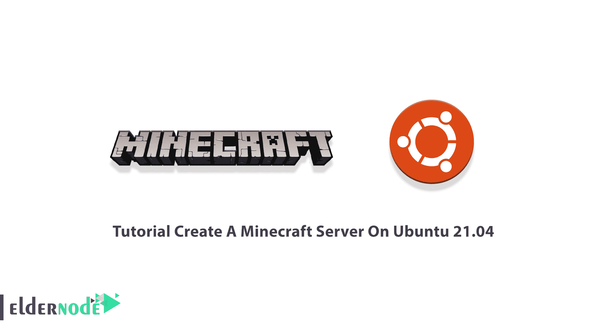

# 教程在 Ubuntu 21.04 - Eldernode 博客上创建《我的世界》服务器

> 原文：<https://blog.eldernode.com/create-a-minecraft-server-on-ubuntu/>



《我的世界》是世界上最受欢迎的游戏之一。这款沙盒视频游戏于 2019 年发布，以其无限冒险而闻名。热衷于建造、探索、制作和在 3D 生成的世界中生存的游戏玩家将会沉迷于《我的世界》。要开始玩这款第二畅销的视频游戏，您需要创建自己的《我的世界》服务器。所以，加入我们这篇文章来回顾一下**教程在 Ubuntu 21.04** 上创建一个《我的世界》服务器。在 [Eldernode](https://eldernode.com/) 上订购您喜欢的包，购买您自己的 [Ubuntu VPS](https://eldernode.com/ubuntu-vps/) 主机。

## **如何在 Ubuntu 21.04 上创建《我的世界》服务器**

如果你和其他玩家对《我的世界》、《手工艺》和《《我的世界》》感兴趣，本指南将帮助你学习如何安装软件包、配置服务器以及部署到游戏中。作为玩家，你可以提高你解决问题的能力，锻炼你的创造力。此外，如果你相信有教育意义的游戏，《我的世界》就是你想要的。

### **在 Ubuntu 21.04 上制作《我的世界》服务器的先决条件**

为了让本教程更好地工作，请考虑以下先决条件:

_ 拥有 Sudo 权限的非 root 用户。

_ 要进行设置，请遵循我们在 Ubuntu 21.04 上的[初始服务器设置。](https://blog.eldernode.com/initial-server-setup-on-ubuntu-21-04/)

_ 至少 4GB 内存。

## **如何在 Ubuntu 21.04 上安装《我的世界》服务器**

为了准确地知道谁在与您或您的孩子联系并一起玩，您需要设置自己的服务器。这意味着您可以完全掌控自己的游戏体验。由于 Ubuntu 以其易用性而闻名，Ubuntu 21.04 Hirsute Hippo 是托管《我的世界》服务器的最佳选择。和我们一起来完成**在 Ubuntu 21.04** 上制作《我的世界》服务器所需的步骤。

*第一步:*

正如所料，您将从安装所需的包开始，因为《我的世界》服务器需要它们来运行。因此，打开一个终端并键入:

```
sudo apt update
```

```
sudo apt install git build-essential
```

这样，构建 **mcrcon** 工具所需的包将被安装。

*第二步:*

这一步，你需要**安装** **Java** 。《我的世界》需要 Java 8 或更高版本，但由于它不需要图形用户界面，您可以安装 Java 的无头版本。使用以下命令来完成此操作:

```
sudo apt install openjdk-11-jre-headless
```

然后，您可以通过运行以下命令来检查您已安装的版本:

```
java -version
```

*第三步:*

现在，您需要**创建一个《我的世界》用户**。但出于安全考虑，《我的世界》不应该以 root 用户身份运行。因此，用主目录 **/opt/minecraft** 创建一个新的系统用户和组。用户将拥有运行《我的世界》服务器所需的最低权限:

```
sudo useradd -r -m -U -d /opt/minecraft -s /bin/bash minecraft
```

由于您不会为该用户设置密码，因此该用户将无法通过 [SSH](https://blog.eldernode.com/tutorial-connect-to-ssh-on-linux/) 登录，也不会受到威胁。

***注*** :要换成《我的世界》用户，需要以 root 或者拥有[权限的用户](https://blog.eldernode.com/sudoers-configurations-setting-sudo/)登录服务器。

*第四步:*

是时候在 Ubuntu 上安装《我的世界》了。但是首先，切换到 **minecraft** 用户:

```
sudo su - minecraft
```

然后，您需要**在用户主目录中创建三个新目录**。备份、工具和服务器。让我们来看看每一个的定义，然后创建它们:

**1)备份目录**

要存储您的《我的世界》服务器备份，您需要此目录。此外，您可以将该目录与远程备份服务器同步。

**2)工具目录**

第二个目录包含 **mcrcon** 客户端和备份脚本。

**3)服务器目录**

服务器目录包含实际的《我的世界》服务器及其数据。

您可以使用下面的命令创建这三个目录:

```
mkdir -p ~/{backups,tools,server}
```

*第五步:*

要**下载编译 mcron** ，去 GitHub、[下载源代码](https://github.com/Tiiffi/mcrcon)。然后，您可以构建 mcron 二进制文件。CON 是一种允许您连接到《我的世界》服务器并执行命令的协议。

将 **Tiiffi/mcrcon** 库从 GitHub 克隆到 **~/tools/mcron** 目录下:

```
git clone https://github.com/Tiiffi/mcrcon.git ~/tools/mcrcon
```

然后，切换到 mcron 目录并构建实用程序:

```
cd ~/tools/mcrcon
```

```
gcc -std=gnu11 -pedantic -Wall -Wextra -O2 -s -o mcrcon mcrcon.c
```

完成后，使用以下命令，通过打印版本来验证 **mcrcon** 是否已成功编译:

```
./mcrcon -v
```

### **《我的世界》服务器 Mods**

要下载《我的世界》服务器，有几个《我的世界》服务器模块，如 Craftbukkit 或 Spigot。您可以使用它们来添加插件到您的服务器，并进一步定制和调整服务器设置。在本节中，您将学习安装 Mojang 官方香草《我的世界》服务器。因此，您将能够使用这些说明来安装任何其他所需的服务器模式。

要获得最新《我的世界》服务器的 Java 归档文件(JAR)的下载链接，请转到[《我的世界》下载页面](https://www.minecraft.net/en-us/download/server)。然后用 **wget** 下载**~/服务器**目录下的 jar 文件:

```
wget https://launcher.mojang.com/v1/objects/a0d03225615ba897619220e256a266cb33a44b6b/server.jar -P ~/server
```

## **如何在 Ubuntu 21.04 上配置《我的世界》服务器**

下载成功后，您可以通过切换到 **~/server 目录**来启动《我的世界》服务器:

```
cd ~/server
```

```
java -Xmx1024M -Xms1024M -jar server.jar nogui
```

在第一次启动时，服务器执行一些操作，创建 **server.properties** 和 **eula.txt** 文件，然后停止。

输出要求您同意《我的世界》EULA。打开 **eula.txt** 文件，将 **eula=false** 改为 **eula=true** :

```
nano ~/server/eula.txt
```

现在，您可以**保存**并关闭文件。

要启用 **rcon 协议**并设置 rcon 密码，请打开 server.properties 文件:

```
nano ~/server/server.properties
```

要更新这些值，请在输出中查找这些行。

***注意*** :如果您不想从远程位置连接到《我的世界》服务器，请确保 rcon 端口被您的防火墙阻止。将强密码更改为更安全的密码。

### **如何创建 Systemd 单元文件**

您可以创建一个 Systemd 单元文件，并将《我的世界》作为服务运行。建议不要手动启动《我的世界》服务器。请遵循以下路径来完成此操作:

1-通过键入 **exit** 切换回您的 Sudo 用户。

2-打开你的文本编辑器，在 **/etc/systemd/system/** 目录下创建一个名为 **minecraft.service** 的文件。

```
sudo nano /etc/systemd/system/minecraft.service
```

然后，粘贴以下配置:

*/etc/systemd/system/minecraft . service*

```
[Unit]  Description=Minecraft Server  After=network.target
```

```
[Service]  User=minecraft  Nice=1  KillMode=none  SuccessExitStatus=0 1  ProtectHome=true  ProtectSystem=full  PrivateDevices=true  NoNewPrivileges=true  WorkingDirectory=/opt/minecraft/server  ExecStart=/usr/bin/java -Xmx1024M -Xms1024M -jar server.jar nogui  ExecStop=/opt/minecraft/tools/mcrcon/mcrcon -H 127.0.0.1 -P 25575 -p strong-password stop
```

```
[Install]  WantedBy=multi-user.target
```

然后你可以根据你的服务器资源修改 ***Xmx*** 和 ***Xms*** 标志。 ***Xmx*** 标志定义了 Java 虚拟机(JVM)的最大内存分配池，而 ***Xms*** 定义了初始内存分配池。此外，确保您使用正确的 **rcon 端口**和密码。

最后，**保存**文件并重新加载 systemd 管理器配置，运行:

```
sudo systemctl daemon-reload
```

现在，您可以通过键入以下命令来运行《我的世界》服务器:

```
sudo systemctl start minecraft
```

首次启动时，该服务将生成几个配置文件和目录，包括《我的世界》世界。运行以下命令检查**服务状态**:

```
sudo systemctl status minecraft
```

您可以**使《我的世界》服务**在启动时自动启动。所以，运行:

```
sudo systemctl enable minecraft
```

### **如何调整防火墙**

如果您的系统启用了防火墙，并且您想从本地网络外部访问《我的世界》服务器，您需要打开端口 **25565** :

```
sudo ufw allow 25565/tcp
```

### **如何配置备份**

要自动备份《我的世界》服务器，您需要创建一个备份 shell 脚本和 cronjob。首先，切换到 **minecraft** :

```
sudo su - minecraft
```

打开您喜欢的文本编辑器并创建以下文件:

```
nano /opt/minecraft/tools/backup.sh
```

粘贴以下配置:

*/opt/minecraft/tools/backup . sh*

```
#!/bin/bash    function rcon {  /opt/minecraft/tools/mcrcon/mcrcon -H 127.0.0.1 -P 25575 -p strong-password "$1"  }    rcon "save-off"  rcon "save-all"  tar -cvpzf /opt/minecraft/backups/server-$(date +%F-%H-%M).tar.gz /opt/minecraft/server  rcon "save-on"    ## Delete older backups  find /opt/minecraft/backups/ -type f -mtime +7 -name '*.gz' -delete
```

**保存**文件并使脚本可执行:

```
chmod +x /opt/minecraft/tools/backup.sh
```

然后，为了在一天的固定时间自动运行一次，您需要[创建一个 cron 作业](https://blog.eldernode.com/list-cron-jobs-on-ubuntu-20-04/)。要打开 crontab 文件，请运行:

```
crontab -e
```

例如，如果您希望每天 8:00 运行备份脚本，您需要粘贴以下行:

```
0 8 * * * /opt/minecraft/tools/backup.sh
```

## **如何在 Ubuntu 21.04 上访问《我的世界》控制台**

您可以使用 **mcrcon** 实用程序来访问《我的世界》控制台。为此，指定主机、rcon 端口、rcon 密码，并使用-t 开关启用 mcrcon 终端模式:

```
/opt/minecraft/tools/mcrcon/mcrcon -H 127.0.0.1 -P 25575 -p strong-password -t
```

输出应该报告您的登录。你可以输入“ **Q** 退出。

***注意*** :无论何时从远程位置访问《我的世界》控制台，rcon 端口都不应该被阻塞。但是如果您经常连接到《我的世界》控制台，创建一个 [bash 别名](https://blog.eldernode.com/what-is-bashrc/)，而不是键入这个日志命令。

## 结论

在本文中，您了解了如何在 Ubuntu 21.04 上创建《我的世界》服务器。现在，你知道了如何在你的 Ubuntu 服务器上创建一个《我的世界》服务器，并设置每日备份。为了保证您的服务器安全和愉快，您必须邀请您认识的人在您的服务器上玩。一旦你的《我的世界》服务器设置好了，你就可以利用你的管理能力来获得优势，并将这些能力给予你的游戏伙伴。但是，您可以创建一个只供您和您的朋友使用的私人服务器，或者将其公开，供所有人访问。启动您的《我的世界》客户端并连接到服务器，开始您的《我的世界》之旅。