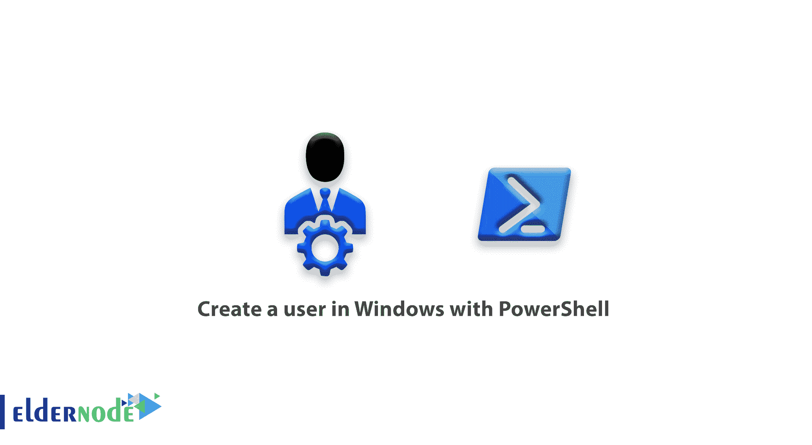

# 如何用 PowerShell 在 Windows 中创建用户- Eldernode Blog

> 原文：<https://blog.eldernode.com/create-a-user-in-windows-with-powershell/>



了解如何使用 PowerShell 一步步在 Windows 中创建用户。通常大多数 Windows 用户至少有过一次与 CMD 或命令提示符斗争的经历，并且知道 CMD 或命令提示符是用来执行 Windows 命令的。但是很少有人知道 PowerShell 是什么，它是如何工作的。在本文中，我们将教你如何用 PowerShell 在 Windows 中创建用户。PowerShell 是一个类似于命令提示符的工具，比命令提示符复杂和强大得多，并且应该完全取代命令提示符。因为 PowerShell 对 Windows 的能力和控制远大于命令提示符。

***注意:***CMD 或者**命令提示符**命令在 [PowerShell](https://blog.eldernode.com/introduction-to-windows-powershell/) 环境下工作，你也可以使用 [CMD](https://en.wikipedia.org/wiki/Cmd.exe) 用户命令创建 PowerShell 用户。

本[教程](https://eldernode.com/category/tutorial/)基于 **PowerShell 版本 5.1 及以上**，默认安装在 **Windows 10** 和 **Windows Server 2016** 及以上。要在旧版本中使用此命令，您必须将相关模块添加到 PowerShell 中，或者使用命令提示符命令来创建用户。立即加入我们，了解如何使用 PowerShell 在 Windows 中创建用户。

## 教程使用 PowerShell 命令创建用户

Windows PowerShell 遵循一个全面的结构，了解您使用过 PowerShell 将使您非常容易学习如何在 PowerShell 中创建用户版本。

**1-** 首先在 Windows 中用**管理员权限**打开 **PowerShell** 。

**2-** 在 PowerShell 中创建一个用户，使用 **New-localuser** 命令，其结构类似如下。

```
New-LocalUser -Name [username] [Option] 
```

**New-LocalUser 命令**的结构是这样的，它有一个名为 Name 的主要部分，实际上是**用户名**和其他参数，我们将在下面解释。

### 使用 PowerShell 在 Windows 中创建用户的示例

在解释各种参数之前，请注意下面的**两个例子**以更熟悉在 PowerShell 中创建的用户命令的结构。

***例 1:***

在下面的例子中，创建了一个名为 **Michael** 的用户，没有为其分配密码，并且在 Description 部分中，为该用户编写了一个描述，您可以根据需要对其进行定制。

```
New-LocalUser -Name “Michael” -Description “Test User” -NoPassword 
```

***例二:***

在下面的示例中，与第一个示例一样，将创建一个具有特定用户名 **Michael** 和描述的用户，并为其分配一个密码。本例中重要的一点是，PowerShell 不接受简单类型或明文形式的密码，您必须首先创建一个变量并在其中输入密码，然后在命令之间使用该变量。

输入以下命令创建一个名为 Password 的变量，并从您那里秘密接收它。

```
$password = Read-Host -AsSecureString 
```

输入上述命令后，您将收到一个密码。按 Enter 键后，还可以使用以下命令。

```
New-LocalUser -Name “Michael” -Description “Test User with Password” -Password $password 
```

这将允许您在 PowerShell 中创建用户。我们现在将继续描述提到的其他实用参数。

### PowerShell 中的 New-LocalUser 命令参数

**AccountExpires:** 用户的到期日期由该参数指定

**帐户永不过期:**用户帐户是否过期

**禁用:**用户帐户是活动的还是不活动的

**FullName:** Full username

**密码永不过期:**用户密码是否过期

**usermaynnotchangepassword:**用户可以更改或不更改密码

提到的项目是该命令的重要参数，它们与第一个和第二个示例中提到的参数一起构成了该命令的实际和特定参数。

下面是创建用户的完整示例。在此示例中，请参见参数的使用。

```
New-LocalUser -Name “Michael” -Description “IT Manager” -Password $password -FullName “Michael Jordan-Disabled -PasswordNeverExpires –UserMayNotChangePassword 
```

## 结论

我们试图用实际例子教你如何在 Windows 中用 PowerShell 创建一个用户。还提到了 PowerShell 中的 New-LocalUser [命令](https://blog.eldernode.com/important-powershell-commands/)参数。