# 如何在 VMware ESXi 6.5 - Eldernode 博客中创建虚拟机

> 原文：<https://blog.eldernode.com/create-a-virtual-machine-in-vmware-esxi-6-5/>

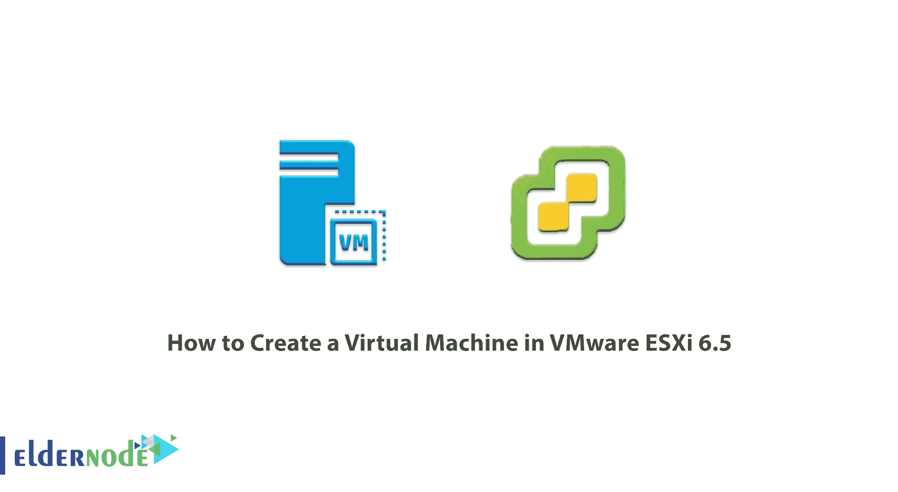

如果要对虚拟机有一个大概的定义，那就必须说它是一个软件，它为我们模拟并创造了一台物理计算机。一个 VM，就像一个[专用服务器](https://blog.eldernode.com/tag/dedicated-server/)，有 Cpu，Ram，硬盘，但是虚拟的。创建虚拟机后，您可以安装和使用任何类型的操作系统或应用程序。在本文中，我们试图教你**如何在 VMware ESXi 6.5** 中创建虚拟机。你也可以访问 [Eldernode](https://eldernode.com/) 提供的包来购买[专用服务器](https://eldernode.com/dedicated-server/)。

## **教程在 VMware ESXi 6.5 中创建虚拟机**

在本文的其余部分，我们将分三步教您如何在 VMware ESXi 6.5 中创建虚拟机。需要注意的是，本培训的先决条件是**一个 ISO 映像**。请和我们在一起。

### **在 VMware ESXi 6.5 中创建虚拟机**

如前所述，ESXi 是安装在一组企业服务器上的操作系统。ESXi 由 VMKernel 提供支持，并管理虚拟机进行通信。为了在 ESXi 上安装虚拟机，按顺序执行以下步骤就足够了。

### 如何在 VMware ESXi 6.5 中上传 ISO

开始工作之前，您应该确保可以在虚拟机上安装操作系统。应该注意的是，ESXi 使用户可以轻松实现直接 ISO 加载。

在第一步中，您必须从导航器面板中单击**存储**选项。

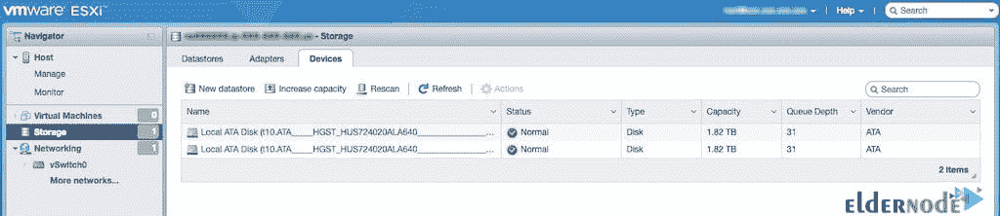

然后，在下一步中，您必须单击**数据存储库**选项卡，以便能够选择数据中心。使用这个数据中心，您将能够保存您的 ISO。

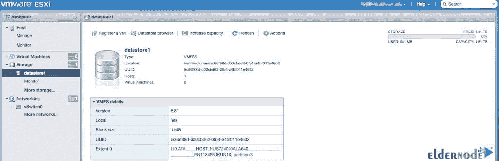

要确定保存 ISO 文件的位置，您必须单击**数据存储浏览器**按钮。然后你必须点击**上传**，选择下一步并点击。请注意，您的 ISO 加载时间取决于 ISO 大小和网络速度等参数。下一步，我们将教你如何在 [ESXi](https://blog.eldernode.com/upgrade-esx-6-0-to-6-5-with-cli/) 中创建虚拟机。

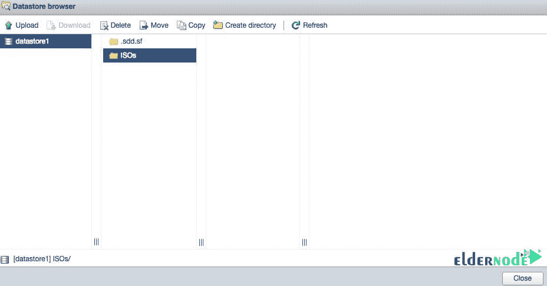

### 如何在 VMware ESXi 6.5 中创建虚拟机

成功完成 ISO 加载后，您需要继续在 ESXi 中创建虚拟机。因此，要在 VMware ESXi 6.5 中创建虚拟机，第一步必须从导航面板中单击**虚拟机**，如下图所示。

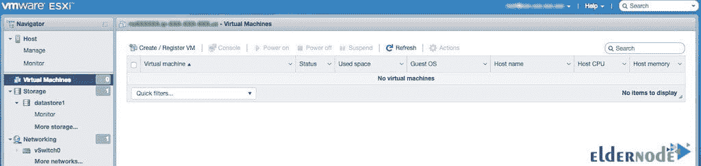

然后，您必须在下一步中点击**创建/注册虚拟机**按钮。如下图所示，您必须点击页面右侧的**创建新虚拟机**，然后点击**下一步**。

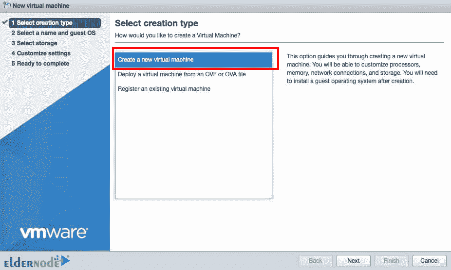

下一部分是关于**选择一个名字和客户操作系统**。正如您在本节中看到的，您必须为您的虚拟机选择一个名称。您还需要输入安装的相关信息，最后点击**下一步**。

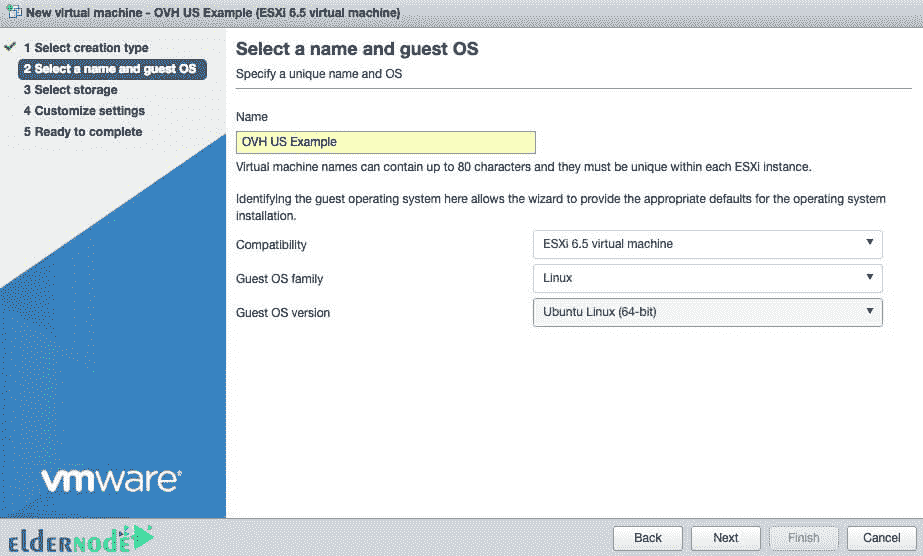

在完成上一步中的信息并选择操作系统后，该选择**数据存储库**来存储虚拟机了。完成后，再次点击**下一步**。接下来，您将进入虚拟硬件设置。

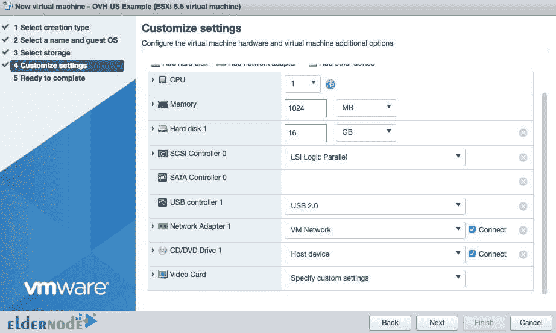

请注意，您必须选择硬件设置，以满足虚拟机和操作系统运行的应用程序的需求。在下一步中，您必须点击 **CD/DVD 驱动器 1** ，然后选择**数据存储 ISO** 文件。这将允许您下载您的 ISO 文件。

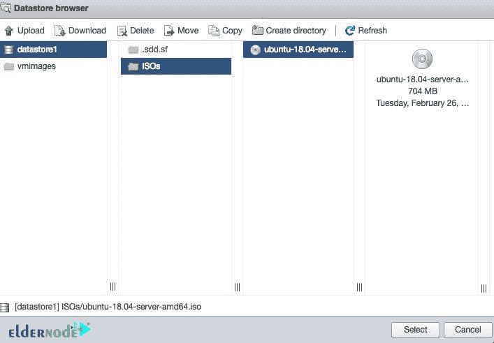

在本节的最后一步，您必须选择上传的 ISO 文件。然后点击**选择**。现在，您需要返回到自定义设置页面来浏览和验证您的虚拟机信息。最后，点击**完成**创建一个虚拟机，在上面安装操作系统。

### **如何在 VMware ESXi 6.5 中安装 OS**

***注意:*** 在开始安装之前，我们必须提醒您，操作系统的安装因您选择的操作系统而异。

成功完成前两步后，就可以在 ESXi 上安装了。为此，您需要从**导航器面板**中点击**虚拟机**。

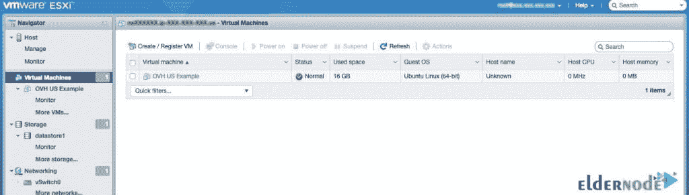

下一步是选择必须安装所需操作系统的虚拟机。最后你必须点击**开机**按钮。通过这样做并遵循操作系统安装说明，您将完成在 VMware ESXi 6.5 中创建和安装虚拟机的步骤。

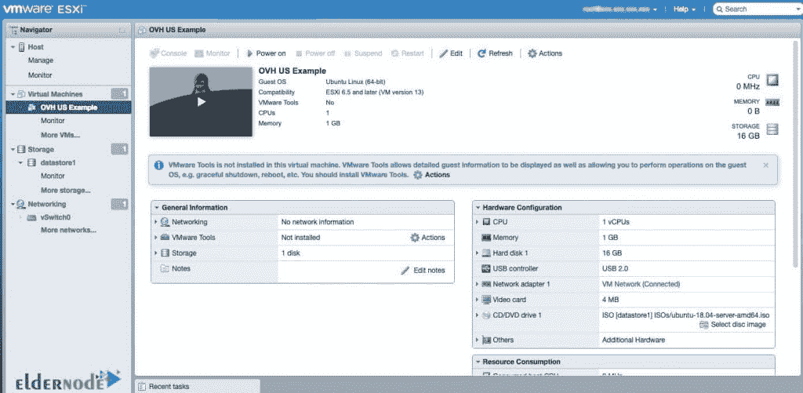

## 结论

ESXi 是 vSphere 中的核心虚拟化应用程序。事实上，它是一种操作系统。因为在安装过程中，它直接安装在硬件上，不需要主机操作系统或主机。这个虚拟器是无主机应用程序的一部分，在速度和性能方面非常有效。ESXi 是 VMware 虚拟机管理程序软件系列的最新版本，它实际上允许您构建虚拟机并将资源分配给虚拟机。该管理平台建立在硬件和系统资源的基础上。实际上，这个程序的任务是控制和管理虚拟机之间的硬件资源。在本文中，我们尝试教您如何在 VMware ESXi 6.5 中创建虚拟机。