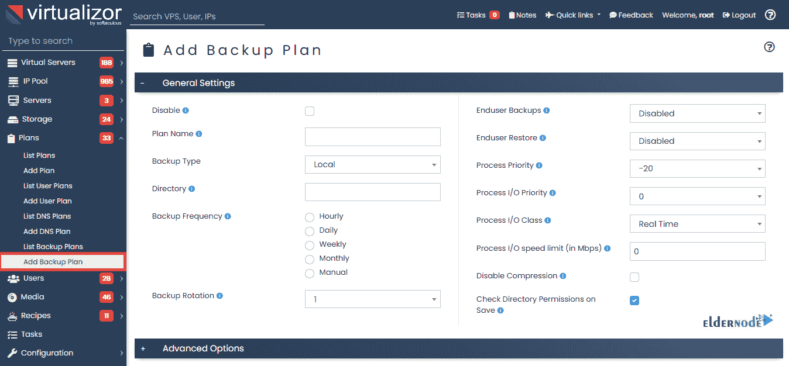

# 如何在 Virtualizor - Eldernode 博客上创建和恢复备份

> 原文：<https://blog.eldernode.com/create-and-restore-backup-on-virtualizor/>

Virtualizor 是一个强大的基于 web 的 VPS 控制面板，支持虚拟机的全自动备份。凭借有用的功能和直观的界面，Virtualizor 适合需要增强业务的企业。它也适用于 VPS 服务提供商。在本文中，您将学习如何在 Virtualizor 上创建和恢复备份。要订购您认为合适的**[VP](https://eldernode.com/vps/)**，请访问 [Eldernode](https://eldernode.com/) 并要求我们的技术团队为您提供指导。

## **教程在虚拟器上创建和恢复备份**

Virtualaizor 是一个 VPS 控制面板，有助于在一台服务器上创建、部署、维护和管理多个虚拟专用服务器。之前，您已经了解了关于[备份 Linux VPS](https://blog.eldernode.com/how-to-backup-linux-vps/) 的所有内容。加入我们的指南，学习如何**创建 VPS 备份**，然后**在 Virtualizor 上恢复备份**。

### **如何在虚拟器上创建 VPS 备份**

要创建 VPS 的备份，您可以使用 Create VPS Backup API。根据 VPS 的**备份计划**，VPS 的映像将存储在本地或远程。然后，你会在***/var/virtualizor/log/backup/VPS id . log***找到备份过程的日志文件。备份过程成功启动后，API 响应将包含“done”作为“1”。

***注*** : Virtualizor 支持 KVM、Xen、OpenVZ、Proxmox、Virtuozzo、LXC 等，内置按小时计费系统。最终用户面板上的备份仅用于 ***OpenVZ*** 。

### **什么是后备计划**

要为同一服务器上的不同 VPS 创建不同的 VPS 备份设置，您需要备份计划。此外，可以将备份计划分配给单个 VPS 或整个 VPS 计划。

使用 Virtualizor，您可以通过三种方式备份 VPS:

**1- FTP**

**2- SSH**

**3-本地备份**

***注意*** :如果选择 FTP，只有配置了 FTP 备份服务器，才能配置设置。

### **如何为服务器设置备份计划**

你需要通过三个主要步骤来建立一个备份计划。

首先，**添加将进行备份的备份服务器**。请遵循以下路径来完成此操作:

1-进入**虚拟化管理面板>服务器>添加备份服务器**

2-选择**备份服务器类型** (SSH 和 FTP)和**输入服务器凭证**。

一旦添加了备份服务器，您就可以运行第二步了，并且**创建一个备份计划**。遵循下面的路径来做这件事。

**Virtualizor 管理面板** > > **计划**(菜单)> > **添加备份计划。**

在第三步中，您将**将备份计划分配给 VPS** 。请考虑您将能够向单个 VPS 或 VPS 计划分配备份计划。因此，如果您需要将备份计划分配给某个**特定的 VPS** ，请遵循以下路径:

1-编辑 VPS: **虚拟服务器管理面板** > > **虚拟服务器**(菜单)> > **列出所有** > > **编辑**(按钮)

2-展开高级选项块，选择之前创建的备份计划。

为了**分配与 VPS 计划相同的备份计划**，您可以选择 ***与 VPS 计划*** 相同。因此，请遵循以下路径来完成此操作:

1-编辑 VPS 计划:**虚拟管理面板**->-**计划**(菜单)->-**列出计划**->-**编辑**(按钮)

展开“高级选项”块，并选择之前创建的备份计划。

## **如何在 Virtualizor 上恢复 VPS 备份**

要恢复 VPS 的备份，您需要使用 Restore VPS Backups API 进行恢复。Virtualizor 允许您将 VPS 恢复到原始 VPS，或者使用备份映像创建一个新的 VPS。此外，您需要使用 Backup VPS Details API 来获取备份目录和使用日期的详细信息。启动恢复过程后，API 响应将包含“ **restore_done** ”作为“ **true** ”。

但是，您可以使用**恢复备份**来恢复服务器 VPS 上的备份。因此，我们来看一下本节的步骤，看看如何恢复 VPS:

第一步:

进入**备份** > > **恢复 VPS 备份**。

在**顶部搜索栏**中，您可以选择想要恢复哪些 VPS 的服务器。将更新最近 20 个任务和新的恢复任务。

在**选择备份 VPS** 字段中，选择要恢复的 **VPS** ，在**选择服务器**字段中，选择 VPS 备份所在的服务器。

您可以通过两种方式**恢复 VPS 备份**:

**1-选择备用 VPS**

**2-选择服务器**

### **通过选择备份 VPS** 恢复 VPS 备份

如果需要选择要恢复的 VPS，必须使用以下方法:

在**选择备份虚拟点**字段中，选择虚拟点以查看要恢复的所选虚拟点的备份列表。

选择您想要恢复的 VPS 允许您按照 VPS 的备份计划更新**选择服务器**和**选择目录**。此外，要恢复相应日期的 VPS，请选择日期。

### **通过选择服务器** 恢复 VPS 备份

如果需要选择 VPS 备份所在的服务器，必须使用以下方法:

## 

如上图所示，有三个字段。第一个是您可以**选择 VPS 所在的服务器**。然后，在**选择目录**字段，选择 VPS 备份。最后，**在 VPS 备份中选择日期**。

选择所有必填字段后，您将获得一个包含**个不同虚拟磁盘**的备份列表，您可以从该列表中恢复任何虚拟磁盘。

***注意*** :如果 VPS 备份存在于另一个目录中，而不是在下拉列表中的目录中，在此之后还有另一个选项，您可以提供 VPS 备份所在的目录。

如您所见，前两个字段与上述字段相同。在下一个字段中，提供目录路径并点击**扫描**按钮扫描该目录。同样，**选择 VPS 备份出现的日期**。

### **恢复 VPS 类型**

有三种不同类型的恢复虚拟处理器。让我们在这一节学习它们:

**1-恢复**

要恢复同一 VPS 中的备份，请单击**恢复** VPS。

**2-恢复到新的 VPS**

要在一个全新的 VPS 中恢复备份，点击 **restore to new VPS** 。此外，您可以选择将在其上恢复 VPS 的服务器。

*

**3-恢复到新服务器**

如下图所示，您可以使用第三种类型进行恢复:

*

在第二个字段中，选择**用户**，然后选择要将虚拟机作为新虚拟机恢复到的**服务器**。当您选择服务器时，将从该服务器加载存储。最后，点击**恢复**按钮。

## 结论

在本文中，您了解了如何在 Virtualizor 上创建和恢复备份。要获得 VPS 的备份信息和备份文件路径的列表，可以使用 Backup VPS Details API。通过这种方式，您将查看发生 VPS 备份的数据以及以字节为单位的映像大小。