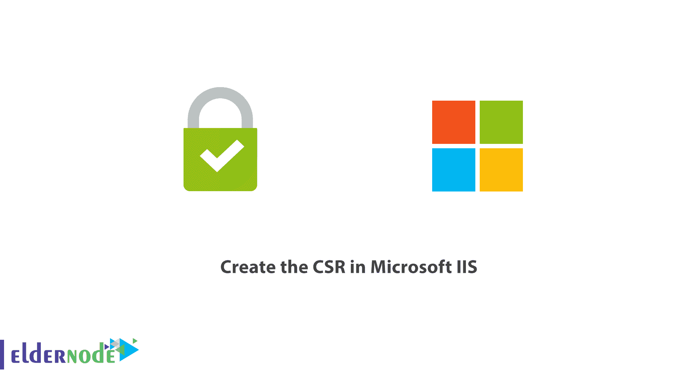
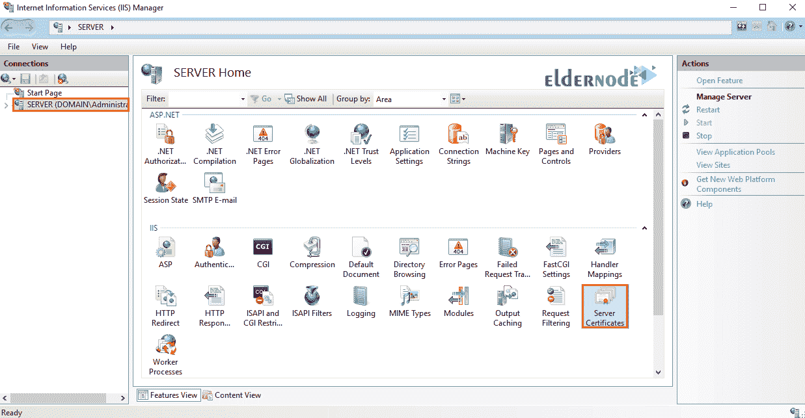
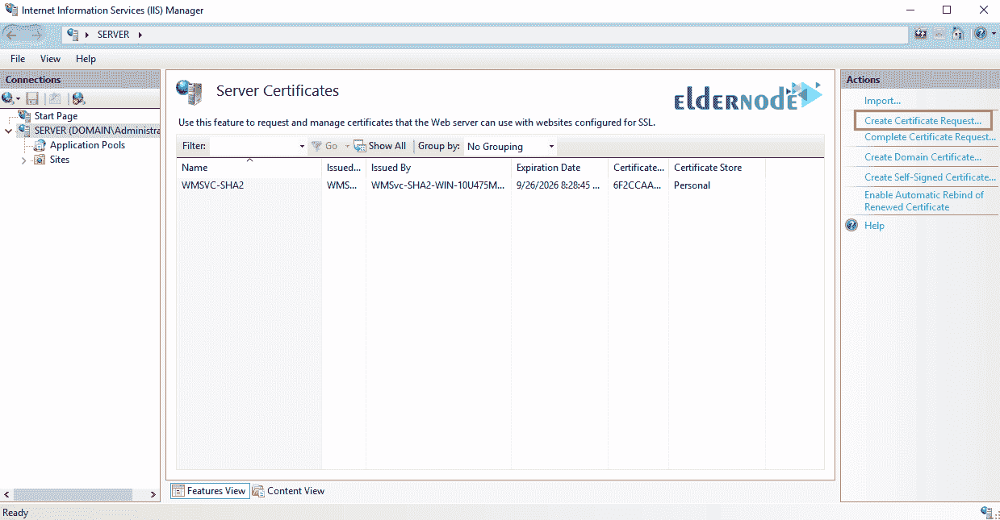
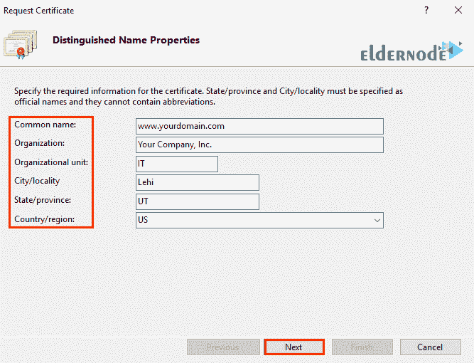
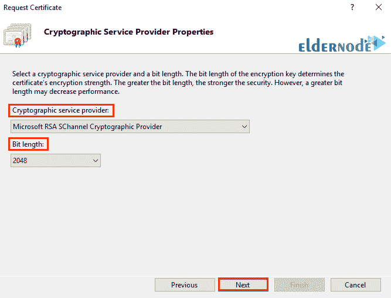
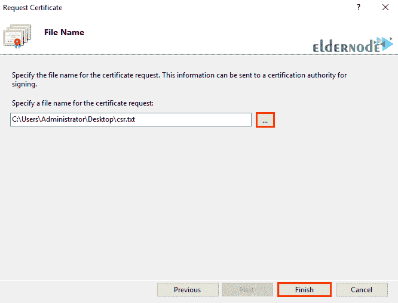
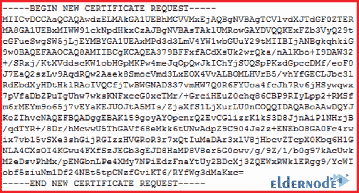

# 教程以及如何在微软 IIS - ElderNode 博客中创建 CSR

> 原文：<https://blog.eldernode.com/create-csr-in-iis/>

## **教程以及如何在微软 IIS 中创建 CSR**

在这篇文章中，我们将教你如何在微软 [IIS](https://eldernode.com/tag/iis/) 中创建 [CSR](https://en.wikipedia.org/wiki/Certificate_signing_request) 。SSL 是一种用于保护用户和网络服务器之间通信的协议。要在 SSL 下通信，您的网站上必须安装 SSL 证书。

在订购您的 SSL 证书之前，您必须首先在您的服务器上生成一个 **CSR** ( 证书签名请求)。CSR 是包含公司信息和域名的加密文本。这个名为“您的网站服务器配置文件”的文件随后被发送到 SSL 发行公司，以便根据这些规范发行 SSL 证书。

以下是在 IIS 中创建 CSR 的步骤。和我们在一起。

### 如何在微软 IIS 中生成 CSR？

**1。**T3 通过点击**开始菜单**选择管理工具。然后点击互联网信息服务 ( **IIS** ) 管理器查看 **IIS 管理**软件。

**注:** 如果你也在开始菜单中搜索 IIS，就可以看到相关的软件。

**2。** 点击服务器名称。

**3。从页面中间的** 选项中，在 **IIS** 部分，**双击服务器证书上的**。

**4。** 然后从页面右侧的**动作**部分，点击创建证书请求。

这将打开申请证书向导。

**5。在** 的专有名称属性窗口中，输入如下信息:

**——常用名称:** 证书名称通常作为域名输入。

例如，输入 www.eldernode.com 的*或者 mail.eldernode.com*的*。*

**注意:** 普通证书只支持一个地址。您在此部分输入的名称必须基于要颁发证书的地址。

### 教程在 Microsoft IIS 中创建 CSR

还有一种 SSL 叫做通配符，它覆盖了一个域的所有**子域**。这些类型的证书更贵。如果您有一个通配符证书，当在**通用名称**字段中创建 CSR 时，您必须输入一个带有星号“ * ”的域名:

*.YourDomain.com

**— 组织:** 组织或公司的注册法定名称。

**— 组织单位:** 您所在组织或公司相关部门的名称。

**— 城市/地点:** 您所在单位或公司所在城市的名称。

**— 州/省:** 贵单位或公司所在的省。

**——****国家/地区:** 是两个字母的国家代码。

**6。**T3 点击下一个。

**7。** 在密码服务提供商属性窗口中，分别设置选项为微软 RSA SChannel 和 2048 。然后点击下一个。

**8。**T3 指定 CSR 文件的名称。

**提示:** 记住文件名和保存的位置。

需要时，您应该将 CSR 文件作为文本文件打开，并将其所有内容复制粘贴到证书的在线订购流程中。

**更多关于 SSL 的信息，可以关注下面的链接:**

[教程在 IIS Web 服务器上安装 SSL 证书](https://eldernode.com/install-ssl-on-iis-web-server/)

[如何安装和激活 SSL 证书](https://eldernode.com/how-to-install-and-activate-the-ssl-certificate/)

[教程在 Debian 10 中为 Apache 创建自签名 SSL 证书](https://eldernode.com/create-ssl-apache-debian-10/)

**尊敬的用户**，我们希望您能喜欢**如何在微软 IIS** 中创建 CSR，您可以在评论区提出关于本次培训的问题，或者解决 [Eldernode 培训](https://eldernode.com/blog/)领域的其他问题，请参考提问页面，并尽快提出您的问题。腾出时间给其他用户和专家来回答你的问题。

好运。