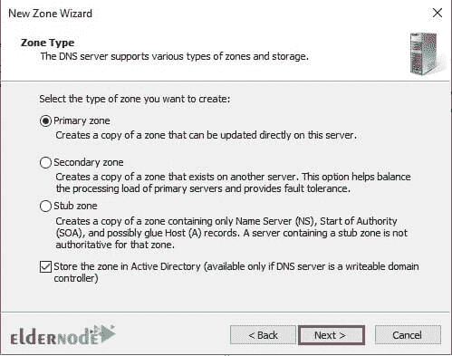

# 教程在 DNS 管理器服务器 2019 中创建正向查找区域- Eldernode

> 原文：<https://blog.eldernode.com/create-forward-lookup-zone/>

教程在 DNS Manager Server 2019 中创建正向查找区域。如你所知， [转发区](https://en.wikipedia.org/wiki/DNS_zone) 用于将名称转换为 IP 地址。在本文中，我们将执行创建该区域的设置步骤，如下所示。你可以从 eldernode 选择你最完美的 [Windows VPS 服务器](https://eldernode.com/windows-vps/)包。

### 如何在 DNS Manager Server 2019 中创建正向查找区域

1.在您的 active directory DNS 服务器上打开 DNS 管理器。

2.**在前向查找区上右击**，选择新区。

3.在**新区域向导**窗口中，点击下一步并继续。

4.在下一步中，选择您想要创建的区域的**类型，并点击下一步。**

5.选择默认设置并点击确定。

6.在区域名称字段中，输入您的外部域名。

**注:**我的外部域名是 eldernode.com

7.因为我们手动创建所有文件，所以在此阶段我们必须单击“**不允许动态更新**”。

8.点击下一个。

9.最后一步，点击 Finish 完成安装过程。

**尊敬的用户**，我们希望您能喜欢这个[教程](https://eldernode.com/category/tutorial/)，您可以在评论区提出关于本次培训的问题，或者解决[老年人节点培训](https://eldernode.com/blog/)领域的其他问题，请参考[提问页面](https://eldernode.com/ask)部分，并尽快提出您的问题。腾出时间给其他用户和专家来回答你的问题。

好运。

Goodluck.