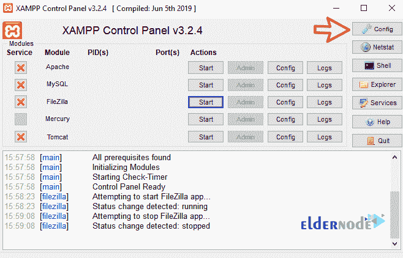

# 如何在 XAMPP 创建 FTP 教程 ElderNode 博客

> 原文：<https://blog.eldernode.com/create-ftp-in-xampp/>

如何在 [XAMPP](https://www.apachefriends.org/) 创建 [FTP](https://en.wikipedia.org/wiki/File_Transfer_Protocol) 。在**之前的文章**中，我们教过你[如何在 Windows 10](https://eldernode.com/install-xampp-on-windows-10/) 中安装 xampp。在这篇文章中，我们将教你如何在 XAMPP 创建 FTP。请和我们一起。

正如前面的教程中所解释的， Xampp 是一个免费软件，它能够在你的 Windows 上建立一个本地 web 服务器。要**在 xampp** 中设置 ftp，只需遵循几个简单的步骤，在你的 Windows 或 [Windows VPS](https://eldernode.com/windows-vps/) 服务器上设置 FTP。

[***elder node 中可用的 VPS 服务器***](https://eldernode.com/vps/)

### 了解如何在 XAMPP 创建 FTP

**1。**T3 打开 xampp 软件。

**2。** 点击旁边的选项 filezilla 到**运行**服务。

**注意:** 正确运行 **ftp** 服务后，端口写在服务名旁边。

如果你想让 ftp 服务在每次 Windows 重启后**自动运行**，请遵循以下步骤:

**1。** 点击配置选项。

**2。在打开的**窗口中选择 filezilla 服务，点击保存。

对你来说，通过 xampp 建立一个 **ftp** 服务就是这么简单。

接下来，转到 **ftp 设置**，这样就可以毫无问题地使用了。

### XAMPP 软件中的 FTP 服务设置

**1。** 点击管理选项前面的 filezilla 名称。

**2。T3 为你的管理员用户选择一个**密码**。(您可以将密码留空。)**

**3。T3 然后点击确定。**

**4。**T3 在打开的页面中，从编辑菜单中选择用户选项。

**5。页面右侧** ，点击添加，输入**用户名**，连接 ftp 。

**注:** 在本教程中，我们输入了用户名迈克尔。

**6。** 在常规部分添加用户名后，输入其密码。

**7。** 现在点击页面左侧的共享文件夹。

**8。** 点击添加选项。

**9。**T3 选择所需文件夹为 **ftp** 空间。

**10。** **最后**，指定**权限**为 ftp 。

**11。**T3 点击确定结束。

这就是 ftp 设置的用武之地，你可以用 filezilla 之类的软件连接到 **ftp** 。

**亦作，见:**

[如何在 Windows 10 上配置 XAMPP](https://eldernode.com/configure-xampp-on-windows-10/)

[了解如何使用 XAMPP 在 Windows 10 中设置 VPS](https://eldernode.com/learn-how-to-setup-vps-in-windows-10-using-xampp/)

[如何在 XAMPP 更新 PHP 版本](https://eldernode.com/update-php-version-in-xampp/)

**尊敬的用户**，我们希望您能喜欢这个[教程](https://eldernode.com/category/tutorial/)，您可以在评论区提出关于本次培训的问题，或者想解决[老年人节点培训](https://eldernode.com/blog/)领域的其他问题，请参考[提问页面](https://eldernode.com/ask)部分，并尽快提出您的问题。腾出时间给其他用户和专家来回答你的问题。

好运。