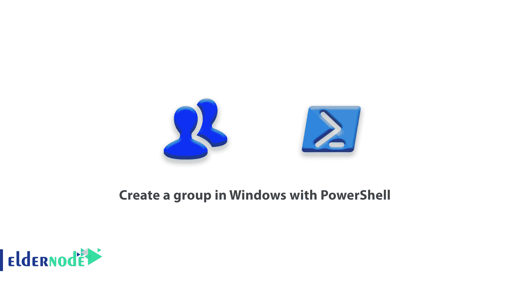

# 如何在 Windows 中使用 PowerShell - Eldernode 创建组

> 原文：<https://blog.eldernode.com/create-group-in-windows-with-powershell/>



Windows Powershell 是来自微软的一个强大的工具，它可以给你比你想象的更多的性能，当你使用这个强大的工具时，你可以看到它和命令提示符之间的巨大差异。在本文中，我们希望通过在 Windows 中使用 [PowerShell](https://docs.microsoft.com/en-us/powershell/scripting/overview) 创建一个群来与您在一起，这样，如果您需要创建群，就可以使用它。

一般来说，一个组只包括一些能够设置不同访问权限的用户。

本[教程](https://blog.eldernode.com/category/advance/)基于 **PowerShell 版本 5.1 及以上**，默认安装在 **Windows 10** 和 **Windows Server 2016** 及以上。要在旧版本中使用此命令，您必须将相关模块添加到 PowerShell 中，或者使用命令提示符命令创建一个组。

## 如何使用 PowerShell 在 Windows 中创建组

在操作系统中创建用户和组有各种原因，其中最重要的是他们访问文件、文件夹等的权利。有几种方法可以确定访问权限，但我们不会在本文中讨论，但要考虑的一点是，您的系统上有许多用户，您需要平等地设置他们的访问权限。正是在这种状态下，群体找到了意义。关注我们，在 Windows by PowerShell 中创建一个群:

**1-** 首先用**管理员权限**打开 **PowerShell** 。

**2- New-LocalGroup** 命令用于在 PowerShell 中创建组。

该命令的结构通常如下。

```
New-LocalGroup –Name “GroupName” [Option] 
```

在 PowerShell 中创建组的命令，就像**创建用户**的命令一样，并不包含不同的参数，只有几个简单的参数，在下面的示例中将使用这些参数来更好地了解它们。

### 使用 PowerShell 命令创建组的示例

```
New-LocalGroup –Name “Accountant”  - Description “Accountant Dept” 
```

在上面的命令中，创建了一个名为**会计**的组，其描述为**会计部**。

您可以在 PowerShell 中轻松创建群组。

## 结论

在本文中，我们试图教你如何用 PowerShell 在 Windows 中创建一个组。还教了一个例子让你更熟悉。